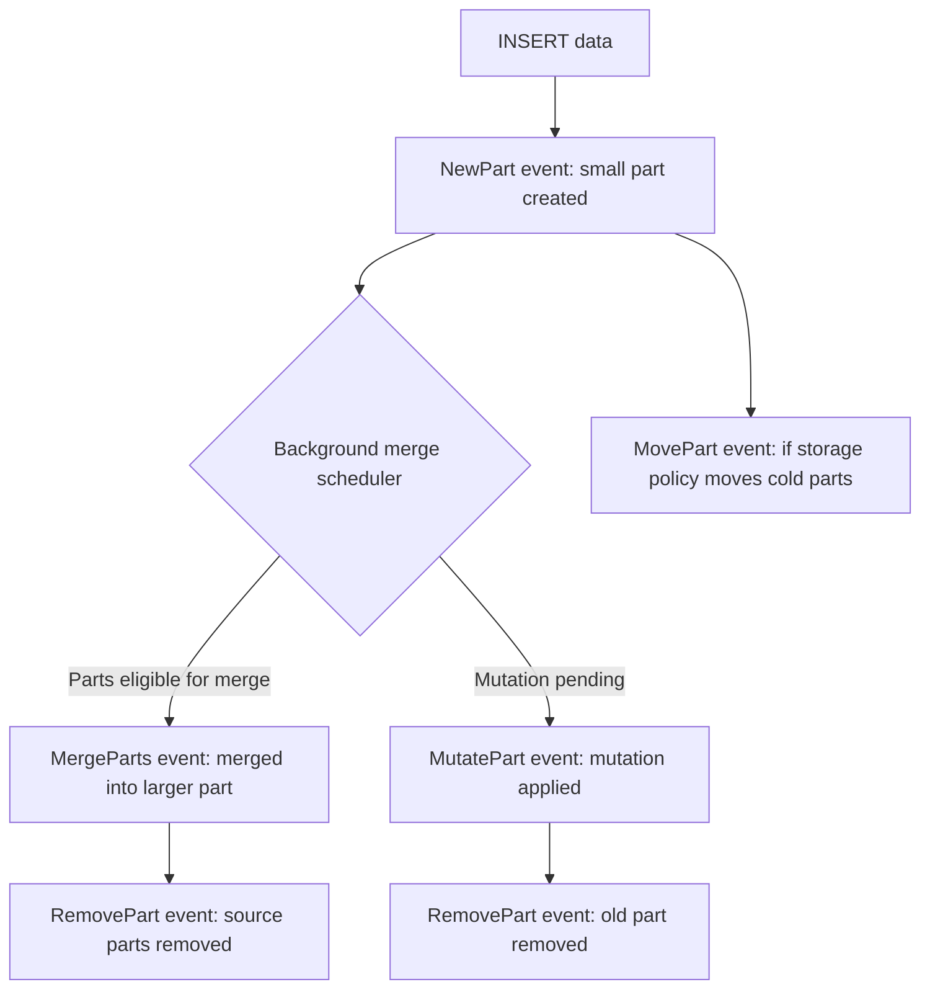

# How to Use system.part_log in ClickHouse

Author: [nawazdhandala](https://www.github.com/nawazdhandala)

Tags: ClickHouse, System, Monitoring, MergeTree, Logging

Description: Learn how to use system.part_log in ClickHouse to track part creation, merges, mutations, and removals for MergeTree table maintenance and debugging.

---

`system.part_log` records every significant event in the lifecycle of a MergeTree data part: when it is created by an INSERT, when it is merged with other parts, when it is removed, when a mutation is applied, and when it is moved between disks or volumes. It is the primary tool for understanding merge and compaction activity on your ClickHouse tables.

## Enabling part_log

Part logging is enabled by default. To verify or configure it in `config.xml`:

```xml
<part_log>
    <database>system</database>
    <table>part_log</table>
    <flush_interval_milliseconds>7500</flush_interval_milliseconds>
    <ttl>event_date + INTERVAL 30 DAY DELETE</ttl>
</part_log>
```

## Key Columns

| Column | Type | Description |
|--------|------|-------------|
| `event_type` | Enum | NewPart, MergeParts, DownloadPart, RemovePart, MutatePart, MovePart |
| `event_time` | DateTime | When the event occurred |
| `database` | String | Database name |
| `table` | String | Table name |
| `part_name` | String | Name of the data part |
| `partition_id` | String | Partition identifier |
| `rows` | UInt64 | Number of rows in the part |
| `size_in_bytes` | UInt64 | Compressed size of the part |
| `merged_from` | Array(String) | Source parts for a merge |
| `duration_ms` | UInt64 | Time taken for the operation |
| `error` | UInt16 | Error code (0 = success) |
| `exception` | String | Error message if operation failed |

## Part Event Lifecycle



## Monitoring Recent Merges

```sql
SELECT
    event_time,
    table,
    part_name,
    rows,
    formatReadableSize(size_in_bytes) AS size,
    duration_ms,
    length(merged_from)               AS parts_merged
FROM system.part_log
WHERE event_type = 'MergeParts'
  AND database = currentDatabase()
  AND event_date = today()
ORDER BY event_time DESC
LIMIT 20;
```

## Tracking INSERT Part Creation

```sql
SELECT
    toStartOfMinute(event_time) AS minute,
    count()                      AS new_parts,
    sum(rows)                    AS rows_inserted,
    formatReadableSize(sum(size_in_bytes)) AS data_size
FROM system.part_log
WHERE event_type = 'NewPart'
  AND table = 'events'
  AND event_date = today()
GROUP BY minute
ORDER BY minute;
```

## Finding Slow Merges

```sql
SELECT
    event_time,
    table,
    part_name,
    duration_ms,
    rows,
    formatReadableSize(size_in_bytes) AS size,
    arrayStringConcat(merged_from, ', ') AS source_parts
FROM system.part_log
WHERE event_type = 'MergeParts'
  AND duration_ms > 60000  -- Merges taking more than 1 minute
  AND event_date >= today() - 7
ORDER BY duration_ms DESC
LIMIT 20;
```

## Detecting Failed Merges

```sql
SELECT
    event_time,
    table,
    part_name,
    event_type,
    error,
    exception
FROM system.part_log
WHERE error != 0
  AND event_date >= today() - 7
ORDER BY event_time DESC;
```

## Merge Throughput by Table

```sql
SELECT
    table,
    countIf(event_type = 'NewPart')    AS insert_parts,
    countIf(event_type = 'MergeParts') AS merges,
    countIf(event_type = 'RemovePart') AS removed_parts,
    formatReadableSize(sumIf(size_in_bytes, event_type = 'MergeParts')) AS merged_bytes,
    round(avg(duration_ms), 0)         AS avg_merge_ms
FROM system.part_log
WHERE event_date >= today() - 7
  AND database = currentDatabase()
GROUP BY table
ORDER BY merged_bytes DESC;
```

## Mutation Tracking

```sql
SELECT
    event_time,
    table,
    part_name,
    duration_ms,
    rows,
    formatReadableSize(size_in_bytes) AS size
FROM system.part_log
WHERE event_type = 'MutatePart'
  AND table = 'events'
  AND event_date >= today() - 30
ORDER BY event_time DESC;
```

## Part Movement Between Volumes

```sql
SELECT
    event_time,
    table,
    part_name,
    formatReadableSize(size_in_bytes) AS size
FROM system.part_log
WHERE event_type = 'MovePart'
  AND event_date >= today() - 7
ORDER BY event_time DESC;
```

## Summary

`system.part_log` is the authoritative source for MergeTree part lifecycle events in ClickHouse. Use it to monitor merge rates, detect failed merges, track INSERT part creation frequency, observe mutation progress, and understand storage tiering moves. It is especially valuable when diagnosing "too many parts" warnings or investigating why background merges are slow or stalled.
