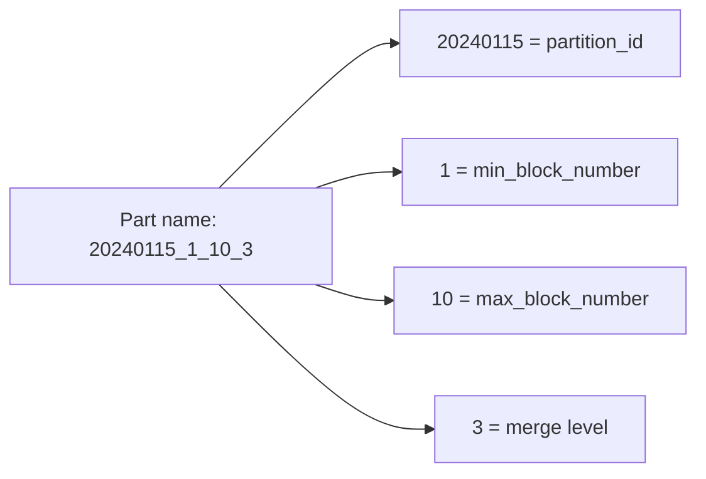

# How to Use system.parts in ClickHouse for Part Analysis

Author: [nawazdhandala](https://www.github.com/nawazdhandala)

Tags: ClickHouse, System, MergeTree, Storage, Monitoring

Description: Learn how to use system.parts in ClickHouse to analyze data part structure, diagnose too-many-parts issues, measure compression, and plan storage optimizations.

---

`system.parts` lists every data part across all MergeTree-family tables on the server. A data part is an immutable directory of column files created by an INSERT and progressively merged into larger parts by background merges. Understanding part structure is fundamental to diagnosing performance issues, storage inefficiencies, and merge behavior in ClickHouse.

## Key Columns

| Column | Type | Description |
|--------|------|-------------|
| `database` | String | Database name |
| `table` | String | Table name |
| `name` | String | Part name (encodes partition, min/max block numbers, level) |
| `active` | UInt8 | 1 = part is live, 0 = part is pending removal |
| `partition` | String | Partition key value |
| `partition_id` | String | Internal partition identifier |
| `rows` | UInt64 | Row count in this part |
| `data_compressed_bytes` | UInt64 | On-disk compressed size |
| `data_uncompressed_bytes` | UInt64 | Logical uncompressed size |
| `marks` | UInt64 | Number of granules (marks) |
| `level` | UInt32 | Merge level (0 = fresh insert, higher = more merges) |
| `min_time` | DateTime | Minimum value of the first DateTime ORDER BY column |
| `max_time` | DateTime | Maximum value of the first DateTime ORDER BY column |
| `disk_name` | String | Which disk this part lives on |
| `path` | String | Filesystem path |
| `modification_time` | DateTime | When the part directory was last modified |

## Viewing Active Parts for a Table

```sql
SELECT
    partition,
    name,
    rows,
    level,
    formatReadableSize(data_compressed_bytes)   AS compressed,
    formatReadableSize(data_uncompressed_bytes) AS uncompressed,
    round(data_uncompressed_bytes / data_compressed_bytes, 2) AS ratio
FROM system.parts
WHERE table = 'events'
  AND database = currentDatabase()
  AND active = 1
ORDER BY partition, name;
```

## Part Name Anatomy



A level of 0 means the part was just inserted. A level of 3 means it has been merged 3 times.

## Diagnosing Too Many Parts

ClickHouse warns "Too many parts" when a partition has more than `parts_to_throw_insert` parts (default: 300). Find problematic partitions:

```sql
SELECT
    database,
    table,
    partition,
    count()                                        AS part_count,
    sum(rows)                                      AS total_rows,
    formatReadableSize(sum(data_compressed_bytes)) AS total_size
FROM system.parts
WHERE active = 1
GROUP BY database, table, partition
HAVING part_count > 50
ORDER BY part_count DESC;
```

## Compression Ratio by Table

```sql
SELECT
    table,
    count()                                            AS part_count,
    formatReadableSize(sum(data_compressed_bytes))    AS compressed,
    formatReadableSize(sum(data_uncompressed_bytes))  AS uncompressed,
    round(sum(data_uncompressed_bytes) / sum(data_compressed_bytes), 2) AS ratio
FROM system.parts
WHERE active = 1
  AND database = currentDatabase()
GROUP BY table
ORDER BY sum(data_compressed_bytes) DESC;
```

## Parts by Merge Level Distribution

```sql
SELECT
    table,
    level,
    count() AS parts_at_level,
    sum(rows) AS total_rows
FROM system.parts
WHERE active = 1
  AND database = currentDatabase()
GROUP BY table, level
ORDER BY table, level;
```

High counts at level 0 indicate that background merges are not keeping up with inserts.

## Parts per Disk (Tiered Storage)

```sql
SELECT
    disk_name,
    table,
    count()                                            AS parts,
    formatReadableSize(sum(data_compressed_bytes))    AS size
FROM system.parts
WHERE active = 1
  AND database = currentDatabase()
GROUP BY disk_name, table
ORDER BY disk_name, size DESC;
```

## Finding the Oldest Parts

```sql
SELECT
    table,
    name,
    modification_time,
    rows,
    formatReadableSize(data_compressed_bytes) AS size
FROM system.parts
WHERE active = 1
  AND database = currentDatabase()
ORDER BY modification_time
LIMIT 10;
```

## Inactive Parts Pending Removal

```sql
SELECT
    table,
    name,
    rows,
    formatReadableSize(data_compressed_bytes) AS size,
    modification_time
FROM system.parts
WHERE active = 0
  AND database = currentDatabase()
ORDER BY modification_time DESC
LIMIT 20;
```

Inactive parts are cleaned up automatically. If they persist for more than `old_parts_lifetime` seconds (default: 480 seconds), investigate for cleanup failures.

## Forcing a Merge

If too many parts are accumulating, trigger a manual merge:

```sql
-- Merge all parts in a table into one part per partition
OPTIMIZE TABLE events FINAL;

-- Merge a specific partition
OPTIMIZE TABLE events PARTITION '20240115';
```

## Summary

`system.parts` is the foundation for understanding MergeTree storage in ClickHouse. Use it to count active parts per partition (diagnosing too-many-parts), measure compression ratios, inspect merge levels, monitor tiered storage distribution, and locate old or inactive parts. Combine it with `OPTIMIZE TABLE` and background merge monitoring via `system.merges` and `system.part_log` for complete storage lifecycle management.
