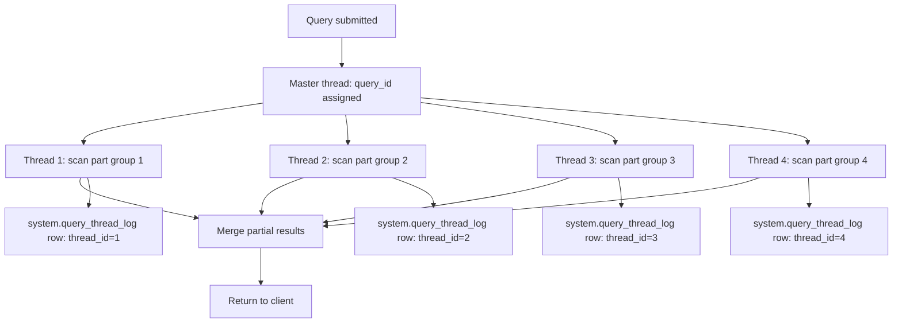

# How to Use system.query_thread_log in ClickHouse

Author: [nawazdhandala](https://www.github.com/nawazdhandala)

Tags: ClickHouse, System, Monitoring, Thread, Logging

Description: Learn how to use system.query_thread_log in ClickHouse to profile individual query threads, identify parallelism bottlenecks, and analyze per-thread resource usage.

---

`system.query_thread_log` extends `system.query_log` by logging one row per execution thread per query, rather than one row per query. When ClickHouse executes a query, it typically spawns multiple threads to scan data in parallel. This table lets you see exactly how much work each thread performed, how long it ran, and whether thread-level imbalances are causing performance problems.

## Enabling Thread Logging

Thread logging is controlled by the query-level setting `log_query_threads`:

```sql
SET log_query_threads = 1;  -- Enable per-thread logging (default: 1)
SET log_queries = 1;        -- Also log to system.query_log
```

You can also enable it for a user profile in `users.xml`:

```xml
<profiles>
  <default>
    <log_query_threads>1</log_query_threads>
  </default>
</profiles>
```

## Key Columns

| Column | Type | Description |
|--------|------|-------------|
| `query_id` | String | Links to `system.query_log` |
| `thread_id` | UInt64 | OS thread ID |
| `thread_name` | String | Internal thread name |
| `master_thread_id` | UInt64 | Parent thread ID |
| `query_start_time` | DateTime | When the query started |
| `query_duration_ms` | UInt64 | Total query duration |
| `read_rows` | UInt64 | Rows read by this thread |
| `read_bytes` | UInt64 | Bytes read by this thread |
| `written_rows` | UInt64 | Rows written by this thread |
| `memory_usage` | Int64 | Memory delta for this thread |
| `peak_memory_usage` | Int64 | Peak memory for this thread |
| `ProfileEvents` | Map(String, UInt64) | Per-thread profiling counters |

## Inspecting Thread-Level Work for a Query

```sql
SELECT
    thread_id,
    thread_name,
    read_rows,
    formatReadableSize(read_bytes)       AS bytes_read,
    formatReadableSize(peak_memory_usage) AS peak_memory,
    query_duration_ms
FROM system.query_thread_log
WHERE query_id = 'your-query-id-here'
ORDER BY read_rows DESC;
```

## Detecting Thread Imbalance

If some threads read far more rows than others, your data is not evenly distributed across parts:

```sql
SELECT
    query_id,
    count()           AS thread_count,
    max(read_rows)    AS max_rows_per_thread,
    min(read_rows)    AS min_rows_per_thread,
    avg(read_rows)    AS avg_rows_per_thread,
    max(read_rows) / avg(read_rows) AS imbalance_ratio
FROM system.query_thread_log
WHERE event_date = today()
  AND read_rows > 0
GROUP BY query_id
HAVING imbalance_ratio > 2
ORDER BY imbalance_ratio DESC
LIMIT 20;
```

## Thread Hierarchy



## Aggregated Thread Stats per Query

```sql
SELECT
    q.query_id,
    q.query_duration_ms,
    t.thread_count,
    formatReadableSize(t.total_bytes)   AS total_bytes_read,
    formatReadableSize(t.peak_memory)   AS peak_memory
FROM system.query_log q
JOIN (
    SELECT
        query_id,
        count()              AS thread_count,
        sum(read_bytes)      AS total_bytes,
        max(peak_memory_usage) AS peak_memory
    FROM system.query_thread_log
    WHERE event_date = today()
    GROUP BY query_id
) t ON q.query_id = t.query_id
WHERE q.type = 'QueryFinish'
  AND q.event_date = today()
  AND q.query_duration_ms > 1000
ORDER BY q.query_duration_ms DESC
LIMIT 20;
```

## Per-Thread CPU Time

```sql
SELECT
    thread_id,
    thread_name,
    ProfileEvents['UserTimeMicroseconds']   AS user_cpu_us,
    ProfileEvents['SystemTimeMicroseconds'] AS sys_cpu_us,
    ProfileEvents['RealTimeMicroseconds']   AS real_us,
    read_rows
FROM system.query_thread_log
WHERE query_id = 'your-query-id-here'
ORDER BY user_cpu_us DESC;
```

## Flushing and Retention

```sql
-- Force flush pending rows
SYSTEM FLUSH LOGS;

-- Set retention
ALTER TABLE system.query_thread_log MODIFY TTL event_date + INTERVAL 14 DAY DELETE;
```

Or configure in `config.xml`:

```xml
<query_thread_log>
    <database>system</database>
    <table>query_thread_log</table>
    <flush_interval_milliseconds>7500</flush_interval_milliseconds>
    <ttl>event_date + INTERVAL 14 DAY DELETE</ttl>
</query_thread_log>
```

## Summary

`system.query_thread_log` provides thread-level execution detail that `system.query_log` cannot offer. Use it to detect thread imbalances, measure per-thread CPU and memory usage, and understand how ClickHouse parallelizes a specific query. Pair it with `system.query_log` via `query_id` to correlate thread-level data with overall query performance metrics.
