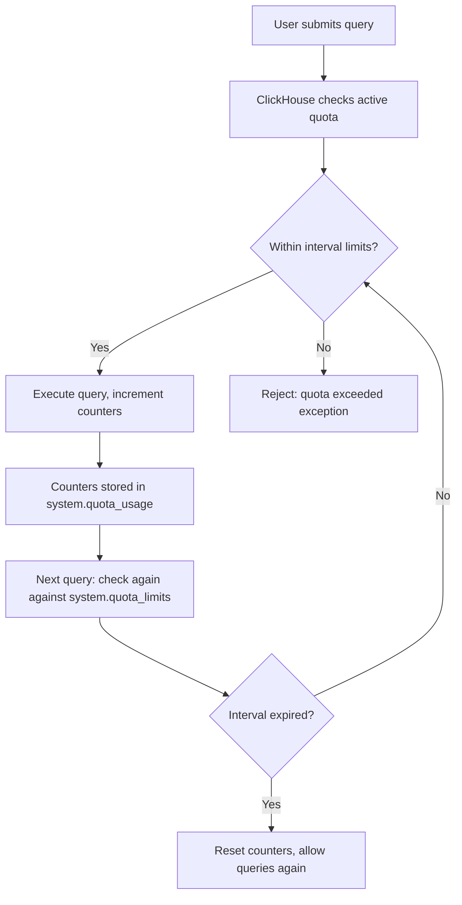

# How to Use system.quota_limits in ClickHouse

Author: [nawazdhandala](https://www.github.com/nawazdhandala)

Tags: ClickHouse, System, Quota, Security, Monitoring

Description: Learn how to use system.quota_limits in ClickHouse to inspect configured quota constraints, understand per-interval resource limits, and audit user access controls.

---

`system.quota_limits` shows the resource limits configured for each quota definition in ClickHouse. Quotas limit how much a user can consume over a time interval (queries executed, rows read, execution time, etc.). While `system.quotas` shows the quota definitions and `system.quota_usage` shows current consumption, `system.quota_limits` shows the threshold values that trigger quota enforcement.

## What Are Quotas

Quotas in ClickHouse are named resource budgets applied to users or IP addresses. A quota defines one or more time intervals (e.g., 1 hour, 1 day) with limits on:

- Number of queries
- Number of errors
- Result rows returned
- Data read
- Execution time

When a user exhausts any limit within the interval, subsequent queries are rejected until the interval resets.

## Key Columns

| Column | Type | Description |
|--------|------|-------------|
| `quota_name` | String | Quota name as defined in config |
| `duration` | UInt64 | Interval duration in seconds |
| `is_randomized_interval` | UInt8 | 1 if interval start is randomized per user |
| `max_queries` | Nullable(UInt64) | Maximum queries per interval |
| `max_query_selects` | Nullable(UInt64) | Maximum SELECT queries per interval |
| `max_query_inserts` | Nullable(UInt64) | Maximum INSERT queries per interval |
| `max_errors` | Nullable(UInt64) | Maximum errors per interval |
| `max_result_rows` | Nullable(UInt64) | Maximum result rows returned |
| `max_result_bytes` | Nullable(UInt64) | Maximum result bytes returned |
| `max_read_rows` | Nullable(UInt64) | Maximum rows read from storage |
| `max_read_bytes` | Nullable(UInt64) | Maximum bytes read from storage |
| `max_execution_time` | Nullable(Float64) | Maximum cumulative execution time in seconds |
| `max_written_bytes` | Nullable(UInt64) | Maximum bytes written |

## Viewing All Quota Limits

```sql
SELECT
    quota_name,
    duration,
    max_queries,
    max_errors,
    max_read_rows,
    formatReadableSize(max_read_bytes) AS max_read_size,
    max_execution_time
FROM system.quota_limits
ORDER BY quota_name, duration;
```

## Quota Enforcement Flow



## Example Quota Configuration in users.xml

```xml
<quotas>
    <default>
        <interval>
            <duration>3600</duration>
            <queries>10000</queries>
            <errors>500</errors>
            <result_rows>1000000000</result_rows>
            <read_rows>100000000000</read_rows>
            <execution_time>36000</execution_time>
        </interval>
        <interval>
            <duration>86400</duration>
            <queries>100000</queries>
            <read_rows>1000000000000</read_rows>
        </interval>
    </default>
    <readonly_quota>
        <interval>
            <duration>3600</duration>
            <queries>1000</queries>
            <errors>50</errors>
            <result_rows>10000000</result_rows>
            <read_rows>10000000000</read_rows>
            <execution_time>600</execution_time>
        </interval>
    </readonly_quota>
</quotas>
```

Or via SQL (ClickHouse 22.4+):

```sql
CREATE QUOTA analytics_hourly
    FOR INTERVAL 1 HOUR
        MAX queries = 5000,
        MAX read_rows = 50000000000,
        MAX execution_time = 7200
    TO analytics_user;
```

## Creating Quotas via SQL

```sql
-- Create a quota for a dashboard service account
CREATE QUOTA dashboard_quota
    FOR RANDOMIZED INTERVAL 1 HOUR
        MAX queries = 2000,
        MAX read_rows = 10000000000,
        MAX result_rows = 100000000,
        MAX execution_time = 3600
    TO dashboard_user;

-- Verify it appears in quota_limits
SELECT quota_name, duration, max_queries, max_read_rows, max_execution_time
FROM system.quota_limits
WHERE quota_name = 'dashboard_quota';
```

## Comparing Quotas Across Users

```sql
SELECT
    q.quota_name,
    ql.duration,
    ql.max_queries,
    ql.max_read_rows,
    formatReadableSize(ql.max_read_bytes) AS max_read_size,
    ql.max_execution_time
FROM system.quotas q
JOIN system.quota_limits ql ON q.name = ql.quota_name
ORDER BY q.quota_name, ql.duration;
```

## Viewing Current Quota Usage

```sql
SELECT
    quota_name,
    quota_key,
    start_time,
    duration,
    queries,
    errors,
    read_rows,
    formatReadableSize(read_bytes) AS bytes_read,
    execution_time
FROM system.quota_usage
ORDER BY quota_name, start_time;
```

## Alerting on Near-Quota Usage

```sql
SELECT
    u.quota_name,
    u.quota_key,
    u.queries,
    l.max_queries,
    round(u.queries * 100.0 / l.max_queries, 1) AS usage_pct
FROM system.quota_usage u
JOIN system.quota_limits l
    ON u.quota_name = l.quota_name
    AND u.duration = l.duration
WHERE l.max_queries IS NOT NULL
  AND u.queries * 100.0 / l.max_queries > 80;
```

## Summary

`system.quota_limits` shows the threshold values for all configured ClickHouse quotas. Use it to audit resource limits across quota definitions, verify that limits are correctly configured, and build dashboards that show how close users are to their limits by joining with `system.quota_usage`. Define quotas using `users.xml` or SQL `CREATE QUOTA` statements and assign them to users or roles for effective multi-tenant resource governance.
