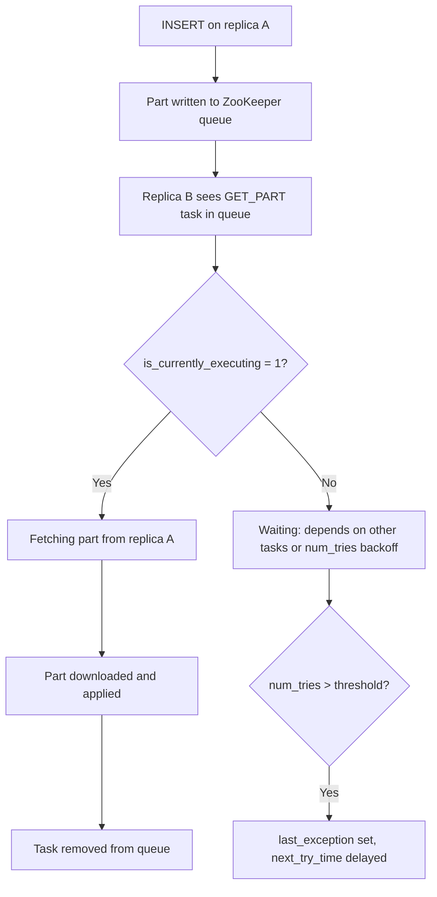

# How to Use system.replication_queue in ClickHouse

Author: [nawazdhandala](https://www.github.com/nawazdhandala)

Tags: ClickHouse, System, Replication, Queue, Monitoring

Description: Learn how to use system.replication_queue in ClickHouse to monitor pending replication tasks, detect stuck replication, and diagnose replica sync issues.

---

`system.replication_queue` shows all pending replication tasks for `ReplicatedMergeTree` tables across all databases on the current server. Replication tasks include fetching parts from other replicas, applying mutations, executing merges, and removing obsolete parts. Monitoring this table is essential for ensuring your replicated tables stay in sync.

## What Appears in the Queue

Every `ReplicatedMergeTree` replica watches a ZooKeeper (or ClickHouse Keeper) queue and processes tasks written there. Tasks flow from:

- **INSERT**: Other replicas fetch parts you inserted
- **MERGE**: All replicas execute the same merge independently
- **MUTATION**: Schema or data changes propagate to all replicas
- **DROP_RANGE**: Part removal from all replicas

## Key Columns

| Column | Type | Description |
|--------|------|-------------|
| `database` | String | Database name |
| `table` | String | Table name |
| `replica_name` | String | This replica's name |
| `position` | UInt32 | Queue position |
| `node_name` | String | ZooKeeper node name for this task |
| `type` | String | GET_PART, MERGE_PARTS, MUTATE_PART, DROP_RANGE, etc. |
| `create_time` | DateTime | When the task was created |
| `required_quorum` | UInt32 | Quorum required before marking done |
| `source_replica` | String | Replica that created this task |
| `new_part_name` | String | Target part name after the operation |
| `parts_to_merge` | Array(String) | Source parts for a merge task |
| `is_currently_executing` | UInt8 | 1 if this task is being processed now |
| `num_tries` | UInt32 | Number of failed attempts |
| `last_exception` | String | Last error message |
| `next_try_time` | DateTime | When next retry is scheduled |
| `num_postponed` | UInt32 | Times postponed due to dependencies |

## Viewing the Queue

```sql
SELECT
    database,
    table,
    type,
    create_time,
    is_currently_executing,
    num_tries,
    last_exception,
    new_part_name
FROM system.replication_queue
ORDER BY create_time
LIMIT 50;
```

## Replication Task Lifecycle



## Detecting Stuck Replication

```sql
SELECT
    database,
    table,
    type,
    create_time,
    num_tries,
    last_exception,
    dateDiff('minute', create_time, now()) AS age_minutes
FROM system.replication_queue
WHERE is_currently_executing = 0
  AND num_tries > 3
ORDER BY create_time
LIMIT 20;
```

## Queue Depth by Table

```sql
SELECT
    database,
    table,
    count()                                AS queue_depth,
    countIf(is_currently_executing = 1)   AS executing,
    max(num_tries)                         AS max_retries,
    min(create_time)                       AS oldest_task
FROM system.replication_queue
GROUP BY database, table
ORDER BY queue_depth DESC;
```

## Tasks with Errors

```sql
SELECT
    database,
    table,
    type,
    num_tries,
    last_exception,
    next_try_time,
    new_part_name
FROM system.replication_queue
WHERE last_exception != ''
ORDER BY num_tries DESC
LIMIT 20;
```

## Checking Merge Tasks

```sql
SELECT
    database,
    table,
    type,
    new_part_name,
    arrayStringConcat(parts_to_merge, ', ') AS sources,
    create_time,
    is_currently_executing
FROM system.replication_queue
WHERE type = 'MERGE_PARTS'
ORDER BY create_time;
```

## Mutation Tasks in Queue

```sql
SELECT
    database,
    table,
    type,
    new_part_name,
    num_tries,
    last_exception
FROM system.replication_queue
WHERE type = 'MUTATE_PART'
ORDER BY create_time;
```

## Forcing Queue Processing

If replication is stuck, you can trigger processing:

```sql
-- Restart the replication queue for a specific table
SYSTEM RESTART REPLICA default.my_replicated_table;

-- Sync this replica with ZooKeeper
SYSTEM SYNC REPLICA default.my_replicated_table;
```

## Summary

`system.replication_queue` is the live view of pending replication work on your ClickHouse replica. Monitor it to detect queue buildup, identify stuck tasks with high `num_tries`, and read `last_exception` to diagnose the root cause. Use `SYSTEM SYNC REPLICA` and `SYSTEM RESTART REPLICA` to recover from stuck states. Alert when `queue_depth` per table exceeds a threshold or when tasks older than a defined SLA remain unprocessed.
