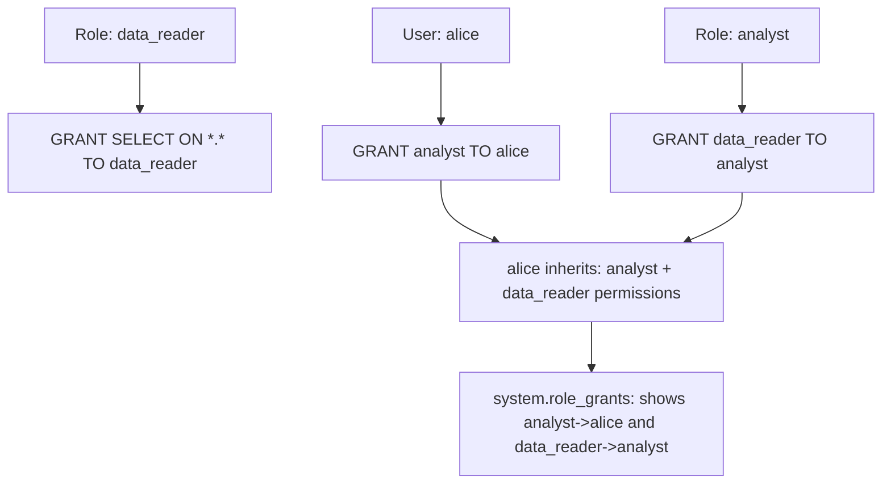

# How to Use system.role_grants in ClickHouse

Author: [nawazdhandala](https://www.github.com/nawazdhandala)

Tags: ClickHouse, System, Security, Role, Access Control

Description: Learn how to use system.role_grants in ClickHouse to audit which roles are assigned to users and other roles, and manage RBAC role hierarchies.

---

`system.role_grants` records all role-to-user and role-to-role assignments in ClickHouse's role-based access control (RBAC) system. When you grant a role to a user (`GRANT analyst_role TO alice`) or grant a role to another role (creating a role hierarchy), the assignment appears here. It is the primary audit table for understanding who has access to what through role inheritance.

## RBAC Model in ClickHouse



## Key Columns

| Column | Type | Description |
|--------|------|-------------|
| `grantee` | String | User or role that received the role |
| `grantee_type` | Enum | `user` or `role` |
| `role_name` | String | The role being granted |
| `with_admin_option` | UInt8 | 1 if grantee can grant this role to others |

## Viewing All Role Grants

```sql
SELECT
    grantee,
    grantee_type,
    role_name,
    with_admin_option
FROM system.role_grants
ORDER BY grantee_type, grantee, role_name;
```

## Roles Assigned to Users

```sql
SELECT
    grantee  AS username,
    role_name,
    with_admin_option
FROM system.role_grants
WHERE grantee_type = 'user'
ORDER BY username, role_name;
```

## Roles Assigned to Other Roles (Role Hierarchy)

```sql
SELECT
    role_name              AS parent_role,
    grantee                AS child_role,
    with_admin_option
FROM system.role_grants
WHERE grantee_type = 'role'
ORDER BY parent_role;
```

## Finding All Roles a User Has (Direct and Inherited)

ClickHouse does not provide a built-in recursive role resolution query, but you can do two levels:

```sql
-- Direct role grants to a user
SELECT role_name AS direct_role
FROM system.role_grants
WHERE grantee = 'alice' AND grantee_type = 'user';

-- Roles inherited through directly granted roles
SELECT rg2.role_name AS inherited_role
FROM system.role_grants rg1
JOIN system.role_grants rg2
    ON rg1.role_name = rg2.grantee
    AND rg2.grantee_type = 'role'
WHERE rg1.grantee = 'alice'
  AND rg1.grantee_type = 'user';
```

## Creating and Granting Roles

```sql
-- Create roles
CREATE ROLE data_reader;
CREATE ROLE analyst;
CREATE ROLE data_engineer;

-- Grant privileges to roles
GRANT SELECT ON default.* TO data_reader;
GRANT SELECT, INSERT ON default.* TO data_engineer;

-- Build role hierarchy
GRANT data_reader TO analyst;   -- analyst inherits data_reader

-- Assign roles to users
GRANT analyst TO alice;
GRANT data_engineer TO bob;
GRANT analyst, data_engineer TO charlie;

-- Verify in system.role_grants
SELECT grantee, grantee_type, role_name
FROM system.role_grants
ORDER BY grantee_type, grantee, role_name;
```

## Finding Users with Admin Option

The `WITH ADMIN OPTION` allows a user to grant the role to others:

```sql
SELECT grantee, grantee_type, role_name
FROM system.role_grants
WHERE with_admin_option = 1
ORDER BY grantee;
```

## Auditing Role Changes

`system.role_grants` reflects the current state. For historical change tracking, query `system.query_log` for DDL queries:

```sql
SELECT
    event_time,
    user,
    query
FROM system.query_log
WHERE type = 'QueryFinish'
  AND (
    query LIKE '%GRANT%TO%'
    OR query LIKE '%REVOKE%FROM%'
  )
  AND event_date >= today() - 30
ORDER BY event_time DESC
LIMIT 50;
```

## Revoking a Role

```sql
-- Revoke a role from a user
REVOKE analyst FROM alice;

-- Verify
SELECT grantee, role_name
FROM system.role_grants
WHERE grantee = 'alice';
```

## Related Tables

| Table | Content |
|-------|---------|
| `system.role_grants` | Role-to-user and role-to-role assignments |
| `system.grants` | Privilege grants (SELECT, INSERT, etc.) to users and roles |
| `system.roles` | List of all defined roles |
| `system.users` | List of all users |
| `system.current_roles` | Roles active in the current session |
| `system.enabled_roles` | All roles enabled for the current user |

## Summary

`system.role_grants` is the audit table for ClickHouse RBAC role assignments. Use it to see which roles are assigned to users, discover role hierarchies (roles granted to other roles), find users with admin option, and audit privilege propagation chains. Combine it with `system.grants` to understand the full privilege set a user has through their role assignments, and with `system.query_log` for historical change tracking.
