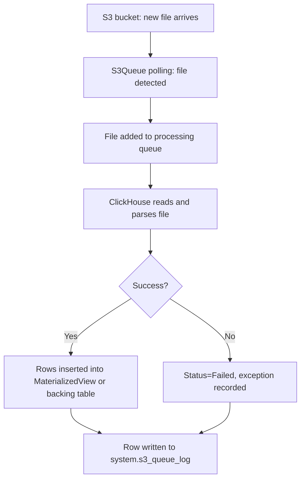

# How to Use system.s3_queue_log in ClickHouse

Author: [nawazdhandala](https://www.github.com/nawazdhandala)

Tags: ClickHouse, System, S3, Queue, Logging

Description: Learn how to use system.s3_queue_log in ClickHouse to monitor S3Queue table ingestion activity, track file processing status, and debug S3 ingestion errors.

---

`system.s3_queue_log` records the history of files processed by `S3Queue` engine tables. The `S3Queue` engine continuously polls an S3 bucket for new files and ingests them into ClickHouse. `system.s3_queue_log` provides an auditable record of every file that was processed, whether it succeeded, how many rows it contained, and what error occurred if it failed.

## Prerequisites: S3Queue Table

First, create an S3Queue table that ingests from S3:

```sql
CREATE TABLE events_s3_queue
(
    ts         DateTime,
    user_id    UInt64,
    event_type String,
    payload    String
)
ENGINE = S3Queue(
    's3://my-bucket/events/*.parquet',
    'Parquet'
)
SETTINGS
    mode = 'unordered',
    polling_min_timeout_ms = 1000,
    polling_max_timeout_ms = 10000,
    enable_logging_to_s3queue_log = 1;  -- Required for s3_queue_log entries
```

## Enabling s3_queue_log

Configure in `config.xml`:

```xml
<s3_queue_log>
    <database>system</database>
    <table>s3_queue_log</table>
    <flush_interval_milliseconds>7500</flush_interval_milliseconds>
    <ttl>event_date + INTERVAL 30 DAY DELETE</ttl>
</s3_queue_log>
```

Also set `enable_logging_to_s3queue_log = 1` on the S3Queue table (shown above).

## Key Columns

| Column | Type | Description |
|--------|------|-------------|
| `event_date` | Date | Date of the processing event |
| `event_time` | DateTime | When file processing completed |
| `database` | String | Database of the S3Queue table |
| `table` | String | S3Queue table name |
| `file_name` | String | S3 path of the processed file |
| `rows_processed` | UInt64 | Rows successfully ingested |
| `status` | Enum | Processed, Failed |
| `processing_start_time` | DateTime | When processing started |
| `processing_end_time` | DateTime | When processing finished |
| `exception` | String | Error message if status = 'Failed' |

## Viewing Recent File Processing Activity

```sql
SELECT
    event_time,
    file_name,
    rows_processed,
    status,
    dateDiff('second', processing_start_time, processing_end_time) AS duration_s
FROM system.s3_queue_log
WHERE table = 'events_s3_queue'
  AND event_date = today()
ORDER BY event_time DESC
LIMIT 30;
```

## File Processing Pipeline



## Monitoring Failed Files

```sql
SELECT
    event_time,
    file_name,
    exception
FROM system.s3_queue_log
WHERE status = 'Failed'
  AND event_date >= today() - 7
ORDER BY event_time DESC
LIMIT 50;
```

## Daily Ingestion Summary

```sql
SELECT
    event_date,
    table,
    count()                                        AS files_processed,
    countIf(status = 'Failed')                    AS failed_files,
    sum(rows_processed)                            AS total_rows,
    avg(dateDiff('second', processing_start_time, processing_end_time)) AS avg_duration_s
FROM system.s3_queue_log
WHERE event_date >= today() - 30
GROUP BY event_date, table
ORDER BY event_date DESC;
```

## Files That Took the Longest to Process

```sql
SELECT
    file_name,
    rows_processed,
    status,
    dateDiff('second', processing_start_time, processing_end_time) AS duration_s
FROM system.s3_queue_log
WHERE event_date >= today() - 7
  AND status = 'Processed'
ORDER BY duration_s DESC
LIMIT 20;
```

## Throughput: Rows Ingested Per Hour

```sql
SELECT
    toStartOfHour(event_time)  AS hour,
    sum(rows_processed)        AS rows_ingested,
    count()                    AS files_processed,
    countIf(status = 'Failed') AS failed_files
FROM system.s3_queue_log
WHERE event_date >= today() - 3
  AND table = 'events_s3_queue'
GROUP BY hour
ORDER BY hour;
```

## Checking Queue Status via system.s3_queue

In addition to `s3_queue_log`, you can inspect the live queue state:

```sql
-- Shows files currently queued or in processing
SELECT *
FROM system.s3_queue
WHERE table = 'events_s3_queue'
ORDER BY last_processed_timestamp DESC
LIMIT 20;
```

## Alerting on High Failure Rate

```sql
SELECT
    table,
    countIf(status = 'Failed') AS failed,
    count()                    AS total,
    round(countIf(status = 'Failed') * 100.0 / count(), 2) AS failure_rate_pct
FROM system.s3_queue_log
WHERE event_date = today()
GROUP BY table
HAVING failure_rate_pct > 5;
```

## Summary

`system.s3_queue_log` is the audit log for S3Queue table ingestion. It records every file processed, its row count, processing duration, and any errors. Use it to monitor ingestion health, detect failed files, measure throughput, and diagnose parsing or schema errors. Enable it by setting `enable_logging_to_s3queue_log = 1` on your S3Queue table and configuring the `s3_queue_log` section in `config.xml`.
