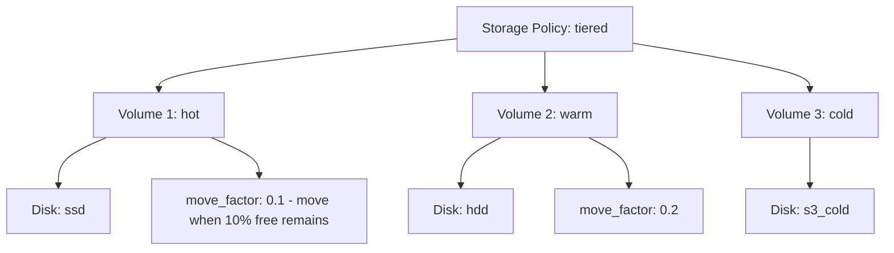

# How to Use system.storage_policies in ClickHouse

Author: [nawazdhandala](https://www.github.com/nawazdhandala)

Tags: ClickHouse, System, Storage, Policy, Monitoring

Description: Learn how to use system.storage_policies in ClickHouse to inspect tiered storage policies, volume configurations, and disk move conditions for MergeTree tables.

---

`system.storage_policies` exposes the configured storage policies defined in ClickHouse's `storage_configuration` section. A storage policy defines one or more volumes, where each volume contains one or more disks. Data written to a MergeTree table with a storage policy can be automatically moved between volumes (hot-to-warm-to-cold) based on space usage thresholds. Monitoring this table helps you verify that tiered storage is configured and functioning correctly.

## Understanding Storage Policy Structure



## Key Columns

| Column | Type | Description |
|--------|------|-------------|
| `policy_name` | String | Policy name as defined in config |
| `volume_name` | String | Volume name within the policy |
| `volume_priority` | UInt64 | Volume order (lower = higher priority/hotter) |
| `disks` | Array(String) | Disk names assigned to this volume |
| `volume_type` | String | JBOD or RAID-like |
| `max_data_part_size` | UInt64 | Max part size before moving to next volume (0 = unlimited) |
| `move_factor` | Float64 | Free space ratio that triggers moving parts to next volume |
| `prefer_not_to_merge` | UInt8 | If 1, avoid merging parts on this volume |
| `perform_ttl_move_on_insert` | UInt8 | If 1, move on INSERT based on TTL rules |
| `load_balancing` | String | How disks within a volume are selected |

## Viewing All Storage Policies

```sql
SELECT
    policy_name,
    volume_name,
    volume_priority,
    disks,
    move_factor,
    max_data_part_size
FROM system.storage_policies
ORDER BY policy_name, volume_priority;
```

## Example Configuration in config.xml

```xml
<storage_configuration>
    <disks>
        <ssd><path>/mnt/ssd/clickhouse/</path></ssd>
        <hdd><path>/mnt/hdd/clickhouse/</path></hdd>
        <s3_archive>
            <type>s3</type>
            <endpoint>https://s3.amazonaws.com/my-archive/clickhouse/</endpoint>
        </s3_archive>
    </disks>
    <policies>
        <tiered>
            <volumes>
                <hot>
                    <disk>ssd</disk>
                    <max_data_part_size_bytes>1073741824</max_data_part_size_bytes>
                </hot>
                <warm>
                    <disk>hdd</disk>
                    <move_factor>0.2</move_factor>
                </warm>
                <cold>
                    <disk>s3_archive</disk>
                </cold>
            </volumes>
        </tiered>
    </policies>
</storage_configuration>
```

## Checking Policy Disk Assignment

```sql
SELECT
    policy_name,
    volume_name,
    arrayStringConcat(disks, ', ') AS disk_list,
    move_factor
FROM system.storage_policies
ORDER BY policy_name, volume_priority;
```

## Which Tables Use Which Policy

```sql
SELECT
    t.database,
    t.name,
    t.engine,
    extractAll(t.create_table_query, 'storage_policy = \'([^\']+)\'')[1] AS policy
FROM system.tables t
WHERE t.engine LIKE '%MergeTree%'
  AND t.create_table_query LIKE '%storage_policy%'
ORDER BY policy, t.name;
```

## Applying a Storage Policy to a Table

```sql
CREATE TABLE events
(
    ts     DateTime,
    user_id UInt64,
    payload String
)
ENGINE = MergeTree()
ORDER BY ts
SETTINGS storage_policy = 'tiered';
```

Or change an existing table:

```sql
ALTER TABLE events
    MODIFY SETTING storage_policy = 'tiered';
```

## Viewing Space on Each Volume's Disks

```sql
SELECT
    sp.policy_name,
    sp.volume_name,
    d.name          AS disk,
    d.type          AS disk_type,
    formatReadableSize(d.free_space)  AS free,
    formatReadableSize(d.total_space) AS total
FROM system.storage_policies sp
JOIN system.disks d ON has(sp.disks, d.name)
ORDER BY sp.policy_name, sp.volume_priority, d.name;
```

## TTL-Based Data Movement

Storage policies work with table-level TTL rules to move old data automatically:

```sql
CREATE TABLE events_tiered
(
    ts      DateTime,
    payload String
)
ENGINE = MergeTree()
ORDER BY ts
TTL ts + INTERVAL 7 DAY TO VOLUME 'warm',
    ts + INTERVAL 30 DAY TO VOLUME 'cold'
SETTINGS storage_policy = 'tiered';
```

## Default Policy

Every ClickHouse server has a built-in `default` policy with a single volume pointing to the default disk:

```sql
SELECT policy_name, volume_name, disks
FROM system.storage_policies
WHERE policy_name = 'default';
```

## Summary

`system.storage_policies` describes your tiered storage configuration: how volumes are ordered, which disks belong to each volume, what move factors trigger automatic data migration, and what part size limits apply. Use it alongside `system.disks` (for space tracking) and `system.parts` (for actual data distribution) to verify that hot-warm-cold tiering is configured correctly and that data is moving as expected based on your TTL and space rules.
