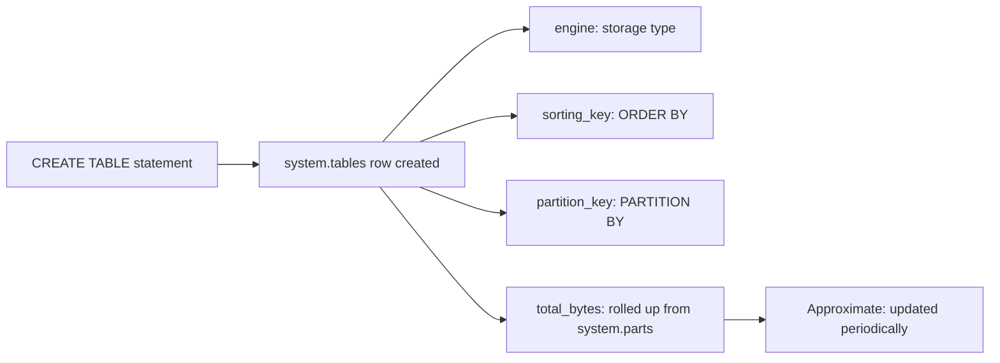

# How to Use system.tables in ClickHouse

Author: [nawazdhandala](https://www.github.com/nawazdhandala)

Tags: ClickHouse, System, Metadata, Table, Monitoring

Description: Learn how to use system.tables in ClickHouse to inspect table metadata, discover engines, check sizes, and audit schema across all databases.

---

`system.tables` contains one row for every table (and view, materialized view, and dictionary) in every database on the ClickHouse server. It is the primary catalog table for schema introspection, size reporting, and table discovery across all databases.

## Key Columns

| Column | Type | Description |
|--------|------|-------------|
| `database` | String | Database name |
| `name` | String | Table name |
| `engine` | String | Storage engine (MergeTree, Kafka, View, etc.) |
| `engine_full` | String | Full engine definition with settings |
| `create_table_query` | String | DDL for the table |
| `partition_key` | String | Partition expression |
| `sorting_key` | String | ORDER BY expression |
| `primary_key` | String | PRIMARY KEY expression |
| `sampling_key` | String | SAMPLE BY expression |
| `total_rows` | Nullable(UInt64) | Approximate total row count |
| `total_bytes` | Nullable(UInt64) | On-disk compressed bytes |
| `lifetime_rows` | Nullable(UInt64) | Total rows ever written |
| `lifetime_bytes` | Nullable(UInt64) | Total bytes ever written |
| `metadata_modification_time` | DateTime | Last schema change time |
| `has_own_data` | UInt8 | 1 = stores data, 0 = view or external engine |
| `comment` | String | Table comment |

## Listing All Tables in a Database

```sql
SELECT
    name,
    engine,
    formatReadableSize(total_bytes) AS size,
    total_rows
FROM system.tables
WHERE database = 'default'
  AND has_own_data = 1
ORDER BY total_bytes DESC;
```

## Finding the Largest Tables

```sql
SELECT
    database,
    name,
    engine,
    formatReadableSize(total_bytes)  AS disk_size,
    total_rows,
    metadata_modification_time       AS last_modified
FROM system.tables
WHERE has_own_data = 1
ORDER BY total_bytes DESC
LIMIT 20;
```

## Tables by Engine Type

```sql
SELECT
    engine,
    count()                                    AS table_count,
    formatReadableSize(sum(total_bytes))       AS total_size
FROM system.tables
WHERE has_own_data = 1
GROUP BY engine
ORDER BY table_count DESC;
```

## Table Metadata Overview



## Inspecting Table DDL

```sql
SELECT create_table_query
FROM system.tables
WHERE database = 'default'
  AND name = 'events'
FORMAT Vertical;
```

## Finding Tables with TTL

```sql
SELECT
    database,
    name,
    engine,
    create_table_query
FROM system.tables
WHERE create_table_query LIKE '%TTL%'
  AND has_own_data = 1
ORDER BY database, name;
```

## Tables Modified Recently

```sql
SELECT
    database,
    name,
    engine,
    metadata_modification_time
FROM system.tables
WHERE metadata_modification_time > now() - INTERVAL 24 HOUR
ORDER BY metadata_modification_time DESC;
```

## Finding Views and Materialized Views

```sql
-- Regular views
SELECT database, name
FROM system.tables
WHERE engine = 'View'
ORDER BY database, name;

-- Materialized views
SELECT database, name, engine_full
FROM system.tables
WHERE engine = 'MaterializedView'
ORDER BY database, name;
```

## Tables Without Comments

```sql
SELECT database, name, engine
FROM system.tables
WHERE has_own_data = 1
  AND (comment = '' OR comment IS NULL)
  AND database NOT IN ('system', 'information_schema', 'INFORMATION_SCHEMA')
ORDER BY database, name;
```

## Checking Sorting and Partition Keys

```sql
SELECT
    database,
    name,
    partition_key,
    sorting_key,
    primary_key,
    sampling_key
FROM system.tables
WHERE engine LIKE '%MergeTree%'
  AND database = 'default'
ORDER BY name;
```

## Total Storage by Database

```sql
SELECT
    database,
    count()                                   AS table_count,
    formatReadableSize(sum(total_bytes))      AS total_size,
    sum(total_rows)                           AS total_rows
FROM system.tables
WHERE has_own_data = 1
GROUP BY database
ORDER BY sum(total_bytes) DESC;
```

## Summary

`system.tables` is the catalog for all ClickHouse tables, views, and dictionaries. Use it to discover tables by engine type, report on storage sizes, inspect DDL, find tables with TTL policies, and audit schema across databases. It is a lightweight read that does not scan data -- sizes are pre-aggregated from part metadata. Combine it with `system.columns` and `system.parts` for complete schema and storage analysis.
