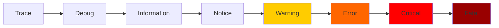

# How to Use system.text_log in ClickHouse

Author: [nawazdhandala](https://www.github.com/nawazdhandala)

Tags: ClickHouse, System, Logging, Monitoring, Debug

Description: Learn how to use system.text_log in ClickHouse to query server log messages directly via SQL, filter by level, and correlate logs with query activity.

---

`system.text_log` exposes ClickHouse's internal server log messages as a queryable SQL table. Instead of grepping log files, you can filter, aggregate, and correlate log entries using SQL. This is especially useful on managed ClickHouse instances where you cannot access the filesystem, or when you want to combine log data with query metadata from other system tables.

## Enabling text_log

Configure in `config.xml`:

```xml
<text_log>
    <database>system</database>
    <table>text_log</table>
    <flush_interval_milliseconds>7500</flush_interval_milliseconds>
    <level>warning</level>  <!-- Minimum level to store: trace/debug/information/warning/error/fatal -->
    <ttl>event_date + INTERVAL 7 DAY DELETE</ttl>
</text_log>
```

Setting `<level>warning</level>` captures only Warning, Error, and Fatal messages. Use `<level>trace</level>` for full verbosity (generates very high write volume on busy servers).

## Key Columns

| Column | Type | Description |
|--------|------|-------------|
| `event_time` | DateTime | When the message was logged |
| `event_time_microseconds` | DateTime64 | Microsecond-precision timestamp |
| `thread_id` | UInt64 | OS thread that logged the message |
| `level` | Enum | Fatal, Critical, Error, Warning, Notice, Information, Debug, Trace |
| `logger_name` | String | Internal component name (e.g., `MergeTreeReader`) |
| `message` | String | Log message text |
| `source_file` | String | Source file path |
| `source_line` | UInt64 | Line number in source file |

## Viewing Recent Warnings and Errors

```sql
SELECT
    event_time,
    level,
    logger_name,
    message
FROM system.text_log
WHERE event_date = today()
  AND level IN ('Warning', 'Error', 'Fatal', 'Critical')
ORDER BY event_time DESC
LIMIT 50;
```

## Filtering by Logger Component

```sql
-- See all messages from the replication subsystem
SELECT
    event_time,
    level,
    message
FROM system.text_log
WHERE logger_name LIKE '%Replica%'
  AND event_date >= today() - 3
ORDER BY event_time DESC
LIMIT 30;
```

## Log Level Hierarchy



## Searching for Specific Error Messages

```sql
SELECT
    event_time,
    logger_name,
    message
FROM system.text_log
WHERE message LIKE '%Too many parts%'
  AND event_date >= today() - 7
ORDER BY event_time DESC;
```

## Most Active Log Sources

```sql
SELECT
    logger_name,
    countIf(level = 'Warning') AS warnings,
    countIf(level = 'Error')   AS errors,
    count()                    AS total
FROM system.text_log
WHERE event_date = today()
GROUP BY logger_name
ORDER BY errors DESC, warnings DESC
LIMIT 20;
```

## Correlating Log Messages with Queries

```sql
-- Find log messages that occurred during a specific query's execution window
SELECT
    t.event_time,
    t.level,
    t.logger_name,
    t.message
FROM system.text_log t
JOIN system.query_log q
    ON q.query_id = 'your-query-id-here'
    AND t.event_time BETWEEN q.query_start_time AND q.query_start_time + INTERVAL 60 SECOND
WHERE t.level IN ('Warning', 'Error')
ORDER BY t.event_time;
```

## Log Volume by Level Over Time

```sql
SELECT
    toStartOfHour(event_time) AS hour,
    countIf(level = 'Information') AS info,
    countIf(level = 'Warning')     AS warnings,
    countIf(level = 'Error')       AS errors
FROM system.text_log
WHERE event_date >= today() - 3
GROUP BY hour
ORDER BY hour;
```

## Finding Memory Pressure Messages

```sql
SELECT
    event_time,
    level,
    message
FROM system.text_log
WHERE (
    message LIKE '%memory%'
    OR message LIKE '%Memory%'
    OR message LIKE '%OOM%'
)
AND level IN ('Warning', 'Error', 'Critical', 'Fatal')
AND event_date >= today() - 7
ORDER BY event_time DESC
LIMIT 30;
```

## Summary

`system.text_log` makes ClickHouse's internal server log queryable via SQL, eliminating the need to grep log files. Use it to search for specific error patterns, audit component-level warnings, correlate log events with query execution windows, and build log volume dashboards. Set the minimum log level to `warning` in production to avoid high write volume, and configure a short TTL since log data grows quickly on busy servers.
