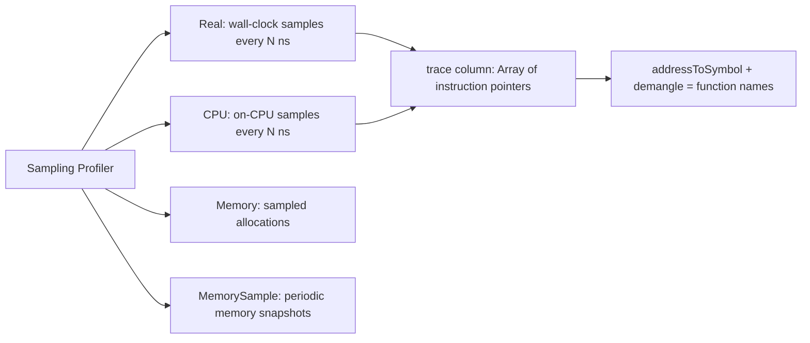

# How to Use system.trace_log in ClickHouse

Author: [nawazdhandala](https://www.github.com/nawazdhandala)

Tags: ClickHouse, System, Profiling, Tracing, Logging

Description: Learn how to use system.trace_log in ClickHouse to capture sampling profiler stack traces, identify CPU-bound functions, and diagnose query bottlenecks.

---

`system.trace_log` stores stack traces collected by ClickHouse's built-in sampling profiler. When enabled, the profiler periodically interrupts query execution threads and records the current call stack. By aggregating these samples, you can identify which C++ functions (and the queries that invoke them) are consuming the most CPU time.

## Enabling the Sampling Profiler

The trace log requires the query profiler to be active. Configure the sampling interval:

```sql
-- Sample every 100ms (10 samples per second per thread)
SET query_profiler_real_time_period_ns = 100000000;
SET query_profiler_cpu_time_period_ns  = 100000000;
```

Or in `users.xml`:

```xml
<profiles>
  <default>
    <query_profiler_real_time_period_ns>100000000</query_profiler_real_time_period_ns>
    <query_profiler_cpu_time_period_ns>100000000</query_profiler_cpu_time_period_ns>
  </default>
</profiles>
```

Enable `system.trace_log` in `config.xml`:

```xml
<trace_log>
    <database>system</database>
    <table>trace_log</table>
    <flush_interval_milliseconds>7500</flush_interval_milliseconds>
    <ttl>event_date + INTERVAL 7 DAY DELETE</ttl>
</trace_log>
```

## Key Columns

| Column | Type | Description |
|--------|------|-------------|
| `event_time` | DateTime | When the sample was taken |
| `query_id` | String | Query being profiled |
| `thread_id` | UInt64 | Thread that was sampled |
| `trace_type` | Enum | Real (wall clock), CPU, Memory, MemorySample, etc. |
| `trace` | Array(UInt64) | Stack of instruction pointer addresses |
| `size` | Int64 | For memory traces: allocation size |

## Viewing Raw Traces for a Query

```sql
SELECT
    event_time,
    trace_type,
    trace
FROM system.trace_log
WHERE query_id = 'your-query-id-here'
ORDER BY event_time;
```

## Converting Addresses to Function Names

ClickHouse provides `addressToSymbol()` and `demangle()` to resolve addresses:

```sql
SELECT
    count()                                         AS samples,
    arrayStringConcat(
        arrayMap(x -> demangle(addressToSymbol(x)), trace), '\n'
    )                                               AS stack
FROM system.trace_log
WHERE query_id = 'your-query-id-here'
  AND trace_type = 'CPU'
GROUP BY trace
ORDER BY samples DESC
LIMIT 10;
```

## Flame Graph Data

Generate a collapsed stack format suitable for flamegraph tools:

```sql
SELECT
    count()  AS samples,
    arrayStringConcat(
        arrayReverse(arrayMap(x -> demangle(addressToSymbol(x)), trace)), ';'
    ) AS stack
FROM system.trace_log
WHERE query_id  = 'your-query-id-here'
  AND trace_type = 'CPU'
GROUP BY trace
ORDER BY samples DESC
INTO OUTFILE '/tmp/clickhouse_flame.txt'
FORMAT TabSeparated;
```

Then use `flamegraph.pl` from Brendan Gregg's toolkit to render:

```bash
flamegraph.pl /tmp/clickhouse_flame.txt > flame.svg
```

## Trace Type Overview



## Top Functions by CPU Samples

```sql
SELECT
    demangle(addressToSymbol(arrayJoin(trace))) AS function,
    count()                                     AS sample_count
FROM system.trace_log
WHERE trace_type = 'CPU'
  AND event_date = today()
GROUP BY function
ORDER BY sample_count DESC
LIMIT 20;
```

## Memory Allocation Traces

```sql
SELECT
    query_id,
    sum(size)                          AS total_allocated,
    formatReadableSize(sum(size))      AS readable_size,
    count()                            AS sample_count
FROM system.trace_log
WHERE trace_type = 'Memory'
  AND size > 0
  AND event_date = today()
GROUP BY query_id
ORDER BY total_allocated DESC
LIMIT 10;
```

## Profiling a Specific Query

Run the query with profiling enabled, then look it up:

```sql
-- Step 1: Run query with profiling
SET query_profiler_cpu_time_period_ns = 10000000;  -- 10ms interval
SELECT count() FROM events WHERE status = 'error';

-- Step 2: Get the query_id
SELECT query_id
FROM system.query_log
WHERE type = 'QueryFinish'
  AND query LIKE '%count()%events%'
ORDER BY event_time DESC
LIMIT 1;

-- Step 3: Examine traces
SELECT
    count() AS samples,
    arrayStringConcat(
        arrayMap(x -> demangle(addressToSymbol(x)), trace), ' -> '
    ) AS call_chain
FROM system.trace_log
WHERE query_id = '<query_id from step 2>'
  AND trace_type = 'CPU'
GROUP BY trace
ORDER BY samples DESC
LIMIT 10;
```

## Summary

`system.trace_log` exposes ClickHouse's sampling profiler data, giving you function-level visibility into what query threads are actually doing at the CPU and memory level. Use it to generate flame graphs, identify hot functions, and diagnose CPU bottlenecks in complex queries. Combine `addressToSymbol()` and `demangle()` to convert raw instruction pointers into human-readable function names for actionable profiling.
