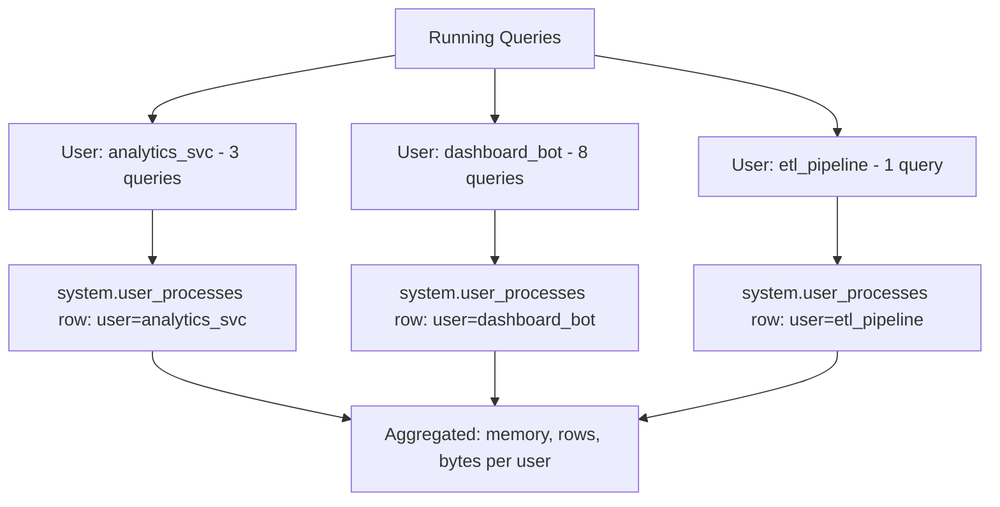

# How to Use system.user_processes in ClickHouse

Author: [nawazdhandala](https://www.github.com/nawazdhandala)

Tags: ClickHouse, System, Process, Monitoring, Query

Description: Learn how to use system.user_processes in ClickHouse to view per-user resource aggregates for running queries and manage multi-tenant resource usage.

---

`system.user_processes` aggregates resource usage for all currently running queries grouped by user. Where `system.processes` shows one row per running query, `system.user_processes` shows one aggregated row per user, making it ideal for multi-tenant resource monitoring and identifying which user or service account is consuming the most resources at a glance.

## Key Columns

| Column | Type | Description |
|--------|------|-------------|
| `user` | String | ClickHouse username |
| `memory_usage` | Int64 | Total memory used by all running queries for this user |
| `peak_memory_usage` | Int64 | Peak memory across all queries for this user |
| `query_count` | UInt32 | Number of currently running queries |
| `initial_query_count` | UInt32 | Number of user-initiated queries (excludes sub-queries) |
| `read_rows` | UInt64 | Total rows read so far |
| `read_bytes` | UInt64 | Total bytes read so far |
| `written_rows` | UInt64 | Total rows written so far |
| `written_bytes` | UInt64 | Total bytes written so far |
| `total_elapsed` | Float64 | Cumulative wall time of running queries in seconds |

## Viewing Active Resource Usage by User

```sql
SELECT
    user,
    query_count,
    formatReadableSize(memory_usage)      AS memory,
    formatReadableSize(peak_memory_usage) AS peak_memory,
    read_rows,
    formatReadableSize(read_bytes)        AS bytes_read,
    round(total_elapsed, 2)               AS elapsed_s
FROM system.user_processes
ORDER BY memory_usage DESC;
```

## Multi-Tenant Resource View



## Finding the Highest Memory Consumer

```sql
SELECT
    user,
    query_count,
    formatReadableSize(memory_usage)  AS memory,
    initial_query_count
FROM system.user_processes
ORDER BY memory_usage DESC
LIMIT 5;
```

## Users with Many Concurrent Queries

```sql
SELECT
    user,
    query_count,
    initial_query_count,
    round(total_elapsed / query_count, 2) AS avg_elapsed_s
FROM system.user_processes
WHERE query_count > 5
ORDER BY query_count DESC;
```

## Drilling Down: Per-Query Detail

After identifying a heavy user in `system.user_processes`, drill into `system.processes` for per-query detail:

```sql
-- Step 1: Identify the user
SELECT user, memory_usage, query_count
FROM system.user_processes
ORDER BY memory_usage DESC
LIMIT 3;

-- Step 2: See their individual queries
SELECT
    query_id,
    elapsed,
    formatReadableSize(memory_usage) AS memory,
    read_rows,
    substring(query, 1, 100) AS query_preview
FROM system.processes
WHERE user = 'analytics_svc'
ORDER BY memory_usage DESC;
```

## Cancelling All Queries for a User

If a user is overwhelming the server, kill all their queries:

```sql
-- Kill all queries from a specific user
KILL QUERY WHERE user = 'analytics_svc';
```

Or kill only specific queries:

```sql
-- Kill the most memory-intensive query from a user
SELECT query_id
FROM system.processes
WHERE user = 'analytics_svc'
ORDER BY memory_usage DESC
LIMIT 1;

KILL QUERY WHERE query_id = '<query_id_here>';
```

## Per-User Resource Quotas

To prevent users from consuming excessive resources, configure quotas in `users.xml`:

```xml
<quotas>
  <analytics_quota>
    <interval>
      <duration>3600</duration>
      <queries>1000</queries>
      <query_selects>1000</query_selects>
      <errors>100</errors>
      <result_rows>1000000000</result_rows>
      <read_rows>100000000000</read_rows>
      <execution_time>36000</execution_time>
    </interval>
  </analytics_quota>
</quotas>

<users>
  <analytics_svc>
    <quota>analytics_quota</quota>
    <profile>default</profile>
  </analytics_svc>
</users>
```

## Summary

`system.user_processes` provides a per-user aggregate view of all currently running query resources. Use it in multi-tenant environments to identify which user or service account is consuming the most memory, running the most concurrent queries, or reading the most data right now. Combine with `system.processes` for per-query detail and `KILL QUERY` for emergency resource management. Pair with quota configuration to enforce limits proactively.
