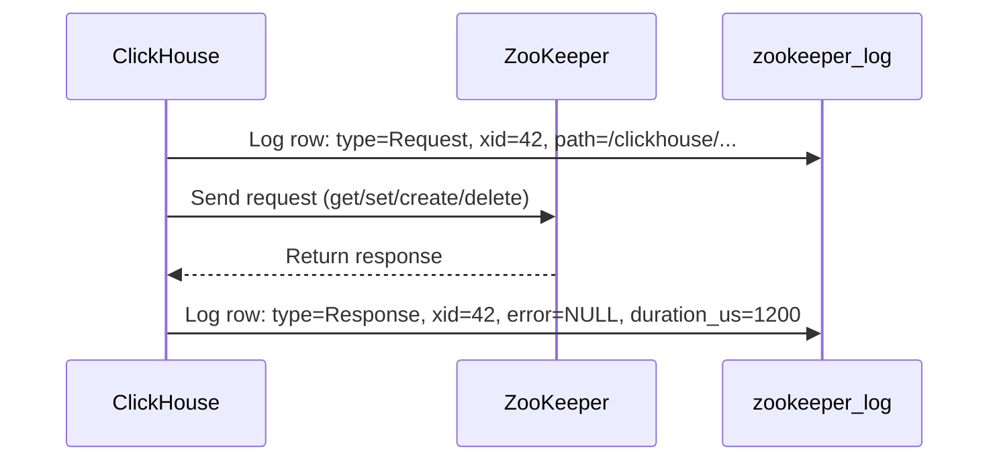

# How to Use system.zookeeper_log in ClickHouse

Author: [nawazdhandala](https://www.github.com/nawazdhandala)

Tags: ClickHouse, System, ZooKeeper, Logging, Monitoring

Description: Learn how to use system.zookeeper_log in ClickHouse to audit ZooKeeper requests and responses, diagnose coordination latency, and debug replication issues.

---

`system.zookeeper_log` records every ZooKeeper (or ClickHouse Keeper) request made by the ClickHouse server, along with the response code and latency. While `system.zookeeper` lets you browse current ZooKeeper state, `system.zookeeper_log` gives you a historical audit of all coordination operations. It is invaluable for diagnosing replication delays, identifying high-latency ZooKeeper operations, and understanding what ClickHouse is asking ZooKeeper to do during a specific time window.

## Enabling zookeeper_log

Configure in `config.xml`:

```xml
<zookeeper_log>
    <database>system</database>
    <table>zookeeper_log</table>
    <flush_interval_milliseconds>7500</flush_interval_milliseconds>
    <ttl>event_date + INTERVAL 7 DAY DELETE</ttl>
</zookeeper_log>
```

## Key Columns

| Column | Type | Description |
|--------|------|-------------|
| `event_date` | Date | Date of the request |
| `event_time` | DateTime | Timestamp of the request |
| `thread_id` | UInt64 | Thread that made the request |
| `query_id` | String | Associated query ID (if applicable) |
| `address` | IPv6 | ZooKeeper server address |
| `port` | UInt16 | ZooKeeper server port |
| `session_id` | Int64 | ZooKeeper session ID |
| `xid` | Int32 | Transaction ID within the session |
| `has_watch` | UInt8 | 1 if a watch was set |
| `op_num` | Int32 | ZooKeeper operation number |
| `path` | String | ZooKeeper node path |
| `data` | String | Data sent or received |
| `is_ephemeral` | UInt8 | 1 if creating an ephemeral node |
| `is_sequential` | UInt8 | 1 if creating a sequential node |
| `error` | Nullable(Int32) | ZooKeeper error code (NULL = success) |
| `watch_type` | Nullable(Enum) | Type of watch event |
| `watch_state` | Nullable(Enum) | State of watch event |
| `path_created` | String | Path actually created (for sequential nodes) |
| `stat` | various | ZooKeeper stat fields |
| `duration_microseconds` | UInt64 | Round-trip time in microseconds |
| `type` | Enum | Request or Response |

## Viewing Recent ZooKeeper Activity

```sql
SELECT
    event_time,
    type,
    path,
    error,
    duration_microseconds / 1000 AS duration_ms
FROM system.zookeeper_log
WHERE event_date = today()
  AND type = 'Response'
ORDER BY event_time DESC
LIMIT 30;
```

## ZooKeeper Request/Response Flow



## Finding Slow ZooKeeper Operations

```sql
SELECT
    event_time,
    path,
    op_num,
    duration_microseconds / 1000 AS duration_ms
FROM system.zookeeper_log
WHERE type = 'Response'
  AND event_date >= today() - 3
  AND duration_microseconds > 500000  -- More than 500ms
ORDER BY duration_microseconds DESC
LIMIT 20;
```

## ZooKeeper Error Analysis

```sql
SELECT
    error,
    count()                     AS occurrences,
    avg(duration_microseconds)  AS avg_us
FROM system.zookeeper_log
WHERE type = 'Response'
  AND error IS NOT NULL
  AND event_date >= today() - 7
GROUP BY error
ORDER BY occurrences DESC;
```

Common ZooKeeper error codes:

| Code | Meaning |
|------|---------|
| 0 | Success |
| -4 | ConnectionLoss |
| -110 | NodeExists |
| -101 | NoNode |
| -111 | NotEmpty |

## Top Paths by Request Volume

```sql
SELECT
    path,
    count() AS request_count,
    avg(duration_microseconds / 1000) AS avg_ms
FROM system.zookeeper_log
WHERE type = 'Response'
  AND event_date = today()
GROUP BY path
ORDER BY request_count DESC
LIMIT 20;
```

## Latency Distribution

```sql
SELECT
    multiIf(
        duration_microseconds < 1000,    '<1ms',
        duration_microseconds < 10000,   '1-10ms',
        duration_microseconds < 100000,  '10-100ms',
        duration_microseconds < 1000000, '100ms-1s',
        '>1s'
    ) AS latency_bucket,
    count()             AS requests,
    round(count() * 100.0 / sum(count()) OVER (), 2) AS pct
FROM system.zookeeper_log
WHERE type = 'Response'
  AND event_date = today()
GROUP BY latency_bucket
ORDER BY min(duration_microseconds);
```

## Operations During a Replication Event

```sql
-- What ZooKeeper operations happened around a known incident?
SELECT
    event_time,
    type,
    path,
    op_num,
    duration_microseconds / 1000 AS ms,
    error
FROM system.zookeeper_log
WHERE event_time BETWEEN '2024-01-15 14:00:00' AND '2024-01-15 14:05:00'
  AND type = 'Response'
ORDER BY event_time;
```

## Summary

`system.zookeeper_log` is an audit log of all ZooKeeper operations performed by ClickHouse. Use it to identify slow ZooKeeper requests that may be causing replication delays, count error rates by error code, find the most frequently accessed ZooKeeper paths, and correlate ZooKeeper activity with specific time windows when issues occurred. Enable it in `config.xml` and configure a short TTL since it generates high write volume on busy replicated clusters.
