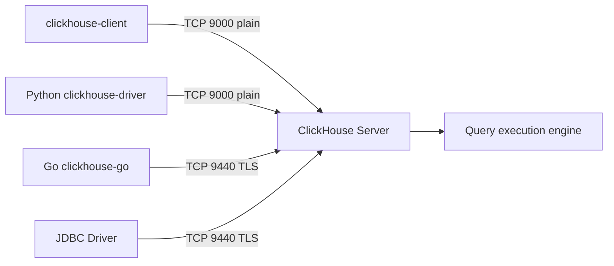

# How to Configure ClickHouse TCP Interface Settings

Author: [nawazdhandala](https://www.github.com/nawazdhandala)

Tags: ClickHouse, Configuration, Networking, TCP, NativeProtocol

Description: Learn how to configure the ClickHouse native TCP interface including port, TLS, timeouts, and keep-alive settings for high-performance client connections.

---

The native TCP interface is the primary high-performance protocol for ClickHouse clients. It is used by `clickhouse-client`, most official drivers (`clickhouse-driver` for Python, `clickhouse-go`, the Java JDBC driver), and for inter-node communication. Configuring it correctly ensures secure, low-latency client connectivity.

## TCP Port Configuration

```xml
<!-- /etc/clickhouse-server/config.d/tcp.xml -->
<clickhouse>
    <!-- Plain TCP - default 9000 -->
    <tcp_port>9000</tcp_port>

    <!-- TCP with TLS - default 9440 -->
    <tcp_port_secure>9440</tcp_port_secure>
</clickhouse>
```

To disable the plain TCP port (force TLS only), remove the `<tcp_port>` element.

## TCP Keep-Alive

Configure TCP keep-alive to detect dead connections:

```xml
<clickhouse>
    <tcp_port>9000</tcp_port>

    <!-- Enable keep-alive probes -->
    <keep_alive_timeout>3</keep_alive_timeout>
</clickhouse>
```

`keep_alive_timeout` is in seconds. This sets how long the server waits before sending the first keep-alive probe on an idle connection.

## Connection Timeouts

```xml
<clickhouse>
    <!-- Maximum time to receive a query from client -->
    <receive_timeout>300</receive_timeout>

    <!-- Maximum time to send a response to client -->
    <send_timeout>300</send_timeout>

    <!-- TCP backlog queue size -->
    <tcp_backlog_size>512</tcp_backlog_size>
</clickhouse>
```

## TLS for TCP Interface

To enable TLS on the native TCP port, configure the OpenSSL server section:

```xml
<clickhouse>
    <tcp_port_secure>9440</tcp_port_secure>

    <openSSL>
        <server>
            <certificateFile>/etc/clickhouse-server/certs/server.crt</certificateFile>
            <privateKeyFile>/etc/clickhouse-server/certs/server.key</privateKeyFile>
            <dhParamsFile>/etc/clickhouse-server/certs/dh.pem</dhParamsFile>
            <verificationMode>none</verificationMode>
            <caConfig>/etc/clickhouse-server/certs/ca.crt</caConfig>
            <loadDefaultCAFile>true</loadDefaultCAFile>
            <cacheSessions>true</cacheSessions>
            <cipherList>ECDHE-ECDSA-AES256-GCM-SHA384:ECDHE-RSA-AES256-GCM-SHA384</cipherList>
            <preferServerCiphers>true</preferServerCiphers>
        </server>
    </openSSL>
</clickhouse>
```

## Connecting from clickhouse-client with TLS

```bash
clickhouse-client \
  --host clickhouse.example.com \
  --port 9440 \
  --secure \
  --user default \
  --password mypassword
```

## TCP Interface Architecture



## Disabling TCP Interface

In some deployments (e.g. when only the HTTP interface is needed), you may want to disable TCP:

```xml
<clickhouse>
    <!-- Remove tcp_port to disable plain TCP -->
    <!-- Remove tcp_port_secure to disable TLS TCP -->
</clickhouse>
```

Note: `clickhouse-client` requires the native TCP port by default. Disabling it means remote clients must use HTTP.

## Monitoring TCP Connections

```sql
-- Active TCP connections
SELECT
    interface,
    address,
    port,
    connection_id,
    user,
    client_hostname,
    elapsed_sec
FROM system.processes
WHERE interface = 'TCP';
```

```sql
-- TCP connection metrics
SELECT metric, value
FROM system.metrics
WHERE metric IN (
    'TCPConnection',
    'InterserverConnection'
);
```

## Python Client with TLS

```python
from clickhouse_driver import Client

client = Client(
    host='clickhouse.example.com',
    port=9440,
    secure=True,
    verify=True,
    ca_certs='/etc/ssl/certs/ca-bundle.crt',
    user='default',
    password='mypassword',
)

result = client.execute('SELECT 1')
```

## Go Client with TLS

```go
conn, err := clickhouse.Open(&clickhouse.Options{
    Addr: []string{"clickhouse.example.com:9440"},
    Auth: clickhouse.Auth{
        Database: "default",
        Username: "default",
        Password: "mypassword",
    },
    TLS: &tls.Config{
        InsecureSkipVerify: false,
    },
})
```

## Summary

The native TCP interface on port 9000 is the highest-performance connection path for ClickHouse. Enable TLS on port 9440 for production deployments. Set `keep_alive_timeout`, `receive_timeout`, and `send_timeout` to match your client idle and query duration patterns. Monitor connections with `system.processes` and `system.metrics`.
