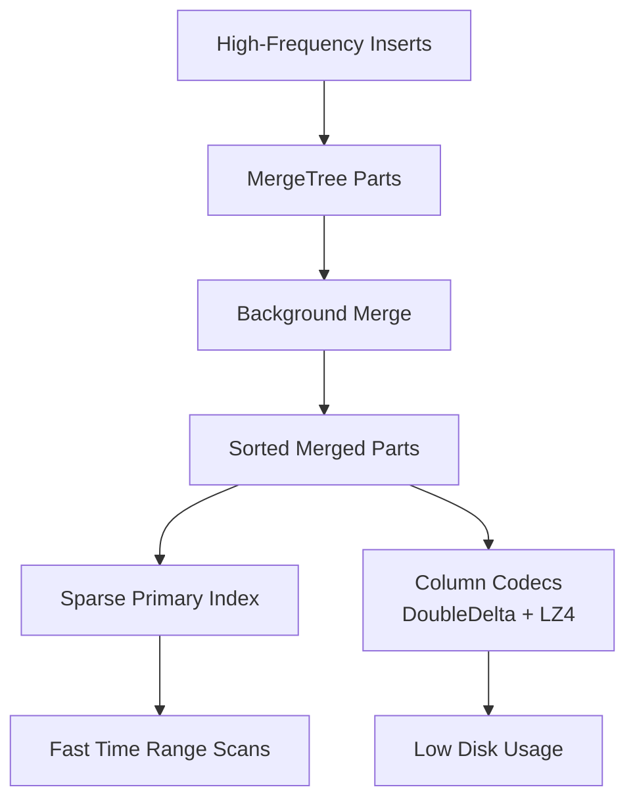

# How to Use ClickHouse for Time Series Data with MergeTree

Author: [nawazdhandala](https://www.github.com/nawazdhandala)

Tags: ClickHouse, TimeSeries, MergeTree, Codec, Compression, Metric

Description: Learn how to design MergeTree tables in ClickHouse optimized for time series data with the right codecs, partitioning, TTL, and query patterns for metrics and events.

---

MergeTree is ClickHouse's foundational storage engine and the right choice for the vast majority of time series workloads. Understanding how to combine the right primary key order, partition granularity, TTL rules, and column codecs turns a basic MergeTree table into a system that stores and queries time series data orders of magnitude more efficiently than a naive schema.

## Why ClickHouse MergeTree for Time Series



MergeTree stores data sorted by the primary key (ORDER BY). For time series, sorting by `(series_id, ts)` means all data points for a given series are physically adjacent, enabling the OS page cache and ClickHouse's granule skipping to serve range queries with minimal I/O.

## Canonical Time Series Schema

```sql
CREATE TABLE ts_metrics
(
    series_id   UInt32   CODEC(LZ4),
    ts          DateTime CODEC(DoubleDelta, LZ4),
    value       Float64  CODEC(Gorilla, LZ4)
)
ENGINE = MergeTree()
PARTITION BY toYYYYMM(ts)
ORDER BY (series_id, ts)
TTL ts + INTERVAL 1 YEAR
SETTINGS index_granularity = 8192;
```

Three columns are the minimum viable time series schema. Every additional column adds overhead; add them only if they are genuinely needed for filtering or aggregation.

## Codec Selection Guide

```sql
-- Timestamps: DoubleDelta beats everything else
ts DateTime CODEC(DoubleDelta, LZ4)

-- Monotonically increasing integers (counters, sequence numbers)
counter UInt64 CODEC(Delta(8), LZ4)

-- Smooth floating-point (CPU%, temperature, latency)
value Float64 CODEC(Gorilla, LZ4)

-- Double-precision structured floats (financial prices)
price Float64 CODEC(FPC, LZ4)

-- Low-cardinality labels (repeated strings)
host LowCardinality(String) CODEC(LZ4)

-- High-cardinality strings (log messages, UUIDs)
message String CODEC(ZSTD(3))
```

## Multi-Dimensional Time Series

For real-world workloads with per-host, per-service metrics:

```sql
CREATE TABLE host_metrics
(
    host       LowCardinality(String) CODEC(LZ4),
    metric     LowCardinality(String) CODEC(LZ4),
    ts         DateTime               CODEC(DoubleDelta, LZ4),
    value      Float64                CODEC(Gorilla, LZ4),
    tags       Map(String, String)    CODEC(ZSTD(3))
)
ENGINE = MergeTree()
PARTITION BY toYYYYMMDD(ts)
ORDER BY (host, metric, ts)
TTL ts + INTERVAL 90 DAY
SETTINGS index_granularity = 8192;
```

Ordering by `(host, metric, ts)` means queries filtering by both host and metric scan only the relevant rows. Ordering by `ts` alone would scatter data across the disk.

## Inserting Time Series Data

```sql
INSERT INTO host_metrics (host, metric, ts, value)
VALUES
    ('web-01', 'cpu_pct',    now() - 60, 42.3),
    ('web-01', 'cpu_pct',    now() - 50, 43.1),
    ('web-01', 'cpu_pct',    now() - 40, 41.8),
    ('web-01', 'mem_pct',    now() - 60, 78.2),
    ('web-02', 'cpu_pct',    now() - 60, 38.5);
```

For high-throughput ingestion, batch inserts of at least 1,000 rows per query. ClickHouse is optimized for large batch writes, not single-row inserts.

## Time Range Query

```sql
SELECT ts, value
FROM host_metrics
WHERE host   = 'web-01'
  AND metric = 'cpu_pct'
  AND ts BETWEEN now() - INTERVAL 1 HOUR AND now()
ORDER BY ts;
```

## Downsampling with toStartOfMinute

```sql
SELECT
    host,
    metric,
    toStartOfMinute(ts) AS minute,
    avg(value)          AS avg_val,
    max(value)          AS max_val,
    min(value)          AS min_val
FROM host_metrics
WHERE ts >= now() - INTERVAL 1 DAY
GROUP BY host, metric, minute
ORDER BY host, metric, minute;
```

## Pre-Aggregated Rollup with Materialized View

```sql
CREATE TABLE host_metrics_1m
(
    host   LowCardinality(String),
    metric LowCardinality(String),
    minute DateTime,
    avg_v  SimpleAggregateFunction(avg, Float64),
    max_v  SimpleAggregateFunction(max, Float64),
    min_v  SimpleAggregateFunction(min, Float64),
    count  SimpleAggregateFunction(sum, UInt64)
)
ENGINE = AggregatingMergeTree()
PARTITION BY toYYYYMMDD(minute)
ORDER BY (host, metric, minute)
TTL minute + INTERVAL 1 YEAR;

CREATE MATERIALIZED VIEW host_metrics_1m_mv
TO host_metrics_1m
AS
SELECT
    host,
    metric,
    toStartOfMinute(ts) AS minute,
    avg(value)    AS avg_v,
    max(value)    AS max_v,
    min(value)    AS min_v,
    count()       AS count
FROM host_metrics
GROUP BY host, metric, minute;
```

## Querying Rollups

```sql
SELECT
    minute,
    avg_v,
    max_v
FROM host_metrics_1m
WHERE host   = 'web-01'
  AND metric = 'cpu_pct'
  AND minute >= now() - INTERVAL 7 DAY
ORDER BY minute;
```

## Partition Management

List active partitions:

```sql
SELECT
    partition,
    count() AS parts,
    formatReadableSize(sum(data_compressed_bytes)) AS compressed
FROM system.parts
WHERE active = 1
  AND table = 'host_metrics'
  AND database = currentDatabase()
GROUP BY partition
ORDER BY partition;
```

Drop a partition (fast, no row-by-row deletion):

```sql
ALTER TABLE host_metrics
    DROP PARTITION '202312';
```

## Compression Ratio Check

```sql
SELECT
    column,
    formatReadableSize(sum(data_compressed_bytes))   AS compressed,
    formatReadableSize(sum(data_uncompressed_bytes)) AS uncompressed,
    round(sum(data_uncompressed_bytes) / sum(data_compressed_bytes), 1) AS ratio
FROM system.parts_columns
WHERE active = 1
  AND table = 'ts_metrics'
  AND database = currentDatabase()
GROUP BY column
ORDER BY ratio DESC;
```

DoubleDelta on timestamps typically achieves 30-100x compression. Gorilla on smooth floats achieves 4-10x.

## Summary

MergeTree with `ORDER BY (series_id, ts)` is the correct foundation for time series data in ClickHouse. Pair DoubleDelta codec on timestamps, Gorilla on float values, and LowCardinality on repeated string labels. Partition by month or day depending on data volume. Add materialized views for pre-aggregated rollups and TTL rules to automate retention. This combination delivers 10-50x better storage efficiency and 10-100x faster queries compared to a generic relational schema.
