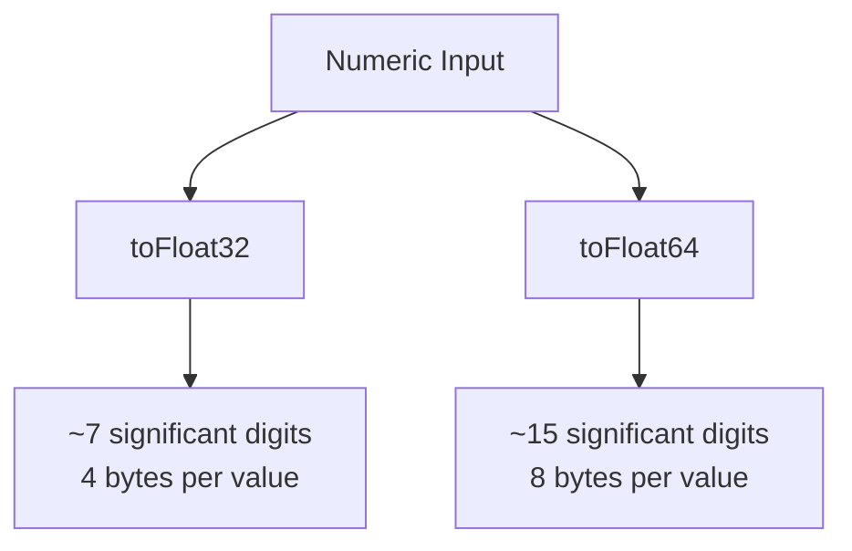

# How to Use toFloat32() and toFloat64() in ClickHouse

Author: [nawazdhandala](https://www.github.com/nawazdhandala)

Tags: ClickHouse, SQL, Type Conversion, Function, Float

Description: Learn how to convert strings, integers, and other values to floating-point types using toFloat32() and toFloat64() in ClickHouse.

---

Floating-point arithmetic is central to analytics workloads - from computing averages to scoring ML predictions. ClickHouse provides `toFloat32()` and `toFloat64()` to convert values into IEEE 754 single-precision and double-precision floating-point numbers respectively.

## How Float Conversion Works

`toFloat32()` produces a 32-bit float (single precision, about 7 significant digits). `toFloat64()` produces a 64-bit float (double precision, about 15 significant digits). When precision matters - such as for financial ratios or scientific measurements - prefer `toFloat64()`.

Conversion rules:
- Integer types are widened to float automatically
- String arguments are parsed; invalid strings produce 0 or NULL depending on the variant used
- Special string values `inf`, `-inf`, and `nan` are recognized

## Syntax

```sql
toFloat32(value)
toFloat64(value)

-- Safe variants
toFloat32OrZero(value)
toFloat64OrZero(value)

toFloat32OrNull(value)
toFloat64OrNull(value)
```

## Precision Comparison



## Examples

### Basic Conversion

Convert an integer and a string to float:

```sql
SELECT
    toFloat32(42)        AS f32_from_int,
    toFloat64('3.14159') AS f64_from_string;
```

```text
f32_from_int  f64_from_string
42            3.14159
```

### Precision Difference

Notice the precision loss with Float32:

```sql
SELECT
    toFloat32(1.23456789012345) AS f32,
    toFloat64(1.23456789012345) AS f64;
```

```text
f32                f64
1.2345679          1.23456789012345
```

### Special Values

ClickHouse recognizes IEEE 754 special values from strings:

```sql
SELECT
    toFloat64('inf')  AS pos_inf,
    toFloat64('-inf') AS neg_inf,
    toFloat64('nan')  AS not_a_number;
```

```text
pos_inf  neg_inf  not_a_number
inf      -inf     nan
```

### Safe Parsing

Use `OrZero` or `OrNull` variants when parsing untrusted data:

```sql
SELECT
    toFloat64OrZero('3.14')  AS valid,
    toFloat64OrZero('N/A')   AS invalid_zero,
    toFloat64OrNull('N/A')   AS invalid_null;
```

```text
valid  invalid_zero  invalid_null
3.14   0             NULL
```

### Complete Working Example

Track sensor readings that arrive as raw strings and need float conversion:

```sql
CREATE TABLE sensor_readings
(
    sensor_id  UInt32,
    raw_value  String,
    reading    Float64
) ENGINE = MergeTree()
ORDER BY sensor_id;

INSERT INTO sensor_readings VALUES
    (1, '23.5',  toFloat64OrZero('23.5')),
    (2, '101.7', toFloat64OrZero('101.7')),
    (3, 'ERR',   toFloat64OrZero('ERR')),
    (4, '-12.3', toFloat64OrZero('-12.3'));

SELECT
    sensor_id,
    raw_value,
    reading,
    round(reading, 1) AS rounded
FROM sensor_readings
ORDER BY sensor_id;
```

```text
sensor_id  raw_value  reading  rounded
1          23.5       23.5     23.5
2          101.7      101.7    101.7
3          ERR        0        0
4          -12.3      -12.3    -12.3
```

### Using toFloat in Calculations

Convert integer counts to float before division to avoid integer division:

```sql
SELECT
    toFloat64(total_clicks) / toFloat64(total_impressions) AS ctr
FROM (
    SELECT 950 AS total_clicks, 10000 AS total_impressions
);
```

```text
ctr
0.095
```

## Summary

`toFloat32()` and `toFloat64()` convert values to floating-point types in ClickHouse. Use `toFloat64()` when precision matters and `toFloat32()` when you need to save memory on large datasets with acceptable precision loss. Always use the `OrZero` or `OrNull` variants when converting strings from external data sources to avoid query errors from unexpected input.
