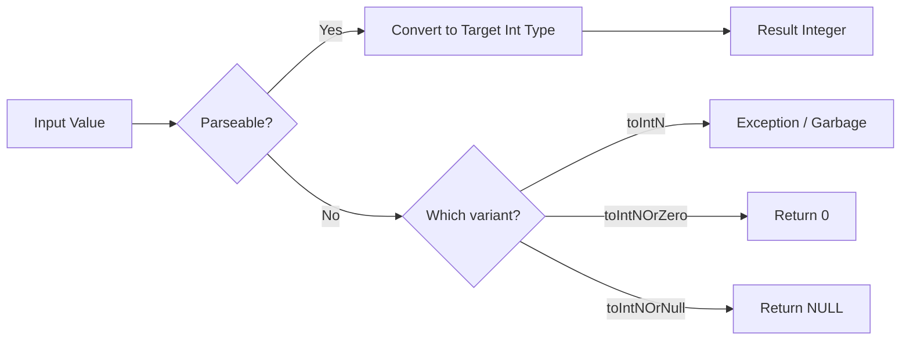

# How to Use toInt8(), toInt16(), toInt32(), toInt64() in ClickHouse

Author: [nawazdhandala](https://www.github.com/nawazdhandala)

Tags: ClickHouse, SQL, Type Conversion, Function, Integer

Description: Learn how to convert values to signed integer types using toInt8(), toInt16(), toInt32(), and toInt64() in ClickHouse with practical examples.

---

ClickHouse is a strongly typed database. When you ingest data from external sources or perform calculations, you often need to convert values to specific integer types. The `toInt8()`, `toInt16()`, `toInt32()`, and `toInt64()` functions handle these conversions explicitly.

## How Integer Conversion Works

Each function converts its argument to a signed integer of the corresponding bit width. The conversion follows these rules:

- Floating-point numbers are truncated toward zero
- Strings are parsed as numbers; invalid strings return 0 (or throw with the `OrZero`/`OrNull` variants)
- Values outside the target range overflow with wrap-around behavior

The type ranges are:

```text
toInt8:  -128 to 127
toInt16: -32768 to 32767
toInt32: -2147483648 to 2147483647
toInt64: -9223372036854775808 to 9223372036854775807
```

## Syntax

```sql
toInt8(value)
toInt16(value)
toInt32(value)
toInt64(value)

-- Safe variants that return 0 on failure
toInt8OrZero(value)
toInt16OrZero(value)
toInt32OrZero(value)
toInt64OrZero(value)

-- Safe variants that return NULL on failure
toInt8OrNull(value)
toInt16OrNull(value)
toInt32OrNull(value)
toInt64OrNull(value)
```

## How the Conversion Pipeline Looks

The following diagram shows how a raw string value flows through type detection and conversion:



## Examples

### Basic Type Conversion

Demonstrate casting a float and a string to various integer sizes:

```sql
SELECT
    toInt8(42)          AS i8,
    toInt16(1000)       AS i16,
    toInt32(2147483647) AS i32,
    toInt64(9999999999) AS i64;
```

```text
i8   i16   i32         i64
42   1000  2147483647  9999999999
```

### Converting Floats (Truncation)

Floating-point values are truncated, not rounded:

```sql
SELECT
    toInt32(3.9)   AS truncated_up,
    toInt32(-3.9)  AS truncated_down;
```

```text
truncated_up  truncated_down
3             -3
```

### Converting Strings

Parse numeric strings into integers:

```sql
SELECT
    toInt32('12345')       AS from_string,
    toInt32OrZero('abc')   AS bad_string_zero,
    toInt32OrNull('abc')   AS bad_string_null;
```

```text
from_string  bad_string_zero  bad_string_null
12345        0                NULL
```

### Overflow Behavior

Values exceeding the type range wrap around:

```sql
SELECT
    toInt8(200)   AS overflow_wrap,
    toInt8(-200)  AS underflow_wrap;
```

```text
overflow_wrap  underflow_wrap
-56            56
```

### Complete Working Example

Create a table that stores event data from a CSV-like ingestion pipeline where counts arrive as strings:

```sql
CREATE TABLE event_counts
(
    event_name   String,
    raw_count    String,
    parsed_count Int32
) ENGINE = MergeTree()
ORDER BY event_name;

INSERT INTO event_counts (event_name, raw_count, parsed_count)
VALUES
    ('click',    '1500',   toInt32OrZero('1500')),
    ('view',     '42000',  toInt32OrZero('42000')),
    ('error',    'N/A',    toInt32OrZero('N/A')),
    ('purchase', '87',     toInt32OrZero('87'));

SELECT
    event_name,
    raw_count,
    parsed_count,
    toInt8OrNull(raw_count) AS small_int
FROM event_counts;
```

```text
event_name  raw_count  parsed_count  small_int
click       1500       1500          NULL
view        42000      42000         NULL
error       N/A        0             NULL
purchase    87         87            87
```

### Choosing the Right Type

Use the smallest type that fits your data range to save memory:

```sql
SELECT
    toInt8(status_code - 200)  AS status_offset,  -- small range
    toInt32(user_id)           AS user_id_int,     -- typical IDs
    toInt64(unix_timestamp_ms) AS ts_ms            -- large epoch values
FROM (
    SELECT 404 AS status_code, 99999 AS user_id, 1711900000000 AS unix_timestamp_ms
);
```

## Summary

`toInt8()`, `toInt16()`, `toInt32()`, and `toInt64()` are the standard functions for converting values to signed integer types in ClickHouse. Choose the narrowest type that fits your data range to minimize storage and improve query performance. Always prefer the `OrZero` or `OrNull` variants when parsing untrusted string data to avoid query failures from malformed input.
