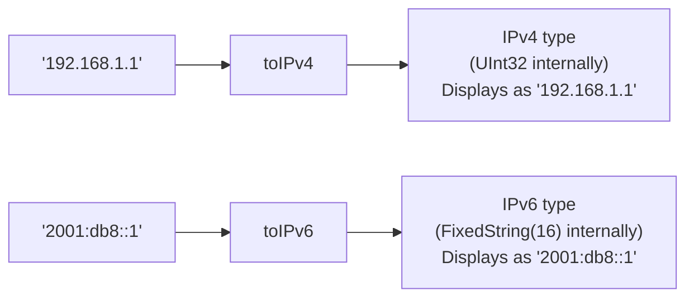

# How to Use toIPv4() and toIPv6() in ClickHouse

Author: [nawazdhandala](https://www.github.com/nawazdhandala)

Tags: ClickHouse, SQL, IP Address, IPv4, IPv6, Function, Type Conversion

Description: Learn how to use toIPv4() and toIPv6() in ClickHouse to convert strings to the native IPv4 and IPv6 data types for type-safe IP address storage and operations.

---

ClickHouse has native `IPv4` and `IPv6` data types that provide type safety and special display formatting. The `toIPv4()` and `toIPv6()` functions convert string representations to these native types, enabling cleaner schemas and access to IP-specific functions.

## How These Functions Work

- `toIPv4(str)` - converts a dotted-decimal string to the `IPv4` type (stored as `UInt32` internally). Throws on invalid input.
- `toIPv6(str)` - converts a colon-separated IPv6 string to the `IPv6` type (stored as `FixedString(16)` internally). Throws on invalid input.
- `toIPv4OrNull(str)` / `toIPv6OrNull(str)` - safe variants that return `NULL` for invalid input.
- `toIPv4OrDefault(str)` / `toIPv6OrDefault(str)` - return `0.0.0.0` or `::` for invalid input.

## Syntax

```sql
toIPv4(string)
toIPv6(string)
toIPv4OrNull(string)
toIPv6OrNull(string)
```

## IPv4 vs IPv6 Data Types



## Examples

### Basic toIPv4 Usage

```sql
SELECT toIPv4('192.168.1.1') AS ipv4_addr;
```

```text
ipv4_addr
192.168.1.1
```

### Basic toIPv6 Usage

```sql
SELECT toIPv6('2001:db8:cafe::1') AS ipv6_addr;
```

```text
ipv6_addr
2001:db8:cafe::1
```

### Safe Variants

```sql
SELECT
    toIPv4OrNull('10.0.0.1')     AS valid_ip,
    toIPv4OrNull('not-an-ip')    AS invalid_ip,
    toIPv4OrDefault('bad-input') AS default_ip;
```

```text
valid_ip   invalid_ip  default_ip
10.0.0.1   NULL        0.0.0.0
```

### Comparison and Sorting

The `IPv4` type supports comparison operators, and addresses sort numerically:

```sql
SELECT
    ip,
    ip > toIPv4('192.168.0.0') AS is_above_192_168
FROM (
    SELECT toIPv4('10.0.0.1')    AS ip UNION ALL
    SELECT toIPv4('192.168.5.1') AS ip UNION ALL
    SELECT toIPv4('172.16.0.1')  AS ip
)
ORDER BY ip;
```

```text
ip           is_above_192_168
10.0.0.1     0
172.16.0.1   0
192.168.5.1  1
```

### Complete Working Example

Use the native IPv4 type in a table schema for type-safe storage:

```sql
CREATE TABLE connections
(
    conn_id    UInt64,
    src_ip     IPv4,
    dst_ip     IPv4,
    src_port   UInt16,
    dst_port   UInt16,
    bytes_sent UInt32
) ENGINE = MergeTree()
ORDER BY conn_id;

INSERT INTO connections VALUES
    (1, toIPv4('10.0.1.5'),   toIPv4('203.0.113.10'), 54321, 443, 4096),
    (2, toIPv4('10.0.1.6'),   toIPv4('198.51.100.5'), 55001, 80,  1024),
    (3, toIPv4('10.0.1.5'),   toIPv4('203.0.113.10'), 54322, 443, 8192),
    (4, toIPv4('172.16.0.2'), toIPv4('10.0.0.1'),     44444, 22,  512);

SELECT
    src_ip,
    dst_ip,
    count()         AS connections,
    sum(bytes_sent) AS total_bytes
FROM connections
GROUP BY src_ip, dst_ip
ORDER BY total_bytes DESC;
```

```text
src_ip      dst_ip         connections  total_bytes
10.0.1.5    203.0.113.10   2            12288
10.0.1.6    198.51.100.5   1            1024
172.16.0.2  10.0.0.1       1            512
```

## Summary

`toIPv4()` and `toIPv6()` convert strings to the native `IPv4` and `IPv6` column types in ClickHouse, providing type safety, proper display formatting, and numeric comparison behavior. Use these types in table schemas instead of `String` or raw `UInt32`/`FixedString(16)` when working with IP address data, and always use the `OrNull` variants when converting untrusted input strings.
