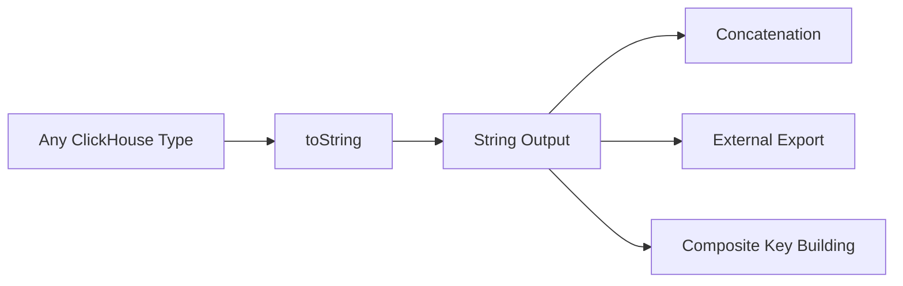

# How to Use toString() in ClickHouse for Type Conversion

Author: [nawazdhandala](https://www.github.com/nawazdhandala)

Tags: ClickHouse, SQL, Type Conversion, Function, String

Description: Learn how to convert numeric, date, and other typed values to strings using the toString() function in ClickHouse with real-world examples.

---

`toString()` is one of the most frequently used conversion functions in ClickHouse. It serializes any supported type to its human-readable string representation, which is essential when building log lines, composite keys, or preparing data for external systems.

## How toString() Works

`toString()` accepts virtually any ClickHouse data type and returns a `String`. The output format depends on the input type:

- Numbers are rendered in decimal notation
- Dates use `YYYY-MM-DD` format
- DateTimes use `YYYY-MM-DD HH:MM:SS` format
- Arrays and tuples are serialized to their literal syntax
- UUID values are rendered in standard hyphenated form

## Syntax

```sql
toString(value)
toString(value, timezone)  -- for DateTime types
```

## Conversion Flow



## Examples

### Converting Numbers

```sql
SELECT
    toString(42)        AS int_to_str,
    toString(3.14)      AS float_to_str,
    toString(-100)      AS neg_to_str;
```

```text
int_to_str  float_to_str  neg_to_str
42          3.14          -100
```

### Converting Dates

```sql
SELECT
    toString(today())          AS date_str,
    toString(now())            AS datetime_str,
    toString(now(), 'UTC')     AS datetime_utc;
```

```text
date_str    datetime_str          datetime_utc
2026-03-31  2026-03-31 14:22:05   2026-03-31 14:22:05
```

### Building Composite Keys

Combine multiple columns into a single string identifier:

```sql
SELECT
    toString(user_id) || '-' || toString(session_id) AS composite_key
FROM (
    SELECT 1001 AS user_id, 42 AS session_id
);
```

```text
composite_key
1001-42
```

### Converting Arrays

```sql
SELECT toString([1, 2, 3]) AS array_str;
```

```text
array_str
[1,2,3]
```

### Complete Working Example

Create an audit log table where all values are normalized to strings for flexible querying:

```sql
CREATE TABLE audit_log
(
    event_time DateTime,
    user_id    UInt32,
    action     String,
    value      String
) ENGINE = MergeTree()
ORDER BY event_time;

INSERT INTO audit_log VALUES
    (now(), 1001, 'login',    toString(now())),
    (now(), 1002, 'purchase', toString(299.99)),
    (now(), 1003, 'view',     toString(today()));

SELECT
    toString(event_time) AS time_str,
    toString(user_id)    AS uid_str,
    action,
    value
FROM audit_log
ORDER BY event_time;
```

```text
time_str               uid_str  action    value
2026-03-31 14:22:05    1001     login     2026-03-31 14:22:05
2026-03-31 14:22:05    1002     purchase  299.99
2026-03-31 14:22:05    1003     view      2026-03-31
```

### Combining toString with formatDateTime

When you need full control over the output format, use `formatDateTime()` instead of `toString()` for datetime values:

```sql
SELECT
    toString(now())                        AS default_format,
    formatDateTime(now(), '%d/%m/%Y %H:%i') AS custom_format;
```

```text
default_format          custom_format
2026-03-31 14:22:05     31/03/2026 14:22
```

## Summary

`toString()` is the universal serialization function in ClickHouse that converts any typed value to a human-readable string. It is particularly useful for building composite keys, preparing data for string concatenation, and exporting data to text-based formats. For datetime formatting beyond the default, combine it with `formatDateTime()` for full control over the output string.
