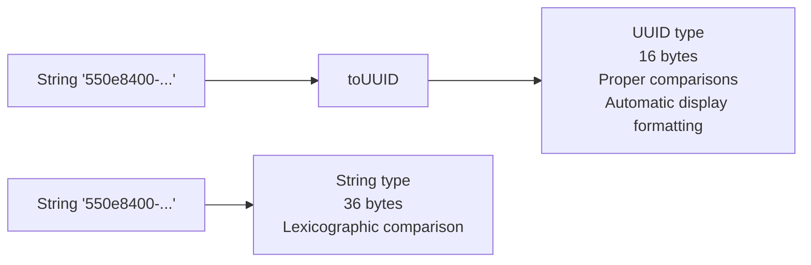

# How to Use toUUID() in ClickHouse for UUID Conversion

Author: [nawazdhandala](https://www.github.com/nawazdhandala)

Tags: ClickHouse, SQL, UUID, Function, Type Conversion, toUUID

Description: Learn how to convert UUID strings to the native UUID data type in ClickHouse using toUUID() for type-safe UUID storage and comparison.

---

ClickHouse has a native `UUID` data type that stores 128-bit universally unique identifiers efficiently in 16 bytes. The `toUUID()` function converts a string representation of a UUID to this native type, enabling type-safe storage, proper indexing, and comparison operations.

## How toUUID() Works

`toUUID(str)` parses a standard UUID string in the format `xxxxxxxx-xxxx-xxxx-xxxx-xxxxxxxxxxxx` and returns a value of type `UUID`. Unlike `UUIDStringToNum()` which returns `FixedString(16)`, `toUUID()` returns the proper `UUID` type that ClickHouse displays in the standard hyphenated format.

- `toUUID(str)` - throws an exception on invalid input.
- `toUUIDOrNull(str)` - returns `NULL` for invalid input.
- `toUUIDOrDefault(str, default_uuid)` - returns a specified default UUID for invalid input.

## Syntax

```sql
toUUID(string)
toUUIDOrNull(string)
toUUIDOrDefault(string, default_uuid_string)
```

## UUID Type vs String Storage



## Examples

### Basic UUID Conversion

```sql
SELECT toUUID('550e8400-e29b-41d4-a716-446655440000') AS uuid_val;
```

```text
uuid_val
550e8400-e29b-41d4-a716-446655440000
```

### Safe Conversion Variants

```sql
SELECT
    toUUIDOrNull('550e8400-e29b-41d4-a716-446655440000') AS valid_uuid,
    toUUIDOrNull('not-a-uuid')                            AS invalid_uuid;
```

```text
valid_uuid                            invalid_uuid
550e8400-e29b-41d4-a716-446655440000  NULL
```

### UUID Comparison

The `UUID` type supports equality and inequality comparisons:

```sql
SELECT
    toUUID('550e8400-e29b-41d4-a716-446655440001') =
    toUUID('550e8400-e29b-41d4-a716-446655440001') AS same_uuid,
    toUUID('550e8400-e29b-41d4-a716-446655440001') =
    toUUID('550e8400-e29b-41d4-a716-446655440002') AS diff_uuid;
```

```text
same_uuid  diff_uuid
1          0
```

### Using UUID as a Column Type

```sql
CREATE TABLE sessions
(
    session_id UUID DEFAULT generateUUIDv4(),
    user_id    UInt32,
    started_at DateTime DEFAULT now()
) ENGINE = MergeTree()
ORDER BY session_id;

INSERT INTO sessions (user_id) VALUES (1001), (1002), (1003);

SELECT session_id, user_id, started_at
FROM sessions
ORDER BY started_at;
```

```text
session_id                            user_id  started_at
a3bc12d4-...                          1001     2026-03-31 ...
7e891234-...                          1002     2026-03-31 ...
f4cd5678-...                          1003     2026-03-31 ...
```

### Complete Working Example

Migrate a string UUID column to the native UUID type:

```sql
CREATE TABLE events_with_uuid
(
    event_id   UUID,
    event_type String,
    user_id    UInt32,
    created_at DateTime DEFAULT now()
) ENGINE = MergeTree()
ORDER BY event_id;

INSERT INTO events_with_uuid (event_id, event_type, user_id) VALUES
    (toUUID('6ba7b810-9dad-11d1-80b4-00c04fd430c8'), 'login',    1001),
    (toUUID('6ba7b811-9dad-11d1-80b4-00c04fd430c8'), 'purchase', 1002),
    (toUUID('6ba7b812-9dad-11d1-80b4-00c04fd430c8'), 'logout',   1001);

SELECT
    event_id,
    event_type,
    user_id
FROM events_with_uuid
WHERE user_id = 1001
ORDER BY created_at;
```

```text
event_id                              event_type  user_id
6ba7b810-9dad-11d1-80b4-00c04fd430c8  login       1001
6ba7b812-9dad-11d1-80b4-00c04fd430c8  logout      1001
```

## Summary

`toUUID()` converts a UUID string to the native `UUID` data type in ClickHouse, which provides type-safe storage in 16 bytes with proper display formatting. Use `toUUID()` for inserting UUID literals, `toUUIDOrNull()` for safe conversion of untrusted input, and prefer the native `UUID` column type over `String` whenever storing UUID values to save memory and enable proper comparison semantics.
