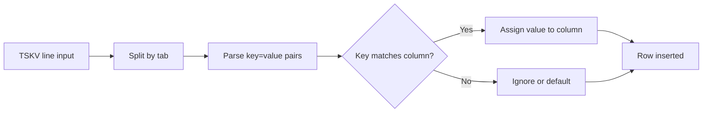

# How to Use TSKV Format in ClickHouse

Author: [nawazdhandala](https://www.github.com/nawazdhandala)

Tags: ClickHouse, Format, TSKV, DataIngestion, Parsing

Description: Learn how to read and write data using the TSKV format in ClickHouse, where each row is a set of tab-separated key=value pairs on one line.

---

TSKV (Tab-Separated Key=Value) is a format where each row is represented as a single line of `key=value` pairs separated by tabs. ClickHouse supports TSKV for both input and output. It is commonly found in Yandex-originated log pipelines and is easy to generate from any application that writes structured log lines.

## TSKV Line Format

Each line in a TSKV stream looks like:

```text
ts=2024-06-01T12:00:00\tlevel=INFO\tmsg=Server started\tlatency_ms=42
```

- Keys and values are separated by `=`.
- Pairs are separated by `\t` (tab).
- Each row ends with `\n`.
- The special sequence `\t`, `\n`, `\0`, and `\\` are backslash-escaped.

## Creating a Target Table

```sql
CREATE TABLE app_events
(
    ts          DateTime,
    level       LowCardinality(String),
    msg         String,
    latency_ms  UInt32
)
ENGINE = MergeTree
ORDER BY ts;
```

## Inserting TSKV Data

```bash
echo -e "ts=2024-06-01 12:00:00\tlevel=INFO\tmsg=Server started\tlatency_ms=42" | \
  clickhouse-client --query "INSERT INTO app_events FORMAT TSKV"
```

Or from a file:

```bash
clickhouse-client \
  --query "INSERT INTO app_events FORMAT TSKV" \
  < /var/log/app/events.tskv
```

## Selecting Data in TSKV Format

```sql
SELECT ts, level, msg, latency_ms
FROM app_events
LIMIT 5
FORMAT TSKV;
```

Output:

```text
ts=2024-06-01 12:00:00	level=INFO	msg=Server started	latency_ms=42
ts=2024-06-01 12:00:05	level=WARN	msg=High memory usage	latency_ms=0
```

## Key Ordering

On output, keys appear in column-definition order. On input, keys can appear in any order, and missing keys receive default values for that column type.



## Handling Missing and Extra Keys

ClickHouse is tolerant of missing keys - it fills them with the column default. Extra keys that have no matching column are silently ignored. This makes TSKV convenient for evolving schemas.

```sql
-- Table has 4 columns; input only provides 3 keys; latency_ms defaults to 0
INSERT INTO app_events FORMAT TSKV;
-- line: ts=2024-06-02 08:00:00\tlevel=ERROR\tmsg=Disk full
```

## Escape Sequences

| Sequence | Meaning |
|---|---|
| `\\t` | Tab character |
| `\\n` | Newline character |
| `\\0` | Null byte |
| `\\\\` | Backslash |
| `\\=` | Literal `=` in value |

## Using TSKV with the HTTP Interface

```bash
curl -s \
  -X POST "http://localhost:8123/?query=INSERT+INTO+app_events+FORMAT+TSKV" \
  --data-binary $'ts=2024-06-03 09:00:00\tlevel=DEBUG\tmsg=Cache hit\tlatency_ms=1\n'
```

## Comparing TSKV with TabSeparated

| Feature | TabSeparated | TSKV |
|---|---|---|
| Column order required | Yes | No |
| Self-describing | No | Yes |
| Missing column handling | Error | Default value |
| Verbosity | Low | Medium |
| Human-readable | Partially | Yes |

Use TSKV when the producer may not emit all fields or when column order cannot be guaranteed. Use TabSeparated for maximum throughput where schema alignment is guaranteed.

## Summary

TSKV is a self-describing, tab-separated key=value format that is forgiving of missing fields and column-order changes. It works for both INSERT and SELECT in ClickHouse. Use it when integrating with Yandex-style log pipelines or when you need a simple, schema-tolerant line-based format that is easy to generate from application code.
