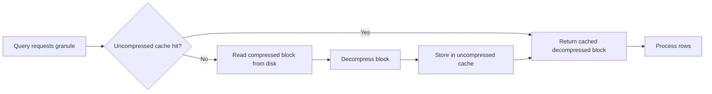

# How to Configure uncompressed_cache_size in ClickHouse

Author: [nawazdhandala](https://www.github.com/nawazdhandala)

Tags: ClickHouse, Performance, Cache, Configuration, MergeTree, Tuning

Description: Learn how to configure uncompressed_cache_size in ClickHouse to cache decompressed column data in memory, speeding up repeated reads of the same data blocks.

---

## Introduction

ClickHouse stores column data in compressed blocks on disk. When a query reads a compressed block, it must decompress it before processing. The `uncompressed_cache_size` setting allocates a memory pool for caching decompressed blocks. If a subsequent query reads the same block, ClickHouse serves it from cache without re-decompressing, saving CPU time.

## Data Flow with Uncompressed Cache



## Default Value

The default `uncompressed_cache_size` is `0` (disabled) in some versions and `1073741824` (1 GiB) in others. Check what is configured:

```sql
SELECT name, value
FROM system.server_settings
WHERE name = 'uncompressed_cache_size';
```

## Configuring uncompressed_cache_size

Add to `config.xml` or a config drop-in:

```xml
<!-- /etc/clickhouse-server/config.d/uncompressed_cache.xml -->
<clickhouse>
  <uncompressed_cache_size>8589934592</uncompressed_cache_size>
</clickhouse>
```

Reload config:

```sql
SYSTEM RELOAD CONFIG;
```

## Enabling Per-Query

Even if the global cache is configured, individual queries can opt in or out:

```sql
-- Use uncompressed cache for this query
SELECT count()
FROM events
WHERE event_time >= today() - INTERVAL 1 DAY
SETTINGS use_uncompressed_cache = 1;

-- Disable uncompressed cache for a heavy full scan
SELECT *
FROM events
WHERE event_time >= '2024-01-01'
SETTINGS use_uncompressed_cache = 0;
```

## Monitoring Cache Effectiveness

```sql
-- Check cache usage
SELECT
    metric,
    value
FROM system.metrics
WHERE metric IN (
    'UncompressedCacheBytes',
    'UncompressedCacheCells'
);

-- Check cumulative hit/miss counts
SELECT
    event,
    value
FROM system.events
WHERE event IN (
    'UncompressedCacheHits',
    'UncompressedCacheMisses',
    'UncompressedCacheWeightLost'
);
```

## Per-Query Cache Stats

```sql
SELECT
    query,
    ProfileEvents['UncompressedCacheHits']   AS cache_hits,
    ProfileEvents['UncompressedCacheMisses'] AS cache_misses,
    query_duration_ms
FROM system.query_log
WHERE type = 'QueryFinish'
  AND query_start_time >= now() - INTERVAL 1 HOUR
ORDER BY event_time DESC
LIMIT 10;
```

## Sizing Recommendations

The uncompressed cache is most effective when:

- The same columns are read repeatedly (e.g., dashboard queries on recent data).
- Compression ratio is high (decompression saves significant CPU).
- Hot data fits in the cache.

A rough formula: `uncompressed_cache_size = compression_ratio * bytes_of_hot_data`

For example, if your hot partition is 5 GiB compressed with a 5x ratio, the uncompressed size is 25 GiB. You might set the cache to 8-16 GiB to cover the most frequently accessed granules.

## When to Disable the Uncompressed Cache

- Sequential scans of large tables: cache pressure evicts entries before they can be reused, wasting memory.
- High-cardinality GROUP BY on large tables: each block is read once, so caching offers no benefit.

For these workloads, disable per-query:

```sql
SELECT event_type, count()
FROM events
GROUP BY event_type
SETTINGS use_uncompressed_cache = 0;
```

## Clearing the Uncompressed Cache

```sql
SYSTEM DROP UNCOMPRESSED CACHE;
```

## Relationship with OS Page Cache

The OS page cache caches compressed blocks at the filesystem level. The uncompressed cache saves CPU decompression time after those blocks are in RAM. Both work together: OS page cache serves compressed blocks from RAM, and the uncompressed cache saves the CPU cost of decompressing them again.

## Summary

`uncompressed_cache_size` tells ClickHouse how much RAM to use for caching decompressed column blocks, reducing CPU overhead for repeated reads of the same data. Configure it in `config.xml`, enable per-query with `use_uncompressed_cache = 1`, and monitor effectiveness with `system.events`. Size it based on how much hot data your queries repeatedly scan, and disable it for large sequential scans where each block is read only once.
