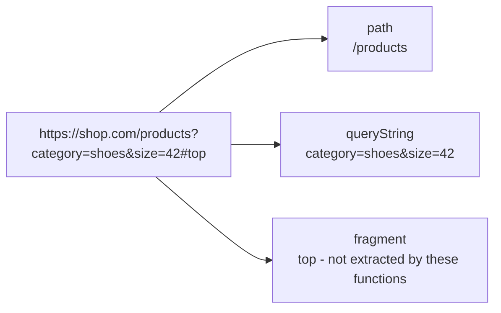

# How to Use path() and queryString() in ClickHouse for URL Parsing

Author: [nawazdhandala](https://www.github.com/nawazdhandala)

Tags: ClickHouse, SQL, URL, Function, Web Analytics

Description: Learn how to extract the URL path and query string from URL strings in ClickHouse using the path() and queryString() functions.

---

Beyond the domain, web analytics often requires extracting the path (which page was visited) and the query string (which parameters were passed). ClickHouse provides dedicated `path()` and `queryString()` functions for these tasks, avoiding fragile string manipulation.

## How These Functions Work

- `path(url)` - returns the path component of a URL, starting with `/`. Excludes the query string and fragment. Returns an empty string for invalid URLs.
- `queryString(url)` - returns the query string without the leading `?`. Returns an empty string when there is no query string.

## Syntax

```sql
path(url)
queryString(url)
```

## URL Component Breakdown



## Examples

### Basic Path Extraction

```sql
SELECT
    path('https://example.com/blog/post-1')       AS url_path,
    path('https://example.com/')                   AS root_path,
    path('https://example.com/search?q=test')     AS path_without_qs;
```

```text
url_path            root_path  path_without_qs
/blog/post-1        /          /search
```

### Extracting Query Strings

```sql
SELECT
    queryString('https://example.com/search?q=clickhouse&page=2') AS qs,
    queryString('https://example.com/about')                       AS no_qs;
```

```text
qs                      no_qs
q=clickhouse&page=2     (empty)
```

### Grouping Traffic by Path

```sql
SELECT
    path(page_url)  AS page_path,
    count()         AS views
FROM (
    SELECT 'https://mysite.com/blog/intro'     AS page_url UNION ALL
    SELECT 'https://mysite.com/blog/advanced'  AS page_url UNION ALL
    SELECT 'https://mysite.com/blog/intro'     AS page_url UNION ALL
    SELECT 'https://mysite.com/pricing'        AS page_url
)
GROUP BY page_path
ORDER BY views DESC;
```

```text
page_path           views
/blog/intro         2
/blog/advanced      1
/pricing            1
```

### Analyzing Query Parameters

Use `extractURLParameter()` in combination with `queryString()` or directly:

```sql
SELECT
    queryString('https://example.com/search?q=analytics&sort=desc') AS full_qs,
    extractURLParameter('https://example.com/search?q=analytics&sort=desc', 'q') AS q_param;
```

```text
full_qs                    q_param
q=analytics&sort=desc      analytics
```

### Complete Working Example

Analyze top landing pages and their query parameters:

```sql
CREATE TABLE web_sessions
(
    session_id UInt64,
    entry_url  String,
    user_agent String
) ENGINE = MergeTree()
ORDER BY session_id;

INSERT INTO web_sessions VALUES
    (1, 'https://shop.com/products?category=shoes&color=red',   'Chrome/120'),
    (2, 'https://shop.com/products?category=bags',              'Safari/17'),
    (3, 'https://shop.com/products?category=shoes&color=blue',  'Firefox/121'),
    (4, 'https://shop.com/sale',                                'Chrome/120'),
    (5, 'https://shop.com/products?category=shoes',             'Chrome/120');

SELECT
    path(entry_url)                                   AS landing_page,
    extractURLParameter(entry_url, 'category')        AS category,
    count()                                           AS sessions
FROM web_sessions
GROUP BY landing_page, category
ORDER BY sessions DESC;
```

```text
landing_page  category  sessions
/products     shoes     3
/products     bags      1
/sale                   1
```

## Summary

`path()` and `queryString()` are fundamental URL parsing functions in ClickHouse that extract the path and query string components respectively. Use `path()` to group and filter by page, and `queryString()` to inspect URL parameters. For extracting individual query parameters by name, pair these functions with `extractURLParameter()`.
