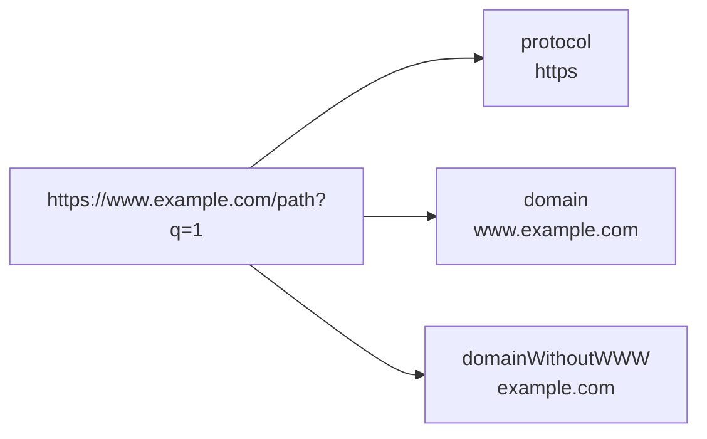

# How to Use protocol(), domain(), domainWithoutWWW() in ClickHouse

Author: [nawazdhandala](https://www.github.com/nawazdhandala)

Tags: ClickHouse, SQL, URL, Function, Web Analytics

Description: Learn how to extract protocol, domain, and domain without WWW from URL strings in ClickHouse using protocol(), domain(), and domainWithoutWWW().

---

URL analysis is a core task in web analytics. ClickHouse provides dedicated URL functions that extract specific components from URL strings, making it straightforward to group traffic by protocol, domain, or referrer host without writing complex string manipulation logic.

## How These Functions Work

- `protocol(url)` - extracts the scheme (e.g., `https`, `http`, `ftp`) from a URL string.
- `domain(url)` - extracts the hostname including any `www.` prefix.
- `domainWithoutWWW(url)` - extracts the hostname and strips a leading `www.` if present.

All three functions return an empty string `''` when the input is not a valid URL or the component is absent.

## Syntax

```sql
protocol(url)
domain(url)
domainWithoutWWW(url)
```

## URL Component Map



## Examples

### Basic Extraction

```sql
SELECT
    protocol('https://www.example.com/page')        AS proto,
    domain('https://www.example.com/page')           AS dom,
    domainWithoutWWW('https://www.example.com/page') AS dom_no_www;
```

```text
proto   dom               dom_no_www
https   www.example.com   example.com
```

### Protocol Variants

```sql
SELECT url, protocol(url) AS proto
FROM (
    SELECT 'https://secure.example.com'  AS url UNION ALL
    SELECT 'http://example.com'          AS url UNION ALL
    SELECT 'ftp://files.example.com'     AS url UNION ALL
    SELECT '/relative/path'              AS url
);
```

```text
url                         proto
https://secure.example.com  https
http://example.com          http
ftp://files.example.com     ftp
/relative/path              (empty)
```

### Domain vs domainWithoutWWW

```sql
SELECT url,
    domain(url)           AS with_www,
    domainWithoutWWW(url) AS without_www
FROM (
    SELECT 'https://www.google.com/search'      AS url UNION ALL
    SELECT 'https://mail.google.com/inbox'      AS url UNION ALL
    SELECT 'https://google.com/'                AS url
);
```

```text
url                           with_www          without_www
https://www.google.com/...    www.google.com    google.com
https://mail.google.com/...   mail.google.com   mail.google.com
https://google.com/           google.com        google.com
```

### Complete Working Example

Analyze referrer traffic grouped by source domain:

```sql
CREATE TABLE page_visits
(
    visit_id  UInt64,
    referrer  String,
    page_url  String,
    visited_at DateTime DEFAULT now()
) ENGINE = MergeTree()
ORDER BY visit_id;

INSERT INTO page_visits (visit_id, referrer, page_url) VALUES
    (1, 'https://www.google.com/search?q=analytics', 'https://mysite.com/blog'),
    (2, 'https://twitter.com/post/123',              'https://mysite.com/'),
    (3, 'https://www.google.com/search?q=clickhouse', 'https://mysite.com/docs'),
    (4, 'https://news.ycombinator.com/',             'https://mysite.com/blog'),
    (5, '',                                          'https://mysite.com/');

SELECT
    domainWithoutWWW(referrer) AS referrer_domain,
    protocol(referrer)         AS proto,
    count()                    AS visits
FROM page_visits
WHERE referrer != ''
GROUP BY referrer_domain, proto
ORDER BY visits DESC;
```

```text
referrer_domain        proto   visits
google.com             https   2
twitter.com            https   1
news.ycombinator.com   https   1
```

## Summary

`protocol()`, `domain()`, and `domainWithoutWWW()` are essential URL parsing functions in ClickHouse for web analytics. Use `protocol()` to segment traffic by scheme, `domain()` when subdomain differentiation matters (e.g., `mail.google.com` vs `www.google.com`), and `domainWithoutWWW()` when you want to consolidate `www` and non-`www` variants of the same site under a single key.
