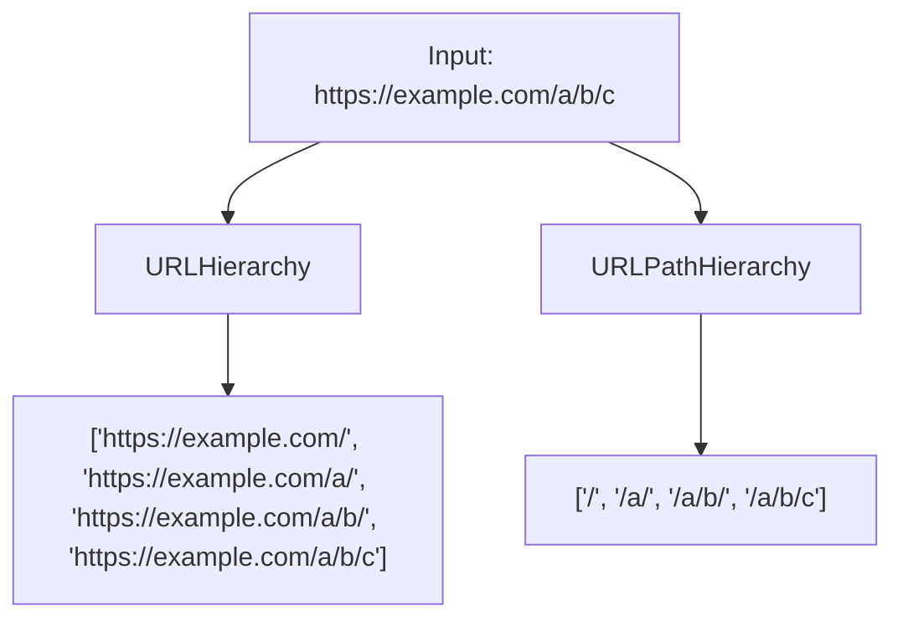

# How to Use URLHierarchy() and URLPathHierarchy() in ClickHouse

Author: [nawazdhandala](https://www.github.com/nawazdhandala)

Tags: ClickHouse, SQL, URL, Function, Web Analytics, URLHierarchy

Description: Learn how to generate URL hierarchy arrays from URL strings in ClickHouse using URLHierarchy() and URLPathHierarchy() for breadcrumb and funnel analysis.

---

Hierarchical URL analysis is useful for understanding how users navigate through sections of a website. `URLHierarchy()` and `URLPathHierarchy()` decompose a URL into its parent paths, giving you an array of all ancestor URLs - perfect for building breadcrumb trails or aggregating metrics across URL trees.

## How These Functions Work

- `URLHierarchy(url)` - returns an array of all URL prefixes from the root to the full URL, splitting at each `/` in the path. The result includes the scheme and domain.
- `URLPathHierarchy(url)` - returns an array of path prefixes only, starting with `/`. The scheme and domain are omitted.

## Syntax

```sql
URLHierarchy(url)
URLPathHierarchy(url)
```

## Output Comparison



## Examples

### URLHierarchy Basic Usage

```sql
SELECT URLHierarchy('https://example.com/blog/2026/clickhouse') AS hierarchy;
```

```text
hierarchy
['https://example.com/','https://example.com/blog/','https://example.com/blog/2026/','https://example.com/blog/2026/clickhouse']
```

### URLPathHierarchy Basic Usage

```sql
SELECT URLPathHierarchy('https://example.com/docs/api/v2/users') AS path_hierarchy;
```

```text
path_hierarchy
['/','docs/','docs/api/','docs/api/v2/','docs/api/v2/users']
```

### Expanding Hierarchy with ARRAY JOIN

Use `ARRAY JOIN` to unnest the hierarchy array into rows - useful for aggregating page view counts across parent paths:

```sql
SELECT
    url_prefix,
    count() AS attributed_views
FROM (
    SELECT arrayJoin(URLHierarchy(full_url)) AS url_prefix
    FROM (
        SELECT 'https://shop.com/products/shoes/sneakers' AS full_url UNION ALL
        SELECT 'https://shop.com/products/shoes/boots'   AS full_url UNION ALL
        SELECT 'https://shop.com/products/bags/handbags' AS full_url
    )
)
GROUP BY url_prefix
ORDER BY url_prefix;
```

```text
url_prefix                                  attributed_views
https://shop.com/                           3
https://shop.com/products/                  3
https://shop.com/products/bags/             1
https://shop.com/products/bags/handbags     1
https://shop.com/products/shoes/            2
https://shop.com/products/shoes/boots       1
https://shop.com/products/shoes/sneakers    1
```

### Complete Working Example

Compute section-level traffic by attributing each visit to all parent URL sections:

```sql
CREATE TABLE page_views
(
    view_id  UInt64,
    page_url String
) ENGINE = MergeTree()
ORDER BY view_id;

INSERT INTO page_views VALUES
    (1, 'https://docs.mysite.com/api/auth/tokens'),
    (2, 'https://docs.mysite.com/api/auth/refresh'),
    (3, 'https://docs.mysite.com/api/users/list'),
    (4, 'https://docs.mysite.com/guides/quickstart'),
    (5, 'https://docs.mysite.com/guides/advanced');

SELECT
    section,
    count() AS total_views
FROM (
    SELECT arrayJoin(URLPathHierarchy(page_url)) AS section
    FROM page_views
)
WHERE section != '/'
GROUP BY section
ORDER BY total_views DESC, section;
```

```text
section          total_views
api/             3
api/auth/        2
guides/          2
api/auth/tokens  1
api/auth/refresh 1
api/users/       1
api/users/list   1
guides/quickstart 1
guides/advanced  1
```

## Summary

`URLHierarchy()` returns an array of full URL prefixes from root to the complete URL, while `URLPathHierarchy()` returns only the path portion prefixes. Both are powerful for hierarchical traffic analysis - pair them with `arrayJoin()` or `ARRAY JOIN` to unnest the hierarchy into rows and aggregate metrics at each level of the URL tree, enabling section-level analytics without needing to pre-categorize URLs.
