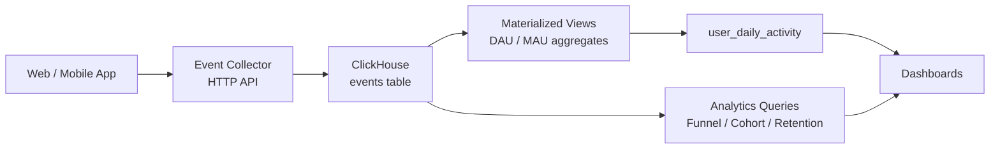

# How to Build a User Analytics Platform with ClickHouse

Author: [nawazdhandala](https://www.github.com/nawazdhandala)

Tags: ClickHouse, Analytics, User, Event, MergeTree, Funnel

Description: Learn how to build a user analytics platform with ClickHouse, covering event tracking, session analysis, funnel queries, cohort retention, and user property storage.

---

A user analytics platform needs to answer questions like "how many users completed checkout this week?", "which acquisition channels retain users best?", and "what is the 30-day retention for users who signed up in January?" ClickHouse handles all of these with its columnar storage and specialized aggregate functions for funnel and cohort analysis.

## Architecture



## Events Table

```sql
CREATE TABLE events
(
    event_id    UUID                           CODEC(LZ4),
    user_id     UInt64                         CODEC(LZ4),
    session_id  UInt64                         CODEC(LZ4),
    event_name  LowCardinality(String)         CODEC(LZ4),
    page        LowCardinality(String)         CODEC(LZ4),
    platform    LowCardinality(String)         CODEC(LZ4),
    country     LowCardinality(FixedString(2)) CODEC(LZ4),
    properties  Map(String, String)            CODEC(ZSTD(3)),
    ts          DateTime64(3)                  CODEC(DoubleDelta, LZ4)
)
ENGINE = MergeTree()
PARTITION BY toYYYYMM(ts)
ORDER BY (event_name, user_id, ts)
TTL toDateTime(ts) + INTERVAL 2 YEAR
SETTINGS index_granularity = 8192;
```

## User Profiles Table

```sql
CREATE TABLE users
(
    user_id       UInt64                 CODEC(LZ4),
    signup_date   Date,
    plan          LowCardinality(String) CODEC(LZ4),
    country       LowCardinality(FixedString(2)) CODEC(LZ4),
    acquisition   LowCardinality(String) CODEC(LZ4),
    properties    Map(String, String)    CODEC(ZSTD(3)),
    updated_at    DateTime               CODEC(DoubleDelta, LZ4)
)
ENGINE = ReplacingMergeTree(updated_at)
ORDER BY user_id;
```

ReplacingMergeTree deduplicates user records by user_id, keeping the most recently updated row.

## Inserting Events

```sql
INSERT INTO events
    (event_id, user_id, session_id, event_name, page, platform, country, properties, ts)
VALUES
    (generateUUIDv4(), 1001, 5001, 'page_view',    '/home',     'web',     'US', {'referrer': 'google'}, now64()),
    (generateUUIDv4(), 1001, 5001, 'add_to_cart',  '/product',  'web',     'US', {'product_id': '42'},   now64()),
    (generateUUIDv4(), 1001, 5001, 'checkout',     '/checkout', 'web',     'US', {'cart_value': '89.5'}, now64()),
    (generateUUIDv4(), 1002, 5002, 'page_view',    '/home',     'mobile',  'GB', {'referrer': 'direct'}, now64());
```

## Daily Active Users (DAU)

```sql
SELECT
    toDate(ts)        AS day,
    uniqExact(user_id) AS dau
FROM events
WHERE ts >= now() - INTERVAL 30 DAY
GROUP BY day
ORDER BY day;
```

## Monthly Active Users (MAU)

```sql
SELECT
    toStartOfMonth(ts) AS month,
    uniqExact(user_id) AS mau
FROM events
WHERE ts >= now() - INTERVAL 12 MONTH
GROUP BY month
ORDER BY month;
```

## DAU/MAU Ratio (Stickiness)

```sql
WITH
    daily AS (
        SELECT toDate(ts) AS day, uniqExact(user_id) AS dau
        FROM events
        WHERE ts >= now() - INTERVAL 30 DAY
        GROUP BY day
    ),
    monthly AS (
        SELECT uniqExact(user_id) AS mau
        FROM events
        WHERE ts >= now() - INTERVAL 30 DAY
    )
SELECT
    d.day,
    d.dau,
    m.mau,
    round(100.0 * d.dau / m.mau, 1) AS stickiness_pct
FROM daily d
CROSS JOIN monthly m
ORDER BY d.day;
```

## Funnel Analysis

Use `windowFunnel` to measure conversion through a defined step sequence:

```sql
SELECT
    level,
    count() AS users
FROM (
    SELECT
        user_id,
        windowFunnel(86400)(
            ts,
            event_name = 'page_view',
            event_name = 'add_to_cart',
            event_name = 'checkout',
            event_name = 'purchase'
        ) AS level
    FROM events
    WHERE ts >= now() - INTERVAL 7 DAY
    GROUP BY user_id
)
GROUP BY level
ORDER BY level;
```

## Cohort Retention

Calculate N-day retention for users who signed up in a given week:

```sql
SELECT
    cohort_week,
    days_since_signup,
    uniqExact(user_id) AS retained_users
FROM (
    SELECT
        e.user_id,
        toMonday(u.signup_date)                              AS cohort_week,
        toInt32(dateDiff('day', u.signup_date, toDate(e.ts))) AS days_since_signup
    FROM events e
    JOIN users u ON e.user_id = u.user_id
    WHERE e.ts >= '2024-01-01'
      AND u.signup_date >= '2024-01-01'
)
WHERE days_since_signup BETWEEN 0 AND 30
GROUP BY cohort_week, days_since_signup
ORDER BY cohort_week, days_since_signup;
```

## Top Events by Platform

```sql
SELECT
    platform,
    event_name,
    count()            AS occurrences,
    uniqExact(user_id) AS unique_users
FROM events
WHERE ts >= now() - INTERVAL 7 DAY
GROUP BY platform, event_name
ORDER BY platform, occurrences DESC;
```

## Session Duration

```sql
SELECT
    user_id,
    session_id,
    min(ts)                                    AS session_start,
    max(ts)                                    AS session_end,
    dateDiff('second', min(ts), max(ts))       AS duration_seconds,
    count()                                    AS event_count
FROM events
WHERE ts >= now() - INTERVAL 1 DAY
GROUP BY user_id, session_id
ORDER BY duration_seconds DESC
LIMIT 20;
```

## Materialized View for Daily User Activity

```sql
CREATE TABLE user_daily_activity
(
    user_id    UInt64,
    day        Date,
    events     UInt32,
    sessions   UInt32
)
ENGINE = SummingMergeTree()
ORDER BY (user_id, day);

CREATE MATERIALIZED VIEW user_daily_activity_mv
TO user_daily_activity
AS
SELECT
    user_id,
    toDate(ts)            AS day,
    count()               AS events,
    uniqExact(session_id) AS sessions
FROM events
GROUP BY user_id, day;
```

## Summary

A ClickHouse user analytics platform pairs a high-cardinality events table with a ReplacingMergeTree users table, materialized views for DAU aggregation, and ClickHouse-specific functions like `windowFunnel` and `uniqExact` for funnel and cohort queries. LowCardinality columns on event names and platform fields reduce storage by 10-20x while keeping lookups fast. This schema handles tens of billions of events per month on a single ClickHouse cluster.
