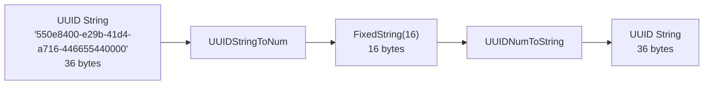

# How to Use UUIDStringToNum() and UUIDNumToString() in ClickHouse

Author: [nawazdhandala](https://www.github.com/nawazdhandala)

Tags: ClickHouse, SQL, UUID, Function, Type Conversion, UUIDStringToNum

Description: Learn how to convert UUIDs between human-readable string format and compact binary FixedString(16) storage in ClickHouse using UUIDStringToNum() and UUIDNumToString().

---

UUIDs are 128-bit identifiers commonly used as primary keys and correlation IDs. While the standard string form (`550e8400-e29b-41d4-a716-446655440000`) is human-readable, it takes 36 bytes as a string. `UUIDStringToNum()` converts UUIDs to a 16-byte `FixedString(16)` for compact storage, and `UUIDNumToString()` converts back for display.

## How These Functions Work

- `UUIDStringToNum(uuid_string)` - parses a standard UUID string (with or without hyphens) and returns a 16-byte `FixedString(16)` in big-endian byte order.
- `UUIDNumToString(fixedstring16)` - takes a 16-byte binary UUID and formats it as the standard hyphenated lowercase UUID string.

For comparison: a UUID stored as `String` uses 36 bytes; as `FixedString(16)` it uses exactly 16 bytes - a 56% reduction.

## Syntax

```sql
UUIDStringToNum(uuid_string)
UUIDNumToString(fixedstring16_value)
```

## Storage Size Comparison



## Examples

### Converting a UUID String to Binary

```sql
SELECT
    UUIDStringToNum('550e8400-e29b-41d4-a716-446655440000') AS binary_uuid,
    length(UUIDStringToNum('550e8400-e29b-41d4-a716-446655440000')) AS byte_len;
```

```text
binary_uuid                 byte_len
\x55\x0e\x84\x00...         16
```

### Converting Binary Back to String

```sql
SELECT UUIDNumToString(UUIDStringToNum('550e8400-e29b-41d4-a716-446655440000')) AS uuid_str;
```

```text
uuid_str
550e8400-e29b-41d4-a716-446655440000
```

### Round-Trip Verification

Verify that conversion is lossless:

```sql
SELECT
    original_uuid,
    UUIDNumToString(UUIDStringToNum(original_uuid)) AS round_tripped,
    original_uuid = UUIDNumToString(UUIDStringToNum(original_uuid)) AS matches
FROM (
    SELECT '6ba7b810-9dad-11d1-80b4-00c04fd430c8' AS original_uuid
);
```

```text
original_uuid                         round_tripped                         matches
6ba7b810-9dad-11d1-80b4-00c04fd430c8  6ba7b810-9dad-11d1-80b4-00c04fd430c8  1
```

### Complete Working Example

Store request correlation IDs compactly as binary:

```sql
CREATE TABLE api_requests
(
    request_id  FixedString(16),
    endpoint    String,
    status      UInt16,
    duration_ms Float64
) ENGINE = MergeTree()
ORDER BY request_id;

INSERT INTO api_requests VALUES
    (UUIDStringToNum('550e8400-e29b-41d4-a716-446655440001'), '/api/users',   200, 12.3),
    (UUIDStringToNum('550e8400-e29b-41d4-a716-446655440002'), '/api/orders',  201, 45.6),
    (UUIDStringToNum('550e8400-e29b-41d4-a716-446655440003'), '/api/users',   404, 5.2),
    (UUIDStringToNum('550e8400-e29b-41d4-a716-446655440004'), '/api/products', 200, 8.9);

SELECT
    UUIDNumToString(request_id) AS request_uuid,
    endpoint,
    status,
    duration_ms
FROM api_requests
WHERE status = 200
ORDER BY duration_ms DESC;
```

```text
request_uuid                          endpoint       status  duration_ms
550e8400-e29b-41d4-a716-446655440001  /api/users     200     12.3
550e8400-e29b-41d4-a716-446655440004  /api/products  200     8.9
```

## Summary

`UUIDStringToNum()` and `UUIDNumToString()` convert UUIDs between the standard 36-character string format and a compact 16-byte `FixedString(16)` binary representation. Use `UUIDStringToNum()` at insert time to reduce storage by 56% compared to string UUIDs, and `UUIDNumToString()` in SELECT queries to present human-readable UUIDs. For most new schemas, prefer using the native `UUID` data type directly, which provides the same efficiency with a cleaner interface.
