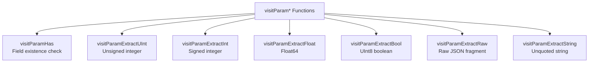

# How to Use visitParam* Functions for JSON Parsing in ClickHouse

Author: [nawazdhandala](https://www.github.com/nawazdhandala)

Tags: ClickHouse, SQL, JSON, visitParam, Function, Log Parsing

Description: Learn how to use the visitParam* family of functions in ClickHouse as aliases for simpleJSON* functions for fast flat JSON parsing.

---

ClickHouse includes a family of functions prefixed with `visitParam` that serve as direct aliases for the `simpleJSON*` functions. These were the original names in older ClickHouse versions, and understanding them is important when working with legacy queries or documentation that predates the `simpleJSON*` naming.

## How visitParam* Functions Work

The `visitParam*` functions are exact aliases:

| visitParam function | Equivalent simpleJSON function |
|---|---|
| `visitParamHas` | `simpleJSONHas` |
| `visitParamExtractUInt` | `simpleJSONExtractUInt` |
| `visitParamExtractInt` | `simpleJSONExtractInt` |
| `visitParamExtractFloat` | `simpleJSONExtractFloat` |
| `visitParamExtractBool` | `simpleJSONExtractBool` |
| `visitParamExtractRaw` | `simpleJSONExtractRaw` |
| `visitParamExtractString` | `simpleJSONExtractString` |

All limitations of `simpleJSON*` apply: flat JSON only, single field lookup, no nested path support.

## Syntax

```sql
visitParamHas(json, field_name)
visitParamExtractUInt(json, field_name)
visitParamExtractInt(json, field_name)
visitParamExtractFloat(json, field_name)
visitParamExtractBool(json, field_name)
visitParamExtractRaw(json, field_name)
visitParamExtractString(json, field_name)
```

## Function Family Overview



## Examples

### Checking for Field Existence

`visitParamHas()` returns 1 if the field exists, 0 otherwise:

```sql
SELECT
    visitParamHas('{"user": "alice", "score": 42}', 'user')  AS has_user,
    visitParamHas('{"user": "alice", "score": 42}', 'email') AS has_email;
```

```text
has_user  has_email
1         0
```

### Extracting an Unsigned Integer

```sql
SELECT visitParamExtractUInt('{"request_id": 9999, "status": 200}', 'request_id') AS req_id;
```

```text
req_id
9999
```

### Extracting Strings

`visitParamExtractString()` returns the string value without surrounding quotes:

```sql
SELECT
    visitParamExtractString('{"action": "click", "page": "/home"}', 'action') AS action,
    visitParamExtractRaw('{"action": "click", "page": "/home"}',    'action') AS raw_action;
```

```text
action  raw_action
click   "click"
```

### Complete Working Example

Analyze web session events using the visitParam family:

```sql
CREATE TABLE session_log
(
    session_id UInt64,
    event_data String
) ENGINE = MergeTree()
ORDER BY session_id;

INSERT INTO session_log VALUES
    (1, '{"uid": 101, "page": "/home",    "duration": 5.2,  "converted": false}'),
    (2, '{"uid": 102, "page": "/pricing", "duration": 12.7, "converted": true}'),
    (3, '{"uid": 101, "page": "/pricing", "duration": 8.1,  "converted": true}'),
    (4, '{"uid": 103, "page": "/home",    "duration": 1.3,  "converted": false}');

SELECT
    visitParamExtractUInt(event_data,   'uid')        AS user_id,
    visitParamExtractString(event_data, 'page')       AS page,
    visitParamExtractFloat(event_data,  'duration')   AS duration_sec,
    visitParamExtractBool(event_data,   'converted')  AS converted
FROM session_log
WHERE visitParamHas(event_data, 'converted')
ORDER BY session_id;
```

```text
user_id  page      duration_sec  converted
101      /home     5.2           0
102      /pricing  12.7          1
101      /pricing  8.1           1
103      /home     1.3           0
```

### Filtering Only Converted Sessions

```sql
SELECT
    count()                                             AS total_conversions,
    avg(visitParamExtractFloat(event_data, 'duration')) AS avg_session_before_convert
FROM session_log
WHERE visitParamExtractBool(event_data, 'converted') = 1;
```

```text
total_conversions  avg_session_before_convert
2                  10.4
```

## Summary

The `visitParam*` functions are aliases for the `simpleJSON*` function family in ClickHouse and provide the same lightweight, fast JSON parsing capability for flat JSON objects. They are functionally identical and can be used interchangeably. New code should prefer the `simpleJSON*` naming for clarity, but `visitParam*` remains fully supported for backward compatibility with legacy queries and third-party integrations.
