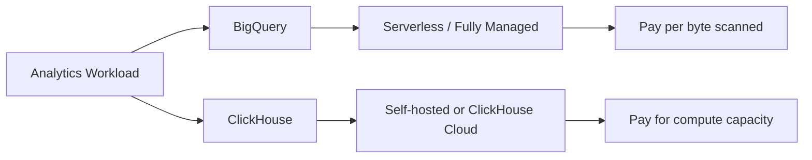
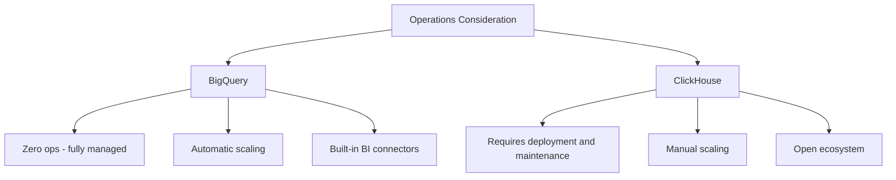

# ClickHouse vs BigQuery Cost and Performance

Author: [oneuptime](https://github.com/oneuptime)

Tags: ClickHouse, BigQuery, Cloud, Cost, Performance, Analytics

Description: Compare ClickHouse and Google BigQuery on cost, query performance, data freshness, and operational model to help you choose the right analytics database.

## Overview

Google BigQuery and ClickHouse represent two different paradigms for analytics infrastructure. BigQuery is a fully managed serverless data warehouse with usage-based pricing. ClickHouse is an open-source OLAP database you deploy yourself (or use via ClickHouse Cloud). The cost and performance trade-offs between them are significant and worth understanding carefully.



## Pricing Model

**BigQuery** charges for:
- Storage: $0.02 per GB/month (active), $0.01 per GB/month (long-term)
- Queries: $5 per TB scanned (on-demand), or flat-rate slot pricing
- Streaming inserts: $0.01 per 200MB

**ClickHouse Cloud** charges for:
- Compute: hourly per service tier
- Storage: per GB/month
- No per-query charges

**Self-hosted ClickHouse** costs only the infrastructure (servers, storage, networking). For high-volume query workloads, self-hosted ClickHouse can be 10-50x cheaper than BigQuery at scale.

### Cost Example: 1TB Query Workload

Assume a team runs 1,000 queries per day, each scanning an average of 1GB of data (1TB total per day).

```text
BigQuery on-demand:
  1TB/day * $5/TB = $5/day = $150/month

ClickHouse Cloud (e.g., 3 nodes):
  ~$400-800/month fixed (handles much more than 1TB/day)

Self-hosted ClickHouse (3 servers):
  ~$150-300/month in cloud VMs
```

At low query volumes, BigQuery is cost-effective because you pay only for what you use. At high query volumes, ClickHouse becomes significantly cheaper.

## Query Performance

BigQuery uses a serverless model where query slots are allocated dynamically. This introduces cold-start latency of 1-5 seconds even for simple queries. For complex queries over large datasets, BigQuery scales massively and can deliver results in seconds.

ClickHouse has no cold-start latency. Simple queries return in milliseconds. For queries that fit in memory and involve single-table scans, ClickHouse is typically 5-20x faster than BigQuery.

```sql
-- Both: simple aggregation over 100M rows
SELECT
    product_category,
    sum(revenue)    AS total_revenue,
    count()         AS order_count
FROM orders
WHERE order_date >= '2025-01-01'
GROUP BY product_category
ORDER BY total_revenue DESC;
```

Expected performance:
- ClickHouse: 50-200ms
- BigQuery: 2-8 seconds (including slot allocation)

For very large queries (scanning terabytes) where BigQuery can allocate hundreds of slots, the gap narrows.

## Data Freshness

BigQuery supports streaming inserts for near-real-time data, but streaming inserts are more expensive than batch loads. BigQuery Storage Write API reduces cost but adds complexity.

ClickHouse supports real-time inserts with millisecond-level freshness. Data is immediately queryable after insert.

```sql
-- ClickHouse: data is visible immediately after insert
INSERT INTO events (event_id, user_id, event_type, occurred_at)
VALUES ('abc123', 42, 'purchase', now());

-- Query returns the just-inserted row instantly
SELECT * FROM events WHERE event_id = 'abc123';
```

## SQL Compatibility and Features

BigQuery has excellent SQL support, including window functions, arrays, structs, and a large library of built-in functions. Its handling of nested/repeated fields (STRUCT, ARRAY) is particularly strong for JSON-like data.

ClickHouse also has rich SQL with extensions for time-series analytics, approximate functions, and array processing. Its `arrayJoin`, `groupArray`, and window functions are powerful for event analytics.

```sql
-- ClickHouse: sessionization using window functions
SELECT
    user_id,
    session_id,
    min(occurred_at) AS session_start,
    max(occurred_at) AS session_end,
    count()          AS event_count
FROM (
    SELECT
        user_id,
        occurred_at,
        sum(is_new_session) OVER (
            PARTITION BY user_id ORDER BY occurred_at
        ) AS session_id
    FROM (
        SELECT
            user_id,
            occurred_at,
            if(
                occurred_at - lagInFrame(occurred_at) OVER (
                    PARTITION BY user_id ORDER BY occurred_at
                ) > 1800,
                1, 0
            ) AS is_new_session
        FROM events
    )
)
GROUP BY user_id, session_id;
```

## Operational Comparison



BigQuery requires no infrastructure management. Google handles scaling, replication, backups, and upgrades. This is a major advantage for small teams.

ClickHouse requires operational expertise. You need to manage deployments, monitor disk usage, configure replication, and handle upgrades. ClickHouse Cloud reduces this burden significantly.

## When to Choose Each

**Choose BigQuery when:**
- You want zero operational overhead
- Your query volume is unpredictable or bursty
- You are deeply invested in the Google Cloud ecosystem
- You need to share data easily with external partners via BigQuery data sharing
- Your team lacks database administration expertise

**Choose ClickHouse when:**
- You have predictable, high-volume query workloads
- Cost control is critical at scale
- You need sub-second query latency
- You have real-time ingestion requirements
- You want to avoid vendor lock-in

## Conclusion

BigQuery is the right choice for teams that value simplicity and are willing to pay a premium for fully managed infrastructure. ClickHouse is the right choice for teams with high query volumes where cost matters, where sub-second latency is required, or where real-time data freshness is essential. Many organizations run ClickHouse for high-volume operational analytics and BigQuery for ad-hoc exploration and reporting.

**Related Reading:**

- [ClickHouse vs Snowflake for Analytics](https://oneuptime.com/blog/post/2026-03-31-clickhouse-vs-snowflake-analytics/view)
- [ClickHouse vs DuckDB for Analytical Workloads](https://oneuptime.com/blog/post/2026-03-31-clickhouse-vs-duckdb-analytical-workloads/view)
- [How to Build a SaaS Usage Analytics System with ClickHouse](https://oneuptime.com/blog/post/2026-03-31-clickhouse-build-saas-usage-analytics/view)
