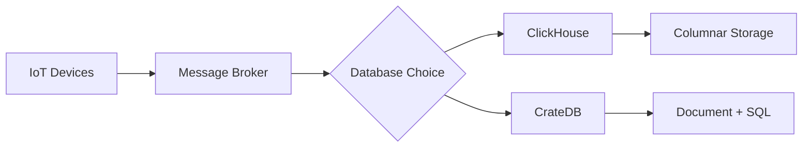
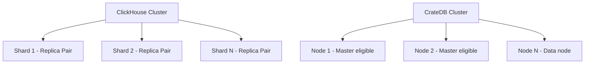

# ClickHouse vs CrateDB for IoT Data

Author: [oneuptime](https://github.com/oneuptime)

Tags: ClickHouse, CrateDB, IoT, Database, Analytics, Time-series

Description: A balanced comparison of ClickHouse and CrateDB for IoT data workloads, covering ingestion speed, storage efficiency, query performance, and operational complexity.

## Overview

IoT platforms generate continuous streams of sensor readings, device events, and telemetry data. Choosing the right database for this workload shapes everything from query latency to infrastructure cost. ClickHouse and CrateDB are two popular choices, each with distinct strengths.



## Architecture Differences

**ClickHouse** is a columnar OLAP database designed for high-throughput analytical queries. It stores data in compressed column files, which makes aggregation across millions of rows extremely fast.

**CrateDB** is built on top of Lucene and Elasticsearch internals but exposes a standard SQL interface. It combines document-style storage with tabular queries, making it flexible for semi-structured IoT payloads.

## Ingestion Performance

For IoT workloads, ingestion throughput is critical. Devices may send thousands of readings per second.

ClickHouse achieves high ingestion rates through its asynchronous insert mechanism and MergeTree engine. Data is written to in-memory buffers and merged into sorted parts on disk.

```sql
-- ClickHouse: create an IoT sensor table
CREATE TABLE sensor_readings (
    device_id   String,
    metric      String,
    value       Float64,
    recorded_at DateTime
) ENGINE = MergeTree()
PARTITION BY toYYYYMM(recorded_at)
ORDER BY (device_id, recorded_at);
```

CrateDB ingests data through its distributed write path, which routes inserts across shards. It handles JSON payloads natively, making it convenient when device payloads are irregular.

```sql
-- CrateDB: create an IoT sensor table
CREATE TABLE sensor_readings (
    device_id   TEXT,
    metric      TEXT,
    value       DOUBLE,
    recorded_at TIMESTAMP WITH TIME ZONE
) CLUSTERED BY (device_id) INTO 4 SHARDS;
```

In benchmark conditions with uniform structured data, ClickHouse typically sustains 500k-1M rows/second per node while CrateDB achieves 100k-300k rows/second per node, depending on shard count and payload complexity.

## Query Performance

Analytical queries over IoT data typically involve time-range filtering, grouping by device, and aggregating sensor values.

```sql
-- ClickHouse: hourly average temperature per device
SELECT
    device_id,
    toStartOfHour(recorded_at) AS hour,
    avg(value) AS avg_temp
FROM sensor_readings
WHERE metric = 'temperature'
  AND recorded_at >= now() - INTERVAL 7 DAY
GROUP BY device_id, hour
ORDER BY device_id, hour;
```

```sql
-- CrateDB: equivalent query
SELECT
    device_id,
    date_trunc('hour', recorded_at) AS hour,
    avg(value) AS avg_temp
FROM sensor_readings
WHERE metric = 'temperature'
  AND recorded_at >= now() - INTERVAL '7 days'
GROUP BY device_id, hour
ORDER BY device_id, hour;
```

ClickHouse benefits from vectorized query execution and compressed columnar reads. For this type of aggregation across hundreds of millions of rows, ClickHouse is typically 5-20x faster than CrateDB.

CrateDB performs better when queries involve full-text search or when data is stored as dynamic JSON objects with varying schema.

## Storage Efficiency

ClickHouse uses LZ4 and ZSTD compression on columnar data. For time-series IoT data with repeated device IDs and limited metric names, compression ratios of 10:1 or better are common.

CrateDB stores data in Lucene segments. Its compression is less aggressive for tabular data, typically achieving 3:1 to 5:1 ratios on structured IoT payloads.

## Scalability and Operations



ClickHouse uses a manual sharding model with ZooKeeper or ClickHouse Keeper for replication coordination. Scaling requires deliberate cluster design but gives precise control over data placement.

CrateDB uses an Elasticsearch-style cluster model where nodes are peers. Adding nodes is operationally simpler, and the cluster automatically rebalances shards.

## When to Choose Each

**Choose ClickHouse when:**
- Your IoT schema is structured and consistent
- You need maximum analytical query speed
- Storage efficiency is a priority
- You are running large batch aggregations over historical data

**Choose CrateDB when:**
- Device payloads are semi-structured or vary by device type
- You need full-text search alongside time-series queries
- Your team prefers simpler horizontal scaling
- You need geospatial queries on device location data

## Conclusion

For most IoT platforms where data is structured and analytical throughput matters, ClickHouse delivers superior performance and storage efficiency. CrateDB is a reasonable choice when schema flexibility and operational simplicity outweigh raw query speed.

**Related Reading:**

- [ClickHouse vs Druid for Real-Time Analytics](https://oneuptime.com/blog/post/2026-03-31-clickhouse-vs-druid-real-time-analytics/view)
- [How to Build a Real-Time Metrics Dashboard with ClickHouse](https://oneuptime.com/blog/post/2026-03-31-clickhouse-build-real-time-metrics-dashboard/view)
- [How to Build a Smart Home Data Platform with ClickHouse](https://oneuptime.com/blog/post/2026-03-31-clickhouse-build-smart-home-data-platform/view)
