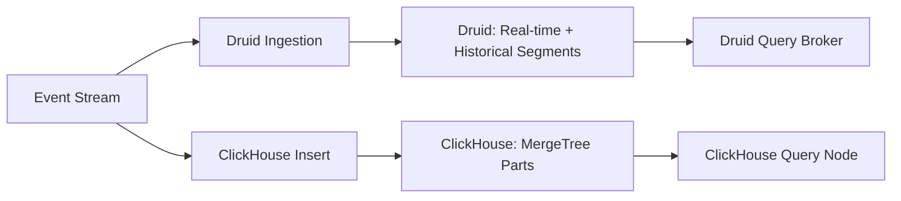
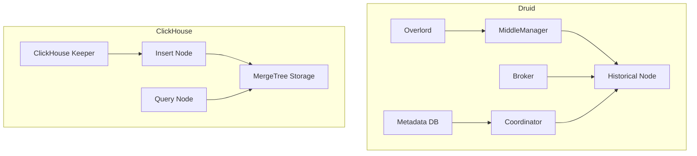

# ClickHouse vs Druid for Real-Time Analytics

Author: [nawazdhandala](https://www.github.com/nawazdhandala)

Tags: ClickHouse, Druid, Analytics, Real-Time, Database, Performance

Description: A detailed comparison of ClickHouse and Apache Druid for real-time analytics, examining ingestion latency, query patterns, architecture, and operational tradeoffs.

## Overview

Apache Druid and ClickHouse are both purpose-built for high-speed analytics, but they take fundamentally different approaches to the problem. Druid was designed for sub-second query latency on streaming data. ClickHouse was designed for maximum throughput on large-scale batch and near-real-time analytics.



## Architecture

**Druid** splits its architecture into several specialized services: Overlord, Coordinator, Broker, Historical, and MiddleManager. Real-time data lands in MiddleManager nodes and is eventually handed off to Historical nodes as immutable segments. Metadata is stored in a relational database (typically PostgreSQL), and coordination uses ZooKeeper or the native coordinator.

**ClickHouse** has a simpler operational footprint. Data is written to MergeTree parts and merged in the background. Replication uses ClickHouse Keeper (or ZooKeeper). There is no strict separation between ingestion nodes and query nodes by default, though dedicated roles can be configured.



## Ingestion Model

Druid supports streaming ingestion natively through Kafka or Kinesis supervisors. Data is visible for query within seconds of arriving in the stream.

ClickHouse ingests data through inserts, which are batched and written as new parts. With the Kafka engine or Kafka table functions, ClickHouse can achieve near-real-time ingestion, but the default insert path involves slightly higher latency than Druid's streaming ingestion.

```sql
-- ClickHouse: Kafka engine integration
CREATE TABLE events_kafka (
    event_id    String,
    user_id     UInt64,
    event_type  String,
    occurred_at DateTime
) ENGINE = Kafka
SETTINGS
    kafka_broker_list = 'kafka:9092',
    kafka_topic_list  = 'events',
    kafka_group_name  = 'clickhouse_consumer',
    kafka_format      = 'JSONEachRow';

CREATE MATERIALIZED VIEW events_mv TO events AS
SELECT * FROM events_kafka;
```

Druid requires a supervisor spec to consume from Kafka, and it handles segment creation, handoff, and compaction automatically.

## Query Performance

For interactive dashboard queries over pre-aggregated rollups, Druid is extremely fast. It pre-aggregates data at ingestion time using rollup, which reduces the data volume that queries must scan.

```json
{
  "dataSchema": {
    "granularitySpec": {
      "rollup": true,
      "queryGranularity": "MINUTE"
    },
    "metricsSpec": [
      { "type": "count", "name": "event_count" },
      { "type": "doubleSum", "name": "revenue_sum", "fieldName": "revenue" }
    ]
  }
}
```

ClickHouse does not pre-aggregate by default, but it executes full-scan aggregation queries faster than almost any other database. For ad-hoc queries over raw data, ClickHouse is typically faster than Druid.

```sql
-- ClickHouse: ad-hoc aggregation over raw events
SELECT
    event_type,
    toStartOfMinute(occurred_at) AS minute,
    count()                      AS event_count,
    sum(revenue)                 AS total_revenue
FROM events
WHERE occurred_at >= now() - INTERVAL 1 HOUR
GROUP BY event_type, minute
ORDER BY minute;
```

## Storage and Data Model

Druid stores data as time-partitioned segments with optional rollup. Segments are immutable. Schema changes require reingestion or reindexing, which adds operational overhead.

ClickHouse supports `ALTER TABLE` for adding and removing columns without rewriting data. Schema evolution is significantly easier. Data is mutable through lightweight deletes and updates (in recent versions).

## Operational Complexity

Druid is notably more complex to operate. A production Druid cluster typically requires:

- ZooKeeper ensemble
- Metadata database (PostgreSQL)
- Separate services for each role
- Deep storage (S3, HDFS, GCS) for segment persistence

ClickHouse requires only the database nodes and ClickHouse Keeper. Deep storage integration is available but optional.

## When to Choose Each

**Choose Druid when:**
- You need guaranteed sub-second query latency on streaming data
- Pre-aggregated rollups match your query patterns
- You are building a fixed-dimension analytics product
- You can afford the operational complexity

**Choose ClickHouse when:**
- You need ad-hoc query flexibility over raw data
- Schema evolves frequently
- You want simpler operations with fewer moving parts
- Storage efficiency and compression ratios matter

## Conclusion

Druid excels at predictable, sub-second latency on pre-defined rollup queries over streaming data. ClickHouse excels at flexible, high-throughput analytical queries over raw data with simpler operations. Many teams choose ClickHouse as a simpler alternative that still delivers excellent real-time analytics performance.

**Related Reading:**

- [ClickHouse vs Pinot for Event Analytics](https://oneuptime.com/blog/post/2026-03-31-clickhouse-vs-pinot-event-analytics/view)
- [How to Build a Real-Time Metrics Dashboard with ClickHouse](https://oneuptime.com/blog/post/2026-03-31-clickhouse-build-real-time-metrics-dashboard/view)
- [ClickHouse vs StarRocks Performance Comparison](https://oneuptime.com/blog/post/2026-03-31-clickhouse-vs-starrocks-performance/view)
