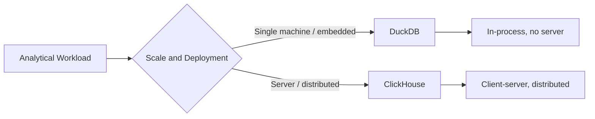
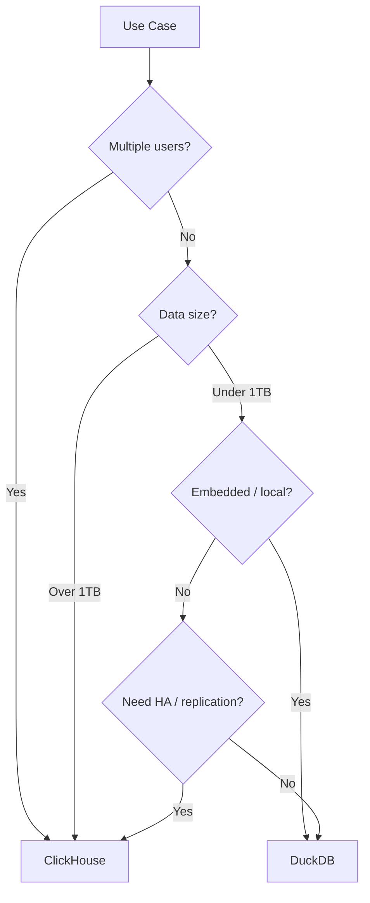

# ClickHouse vs DuckDB for Analytical Workloads

Author: [nawazdhandala](https://www.github.com/nawazdhandala)

Tags: ClickHouse, DuckDB, Analytics, Database, Performance, OLAP

Description: Compare ClickHouse and DuckDB for analytical workloads - covering deployment model, query performance, file format support, concurrency, and when to use each.

## Overview

DuckDB and ClickHouse are both columnar analytical databases, but they occupy very different deployment niches. DuckDB is an in-process database designed for local analytics on a single machine. ClickHouse is a distributed server designed to handle petabytes of data across a cluster. Understanding this distinction is the key to choosing between them.



## Deployment Model

**DuckDB** runs in-process, embedded in your application like SQLite. There is no server to start or maintain. It reads directly from Parquet, CSV, JSON, and Arrow files. This makes it ideal for data science workflows, ETL scripts, and analytical applications that run on a single machine.

**ClickHouse** is a dedicated database server. You deploy it on one or more nodes and query it over HTTP or native protocol. It manages its own storage, handles concurrent queries, and scales horizontally.

```python
# DuckDB: run analytics directly in Python, no server needed
import duckdb

result = duckdb.query("""
    SELECT
        country,
        sum(revenue) AS total_revenue
    FROM 'sales_data.parquet'
    WHERE sale_date >= '2025-01-01'
    GROUP BY country
    ORDER BY total_revenue DESC
    LIMIT 10
""").fetchdf()
```

```sql
-- ClickHouse: query requires a running server
SELECT
    country,
    sum(revenue) AS total_revenue
FROM sales_data
WHERE sale_date >= '2025-01-01'
GROUP BY country
ORDER BY total_revenue DESC
LIMIT 10;
```

## Query Performance

For datasets that fit in memory or on a single machine (up to a few hundred GB), DuckDB is competitive with ClickHouse and often faster for certain workloads because it avoids serialization overhead.

For datasets in the terabyte-to-petabyte range, ClickHouse is the clear winner because it is designed for distributed query execution and can parallelize across many nodes.

### TPC-H Benchmark Context

On TPC-H benchmarks at scale factor 10 (10GB), DuckDB and ClickHouse perform comparably. At scale factor 100 (100GB) on a single machine, both remain fast. At scale factor 1000+ (1TB+), ClickHouse on a cluster will complete queries orders of magnitude faster.

## File Format Support

DuckDB has excellent support for reading external file formats directly, which is a major productivity advantage.

```sql
-- DuckDB: query Parquet files directly from S3
SELECT count(*), sum(revenue)
FROM read_parquet('s3://my-bucket/sales/*.parquet')
WHERE sale_date >= '2025-01-01';

-- DuckDB: query CSV files
SELECT * FROM read_csv('data.csv', header=true, auto_detect=true);

-- DuckDB: query JSON files
SELECT * FROM read_json('events.json', auto_detect=true);
```

ClickHouse also supports external file access but it is primarily a server-side feature. ClickHouse can query S3 directly using the S3 table engine and supports Parquet, ORC, CSV, and other formats.

```sql
-- ClickHouse: query Parquet from S3
SELECT count(), sum(revenue)
FROM s3(
    'https://s3.amazonaws.com/my-bucket/sales/*.parquet',
    'Parquet'
)
WHERE sale_date >= '2025-01-01';
```

## Concurrency and Multi-User Access

DuckDB is designed for single-user workloads. It allows multiple readers but only one writer at a time. It is not suitable for multi-user analytics applications where many users run queries simultaneously.

ClickHouse handles hundreds of concurrent queries. It has a sophisticated query scheduler and supports query priority, resource groups, and user-level quotas.

```sql
-- ClickHouse: create resource profiles for different user classes
CREATE SETTINGS PROFILE analyst_profile
SETTINGS max_memory_usage = 4000000000,    -- 4GB
         max_execution_time = 60;

CREATE USER analyst SETTINGS PROFILE analyst_profile;
```

## Storage and Persistence

DuckDB stores data in a single `.duckdb` file. This is simple but limits scalability. There is no built-in replication or high availability.

ClickHouse stores data in a structured directory on disk, supports replication across nodes via ReplicatedMergeTree, and provides high availability through multiple replicas.

## Use Case Mapping



## When to Choose Each

**Choose DuckDB when:**
- You need an embedded analytical database in an application
- You are doing data science, exploration, or ETL on a single machine
- You want to query Parquet, CSV, or JSON files without a server
- Your dataset fits comfortably on one machine
- You need zero operational overhead

**Choose ClickHouse when:**
- You are building a multi-user analytics application
- Your data is in the terabytes or petabytes
- You need high availability and replication
- You need concurrent query support
- You are ingesting continuous streams of data

## Conclusion

DuckDB and ClickHouse are complementary tools rather than direct competitors. DuckDB dominates for local, single-user, or embedded analytics. ClickHouse dominates for production analytics services, large-scale data, and multi-user environments. Many data teams use both: DuckDB for local development and exploration, ClickHouse for production serving.

**Related Reading:**

- [ClickHouse vs BigQuery Cost and Performance](https://oneuptime.com/blog/post/2026-03-31-clickhouse-vs-bigquery-cost-performance/view)
- [ClickHouse vs Snowflake for Analytics](https://oneuptime.com/blog/post/2026-03-31-clickhouse-vs-snowflake-analytics/view)
- [How to Monitor Database Query Performance with ClickHouse](https://oneuptime.com/blog/post/2026-03-31-clickhouse-monitor-database-query-performance/view)
