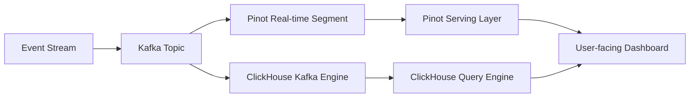
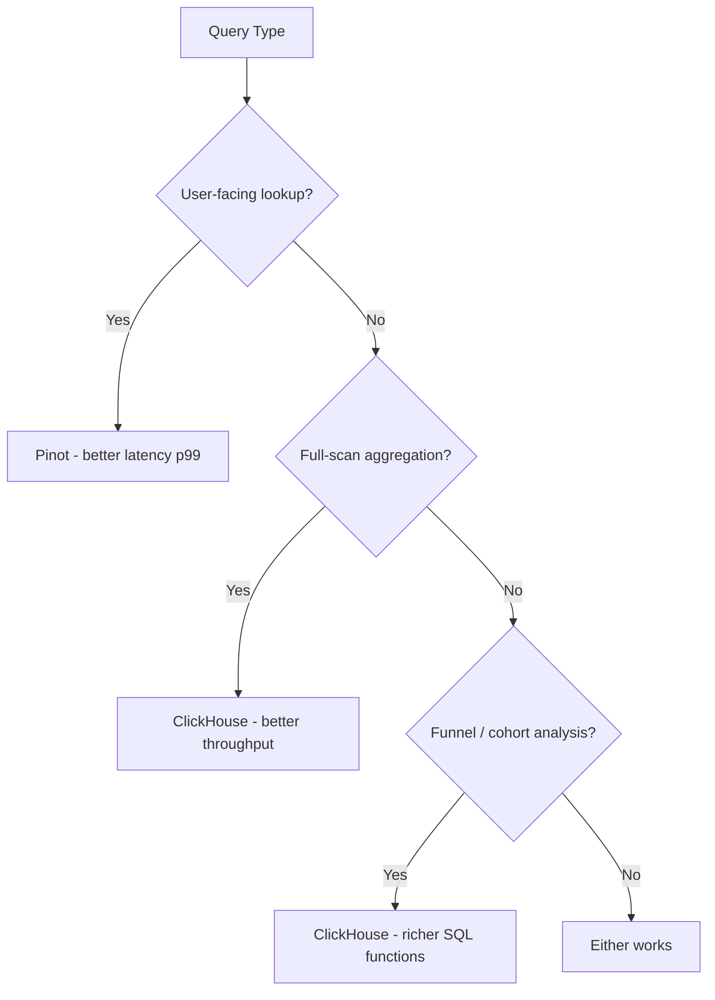

# ClickHouse vs Pinot for Event Analytics

Author: [oneuptime](https://github.com/oneuptime)

Tags: ClickHouse, Pinot, Analytics, Event, Database, Real-time

Description: Compare ClickHouse and Apache Pinot for event analytics workloads, covering query latency, indexing strategies, streaming ingestion, and operational tradeoffs.

## Overview

Apache Pinot was purpose-built at LinkedIn for user-facing, low-latency analytics over event data. ClickHouse is a general-purpose OLAP engine that has become a popular choice for event analytics at scale. Both systems can handle billions of events, but their design philosophies differ significantly.



## Design Philosophy

**Apache Pinot** is designed for user-facing analytics - queries triggered by individual user actions in production applications. It prioritizes consistent low latency (single-digit milliseconds) over high throughput. It achieves this through aggressive indexing: every column can have an inverted index, sorted index, bloom filter, or range index.

**ClickHouse** is designed for analytical throughput. It scans compressed columnar data very fast and returns results for complex aggregations in milliseconds to seconds depending on data size. It is better suited for internal analytics dashboards and reporting than for user-facing real-time queries.

## Indexing Strategies

Pinot's indexing model is one of its defining features. Tables can have multiple index types applied to different columns simultaneously.

```json
{
  "tableIndexConfig": {
    "invertedIndexColumns": ["user_id", "event_type"],
    "rangeIndexColumns": ["occurred_at"],
    "bloomFilterColumns": ["session_id"],
    "sortedColumn": ["occurred_at"]
  }
}
```

ClickHouse uses primary key sorting and optional skip indexes (bloom filter, minmax, set) for query pruning. The primary key defines the sort order of the MergeTree, which doubles as a sparse index.

```sql
-- ClickHouse: table with skip indexes
CREATE TABLE events (
    event_id    String,
    user_id     UInt64,
    event_type  LowCardinality(String),
    occurred_at DateTime,
    properties  String
) ENGINE = MergeTree()
PARTITION BY toYYYYMM(occurred_at)
ORDER BY (user_id, occurred_at)
SETTINGS index_granularity = 8192;

ALTER TABLE events ADD INDEX idx_event_type event_type
    TYPE set(100) GRANULARITY 4;
```

## Streaming Ingestion

Pinot supports real-time ingestion natively through its real-time table type, which consumes directly from Kafka. Segments are committed on a time or row-count threshold and moved to deep storage.

ClickHouse achieves similar behavior through the Kafka table engine and materialized views. The latency is slightly higher but the setup is more flexible.

```sql
-- ClickHouse: streaming ingestion pipeline
CREATE TABLE events_raw (
    event_id    String,
    user_id     UInt64,
    event_type  String,
    occurred_at DateTime,
    properties  String
) ENGINE = Kafka
SETTINGS
    kafka_broker_list  = 'kafka:9092',
    kafka_topic_list   = 'user-events',
    kafka_group_name   = 'ch-events',
    kafka_format       = 'JSONEachRow';

CREATE TABLE events (
    event_id    String,
    user_id     UInt64,
    event_type  LowCardinality(String),
    occurred_at DateTime,
    properties  String
) ENGINE = MergeTree()
ORDER BY (user_id, occurred_at);

CREATE MATERIALIZED VIEW events_mv TO events AS
SELECT * FROM events_raw;
```

## Query Patterns

Event analytics typically involves funnel analysis, retention, session analysis, and user journey tracking.

```sql
-- ClickHouse: funnel analysis
SELECT
    countIf(event_type = 'page_view')    AS step1_views,
    countIf(event_type = 'add_to_cart')  AS step2_carts,
    countIf(event_type = 'purchase')     AS step3_purchases
FROM events
WHERE occurred_at >= today() - 30
  AND user_id IN (
      SELECT DISTINCT user_id FROM events
      WHERE event_type = 'page_view'
        AND occurred_at >= today() - 30
  );
```

Pinot supports similar queries through its SQL interface but is optimized for single-user lookups (e.g., "show all events for user 12345 in the last 24 hours") rather than full-table aggregations.

## Operational Complexity

Pinot requires a Controller, Broker, Server, and Minion service, plus ZooKeeper and deep storage. Schema and table configurations are managed through REST APIs and are more rigid than ClickHouse's SQL-based DDL.

ClickHouse has a much simpler operational model. Schema is managed with standard SQL DDL. The cluster can be as simple as a single server for moderate workloads.

## Performance Summary



## When to Choose Each

**Choose Pinot when:**
- You are building user-facing analytics features in a production application
- You need consistent single-digit millisecond latency
- Your queries are primarily point lookups with filtering on indexed columns
- You need strong guarantees on query tail latency

**Choose ClickHouse when:**
- You are building internal analytics dashboards and reporting
- You need ad-hoc query flexibility with rich SQL functions
- Your team wants simpler operations
- You need funnel, cohort, or session analysis functions built in

## Conclusion

Pinot is the right choice when you are embedding analytics into a user-facing product and need guaranteed low latency. ClickHouse wins for internal analytics workloads where query flexibility, operational simplicity, and throughput matter more than tail latency.

**Related Reading:**

- [ClickHouse vs Druid for Real-Time Analytics](https://oneuptime.com/blog/post/2026-03-31-clickhouse-vs-druid-real-time-analytics/view)
- [How to Build an Ad Click Tracking System with ClickHouse](https://oneuptime.com/blog/post/2026-03-31-clickhouse-build-ad-click-tracking-system/view)
- [How to Build Audience Segmentation with ClickHouse](https://oneuptime.com/blog/post/2026-03-31-clickhouse-build-audience-segmentation/view)
