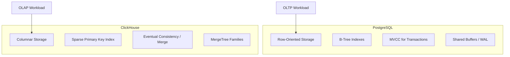
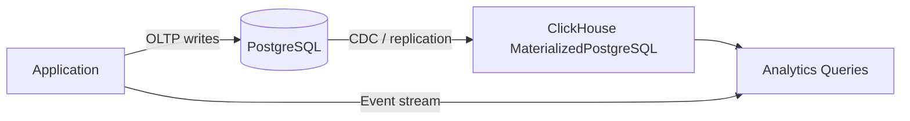

# How to Compare ClickHouse vs PostgreSQL for Analytics

Author: [nawazdhandala](https://www.github.com/nawazdhandala)

Tags: ClickHouse, PostgreSQL, Analytics, Performance, Database

Description: Compare ClickHouse and PostgreSQL for analytical workloads across query speed, storage, compression, concurrency, and operational complexity to choose the right tool.

---

## Introduction

PostgreSQL is the world's most popular open-source relational database and handles OLTP workloads exceptionally well. ClickHouse is a columnar analytical database built for aggregate queries over billions of rows at sub-second latency. Understanding their architectural differences helps teams decide when to use each, or when to run both in a complementary setup.

## Architecture Comparison



## Storage Model

PostgreSQL stores data row by row. Each row contains all column values together on disk. This is optimal for point lookups and row-level operations, but inefficient for queries that aggregate a few columns across millions of rows.

ClickHouse stores data column by column. When a query aggregates `SUM(revenue)` from a table with 50 columns, ClickHouse reads only the `revenue` column from disk, ignoring the rest.

```sql
-- PostgreSQL: reads entire rows even though we only need revenue
SELECT SUM(revenue) FROM orders WHERE region = 'US';

-- ClickHouse: reads only the revenue and region columns
SELECT sum(revenue) FROM orders WHERE region = 'US';
```

## Query Performance Benchmark (Illustrative)

| Query Type | PostgreSQL (100M rows) | ClickHouse (100M rows) |
|---|---|---|
| COUNT(*) with filter | ~12s | ~0.1s |
| SUM + GROUP BY (3 cols) | ~25s | ~0.3s |
| JOIN two large tables | ~8s | ~1.5s |
| Single row by PK | ~1ms | ~5ms |
| UPSERT / UPDATE | ~1ms | ~100ms (async) |

These numbers are illustrative. Actual results depend heavily on hardware, indexes, and query shape.

## When PostgreSQL Wins

- **OLTP workloads**: High-frequency INSERTs, UPDATEs, DELETEs with transactional guarantees
- **Row-level operations**: Fetching individual records by primary key
- **Complex relational queries**: Multi-table JOINs with complex WHERE clauses on normalized schemas
- **Full ACID transactions**: Bank transfers, inventory management, order processing
- **PostGIS / full-text search**: Rich extension ecosystem
- **Small datasets**: Under ~10 million rows where the overhead of columnar format is unnecessary

## When ClickHouse Wins

- **Aggregate analytics**: SUM, COUNT, AVG, percentiles over billions of rows
- **Time-series analysis**: High-cardinality event data, logs, metrics
- **Dashboards with sub-second queries**: BI tools querying large datasets
- **Immutable or append-mostly data**: Logs, telemetry, clickstream
- **High-throughput ingestion**: Millions of events per second via async inserts
- **Storage efficiency**: 5-10x compression vs PostgreSQL on typical analytical data

## Data Modeling Differences

PostgreSQL favors normalized schemas to reduce redundancy:

```sql
-- PostgreSQL: normalized
CREATE TABLE customers (id SERIAL PRIMARY KEY, name TEXT, region TEXT);
CREATE TABLE orders (id SERIAL PRIMARY KEY, customer_id INT REFERENCES customers(id), total NUMERIC, created_at TIMESTAMPTZ);
```

ClickHouse favors denormalized, wide flat tables to avoid expensive JOINs:

```sql
-- ClickHouse: denormalized for analytics
CREATE TABLE orders
(
    order_id     UInt64,
    customer_id  UInt64,
    customer_name String,
    region        String,
    total         Decimal(12,2),
    created_at    DateTime
)
ENGINE = MergeTree()
ORDER BY (region, created_at);
```

## UPDATE and DELETE Behavior

PostgreSQL supports efficient row-level updates and deletes via MVCC:

```sql
UPDATE orders SET status = 'shipped' WHERE order_id = 12345;
DELETE FROM orders WHERE created_at < NOW() - INTERVAL '1 year';
```

ClickHouse treats updates and deletes as heavyweight mutations that rewrite entire data parts asynchronously:

```sql
-- ClickHouse: async mutation, not immediate
ALTER TABLE orders UPDATE status = 'shipped' WHERE order_id = 12345;
ALTER TABLE orders DELETE WHERE created_at < today() - 365;
```

For use cases requiring frequent row-level changes, PostgreSQL is the clear choice.

## Concurrency and Transactions

| Feature | PostgreSQL | ClickHouse |
|---|---|---|
| ACID transactions | Full | Limited (single-table) |
| Row-level locking | Yes | No |
| Concurrent writers | Yes | Yes (append only) |
| Isolation levels | Full MVCC | Read committed only |
| Rollback support | Yes | No |

## Compression and Storage Efficiency

ClickHouse typically achieves 5-10x better compression than PostgreSQL for analytical data because:
- Columnar storage enables column-specific codecs
- Similar values in a column (e.g., timestamps) compress much better together

```sql
-- ClickHouse: column-level codec
CREATE TABLE events
(
    ts        DateTime CODEC(DoubleDelta, ZSTD),
    user_id   UInt64   CODEC(T64, LZ4),
    event     LowCardinality(String) CODEC(ZSTD)
)
ENGINE = MergeTree()
ORDER BY ts;
```

PostgreSQL uses page-level compression (with `pg_lz`) or tablespace-level compression (PostgreSQL 14+), which is less effective for analytical columns.

## Replication and Scaling

| Feature | PostgreSQL | ClickHouse |
|---|---|---|
| Primary-replica replication | WAL streaming | ReplicatedMergeTree |
| Horizontal sharding | Manual / Citus | Native distributed tables |
| Read scaling | Replicas | Replicas + shards |
| Write scaling | Limited | Native horizontal sharding |

## Combining Both

Many production architectures use PostgreSQL and ClickHouse together:



PostgreSQL handles transactional writes; ClickHouse handles analytical reads. This avoids contention and lets each database do what it does best.

## Feature Summary Table

| Feature | PostgreSQL | ClickHouse |
|---|---|---|
| Storage model | Row-oriented | Columnar |
| Primary use case | OLTP | OLAP |
| Aggregate query speed | Moderate | Very fast |
| Point lookup speed | Very fast | Moderate |
| UPDATE / DELETE | Efficient | Expensive (mutations) |
| ACID transactions | Full | Limited |
| Compression | Moderate | Excellent |
| Horizontal scaling | Extensions (Citus) | Native |
| SQL compatibility | Full ANSI + extensions | Mostly ANSI + ClickHouse-specific |
| Ecosystem maturity | Decades | Growing rapidly |

## Summary

ClickHouse and PostgreSQL solve different problems. PostgreSQL excels at transactional workloads requiring ACID guarantees and row-level operations. ClickHouse excels at aggregate analytics over large datasets with sub-second query times. Many production systems use both: PostgreSQL as the source of truth for operational data, and ClickHouse as the analytical backend. Use `MaterializedPostgreSQL` or a CDC pipeline to keep them in sync without building a separate ETL layer.
