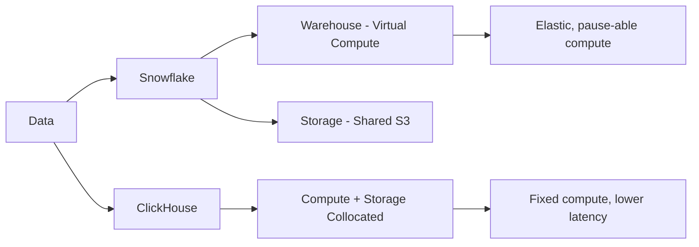

# ClickHouse vs Snowflake for Analytics

Author: [nawazdhandala](https://www.github.com/nawazdhandala)

Tags: ClickHouse, Snowflake, Analytics, Cloud, Database, Data Warehouse

Description: A thorough comparison of ClickHouse and Snowflake for analytics, covering architecture, query performance, cost structure, data sharing, and real-time capabilities.

## Overview

Snowflake is the dominant cloud data warehouse, known for its elastic scaling, data sharing, and ease of use. ClickHouse is an open-source OLAP database known for extreme query speed and cost efficiency. Choosing between them involves trade-offs in performance, cost, operational complexity, and ecosystem features.



## Architecture Differences

**Snowflake** separates storage from compute. Data lives in Snowflake's managed S3-based storage layer. Virtual Warehouses (compute clusters) are spun up on demand and can be paused when idle. This makes Snowflake very cost-effective for intermittent workloads.

**ClickHouse** traditionally collocates compute and storage. Data lives on the same nodes that execute queries. ClickHouse Cloud (and the tiered storage feature) supports separation of compute and storage, but the default deployment model keeps them together for maximum performance.

## Query Performance

For the same hardware resources, ClickHouse consistently outperforms Snowflake on analytical query benchmarks, often by 5-50x on single-table aggregation queries.

```sql
-- Both: time-series aggregation over 1 billion rows
SELECT
    toStartOfDay(event_time)  AS day,
    event_type,
    count()                   AS event_count,
    uniqExact(user_id)        AS unique_users
FROM events
WHERE event_time >= '2024-01-01'
  AND event_time  < '2025-01-01'
GROUP BY day, event_type
ORDER BY day, event_count DESC;
```

On a comparable XL cluster (Snowflake XL warehouse vs 4 ClickHouse nodes), ClickHouse typically returns this in 1-3 seconds. Snowflake returns it in 10-30 seconds.

Snowflake's performance is more consistent across diverse query patterns due to its cost-based optimizer and broader SQL support. ClickHouse requires query tuning and proper table design to achieve top performance.

## Cost Structure

Snowflake pricing is based on credit consumption per virtual warehouse size per hour, plus storage. An XL warehouse costs roughly $16/credit and consumes 16 credits/hour when active.

```text
Snowflake XL Warehouse (running 8 hours/day, 22 days/month):
  16 credits/hour * 8 hours * 22 days * $2/credit = $5,632/month

ClickHouse Cloud (comparable compute):
  4-node cluster: ~$600-1,200/month

Self-hosted ClickHouse (4x 16-core servers in cloud):
  ~$300-600/month
```

For continuously running analytics workloads, ClickHouse is 5-20x cheaper than Snowflake. For intermittent workloads where Snowflake warehouses can be paused, the gap narrows considerably.

## Data Ingestion and Freshness

Snowflake ingestion options include:
- `COPY INTO` for bulk loading from S3/GCS/Azure
- Snowpipe for continuous automated loading (minutes of latency)
- Snowflake Streaming for low-latency inserts (seconds)

ClickHouse supports direct inserts with millisecond freshness, Kafka integration for streaming, and S3-based batch loading.

```sql
-- ClickHouse: real-time insert visible immediately
INSERT INTO page_views (user_id, url, viewed_at)
VALUES (1001, '/pricing', now());

-- Immediately queryable
SELECT count() FROM page_views WHERE user_id = 1001;
```

For real-time analytics where data must be visible within seconds of generation, ClickHouse has a clear advantage.

## SQL and Ecosystem

Snowflake has excellent ANSI SQL compliance, strong support for semi-structured data (VARIANT type for JSON), stored procedures, user-defined functions, and a rich ecosystem of connectors.

ClickHouse has a SQL dialect with powerful extensions for analytics but some non-standard behaviors. It supports JSON processing, array operations, and approximate aggregations that are not available in standard SQL.

```sql
-- ClickHouse: approximate count distinct (much faster for huge datasets)
SELECT uniq(user_id) AS approx_unique_users
FROM events
WHERE event_time >= today() - 30;

-- ClickHouse: exact count distinct
SELECT uniqExact(user_id) AS exact_unique_users
FROM events
WHERE event_time >= today() - 30;
```

## Data Sharing and Collaboration

Snowflake's Data Sharing feature is a major differentiator. Organizations can share live data with other Snowflake accounts without copying data, and the Snowflake Marketplace allows purchasing third-party datasets.

ClickHouse does not have an equivalent native data sharing feature. Sharing requires exporting data or providing direct database access.

## When to Choose Each

**Choose Snowflake when:**
- You need a fully managed data warehouse with no operational work
- Your workloads are intermittent and you want pause-able compute
- You need to share data with external partners or customers
- You need strong ANSI SQL compliance and a mature ecosystem
- Your team has existing Snowflake expertise

**Choose ClickHouse when:**
- You need maximum query performance on large event datasets
- Cost at scale is a primary concern
- You need real-time data freshness (seconds, not minutes)
- You want to avoid per-query costs and predictable infrastructure costs
- You are building a custom analytics application, not general BI reporting

## Conclusion

Snowflake is the best choice when operational simplicity, ecosystem breadth, and data collaboration features matter more than raw performance. ClickHouse is the best choice when you need maximum speed on high-volume event analytics at a fraction of the cost. These are not mutually exclusive: many organizations use Snowflake as their general data warehouse and ClickHouse for specific high-performance analytics use cases.

**Related Reading:**

- [ClickHouse vs BigQuery Cost and Performance](https://oneuptime.com/blog/post/2026-03-31-clickhouse-vs-bigquery-cost-performance/view)
- [How to Build a Web Analytics System with ClickHouse](https://oneuptime.com/blog/post/2026-03-31-clickhouse-build-web-analytics-system/view)
- [How to Build a SaaS Usage Analytics System with ClickHouse](https://oneuptime.com/blog/post/2026-03-31-clickhouse-build-saas-usage-analytics/view)
