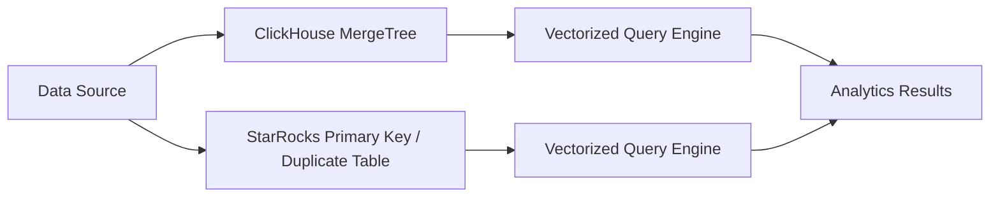
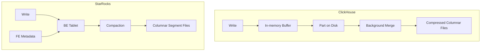

# ClickHouse vs StarRocks Performance Comparison

Author: [oneuptime](https://github.com/oneuptime)

Tags: ClickHouse, StarRocks, Performance, Database, Analytics, Benchmark

Description: An in-depth performance comparison of ClickHouse and StarRocks for analytical workloads, covering query speed, ingestion throughput, join performance, and real-world use cases.

## Overview

StarRocks (formerly DorisDB) and ClickHouse are two of the fastest OLAP databases available today. Both target analytical workloads at scale but differ in their architecture, join capabilities, and operational model. This post examines where each excels and where trade-offs exist.



## Architecture Overview

**ClickHouse** uses a shared-nothing columnar storage architecture. Data is stored as MergeTree parts, compressed per column, and queries are executed using vectorized SIMD operations. There is no separation between storage and compute in the default deployment.

**StarRocks** uses a similar vectorized columnar engine but is based on the Apache Doris architecture. It has a Frontend (FE) / Backend (BE) split. FEs handle query planning and metadata. BEs store data and execute query fragments. StarRocks also supports a shared-data mode (lake-house architecture) where storage is decoupled into S3-compatible object storage.

## Query Performance: Single-Table Aggregation

For single-table aggregation over hundreds of millions of rows, both databases perform extremely well. ClickHouse has a slight edge on compression and column scan speed.

```sql
-- ClickHouse: aggregation query
SELECT
    toDate(event_time)  AS day,
    country_code,
    sum(revenue)        AS total_revenue,
    count()             AS order_count
FROM orders
WHERE event_time >= '2025-01-01'
GROUP BY day, country_code
ORDER BY day, total_revenue DESC
LIMIT 100;
```

```sql
-- StarRocks: equivalent query
SELECT
    DATE(event_time)    AS day,
    country_code,
    SUM(revenue)        AS total_revenue,
    COUNT(*)            AS order_count
FROM orders
WHERE event_time >= '2025-01-01'
GROUP BY day, country_code
ORDER BY day, total_revenue DESC
LIMIT 100;
```

On SSB (Star Schema Benchmark) tests, ClickHouse typically finishes single-table queries in 50-200ms. StarRocks performs similarly, with results often within 20% of each other.

## Join Performance

This is where StarRocks differentiates itself. ClickHouse historically had limited multi-table join performance for large fact-dimension joins. StarRocks was designed with MPP (massively parallel processing) joins from the start, using a cost-based optimizer and runtime adaptive join strategies.

```sql
-- StarRocks: multi-table join with fact and dimension tables
SELECT
    p.product_category,
    c.country_name,
    sum(o.revenue) AS total_revenue
FROM orders o
JOIN products p ON o.product_id = p.product_id
JOIN customers c ON o.customer_id = c.customer_id
WHERE o.order_date >= '2025-01-01'
GROUP BY p.product_category, c.country_name
ORDER BY total_revenue DESC;
```

ClickHouse handles this pattern through hash joins and broadcast joins, but its optimizer is less mature. For complex multi-table star schema queries, StarRocks typically outperforms ClickHouse.

## Upsert and Real-Time Updates

StarRocks Primary Key tables support efficient upserts (insert or update), which is critical for real-time analytics on mutable data.

```sql
-- StarRocks: primary key table for upserts
CREATE TABLE user_metrics (
    user_id         BIGINT NOT NULL,
    last_active_at  DATETIME,
    total_sessions  INT,
    total_revenue   DECIMAL(18, 2)
) PRIMARY KEY (user_id)
DISTRIBUTED BY HASH(user_id) BUCKETS 16;
```

ClickHouse handles updates through the ReplacingMergeTree engine, which deduplicates rows on merge. Immediate consistency requires using `FINAL` in queries, which adds overhead.

```sql
-- ClickHouse: ReplacingMergeTree for upsert-like behavior
CREATE TABLE user_metrics (
    user_id         UInt64,
    last_active_at  DateTime,
    total_sessions  Int32,
    total_revenue   Decimal(18, 2),
    updated_at      DateTime
) ENGINE = ReplacingMergeTree(updated_at)
ORDER BY user_id;

-- Query with deduplication
SELECT user_id, last_active_at, total_sessions
FROM user_metrics FINAL
WHERE user_id = 12345;
```

## Storage Architecture Comparison



## Benchmark Summary

| Workload | ClickHouse | StarRocks |
|---|---|---|
| Single-table aggregation | Excellent | Excellent |
| Multi-table star schema joins | Good | Excellent |
| High-cardinality group by | Excellent | Very good |
| Real-time upserts | Adequate | Excellent |
| Compression ratio | Excellent | Very good |
| Ingestion throughput | Excellent | Very good |

## When to Choose Each

**Choose ClickHouse when:**
- Workloads are primarily single-table or simple joins
- Maximum compression and storage efficiency matter
- You have append-only event data
- Operational simplicity is a priority

**Choose StarRocks when:**
- You have complex star schema queries with large joins
- You need real-time upserts with immediate consistency
- You are migrating from a traditional data warehouse
- You need a lake-house architecture with S3 storage

## Conclusion

Both ClickHouse and StarRocks are excellent OLAP databases. ClickHouse wins on compression, single-table performance, and simplicity. StarRocks wins on join performance, upsert support, and data warehouse compatibility. Many organizations choose StarRocks as a more traditional data warehouse replacement and ClickHouse for high-volume event analytics.

**Related Reading:**

- [ClickHouse vs DuckDB for Analytical Workloads](https://oneuptime.com/blog/post/2026-03-31-clickhouse-vs-duckdb-analytical-workloads/view)
- [ClickHouse vs Druid for Real-Time Analytics](https://oneuptime.com/blog/post/2026-03-31-clickhouse-vs-druid-real-time-analytics/view)
- [How to Monitor Database Query Performance with ClickHouse](https://oneuptime.com/blog/post/2026-03-31-clickhouse-monitor-database-query-performance/view)
