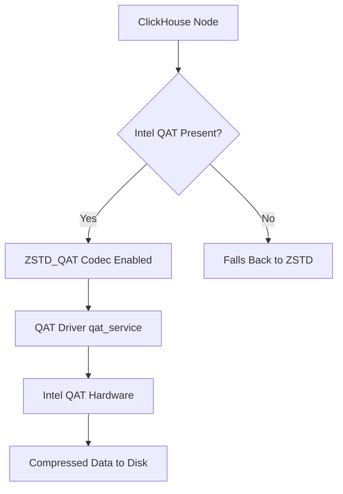

# How to Use ZSTD_QAT Codec in ClickHouse

Author: [nawazdhandala](https://www.github.com/nawazdhandala)

Tags: ClickHouse, Compression, ZSTD, Codec, Performance, Hardware

Description: Learn how to use the ZSTD_QAT codec in ClickHouse to offload ZSTD compression to Intel QAT hardware accelerators for CPU-free compression throughput.

---

The `ZSTD_QAT` codec in ClickHouse offloads ZSTD compression to Intel QuickAssist Technology (QAT) hardware accelerators. On servers equipped with Intel QAT (available on certain Xeon Scalable processors and add-in cards), ZSTD_QAT delegates compression work to dedicated silicon rather than general-purpose CPU cores, reducing compression-related CPU utilization while maintaining ZSTD compression ratios.

This codec is relevant for high-ingest workloads where compression CPU overhead is measurable and server hardware includes QAT capability.

## Hardware and Software Requirements



Requirements:
- Intel QAT hardware (built-in on Xeon SP or PCIe add-in card)
- Intel QAT driver (`qat_service`) installed and running
- ClickHouse built with QAT support (check `system.build_options`)
- `libisal` and Intel QAT Engine libraries

Verify ClickHouse was built with QAT support:

```sql
SELECT name, value
FROM system.build_options
WHERE name LIKE '%QAT%';
```

## Syntax

```sql
CODEC(ZSTD_QAT)
CODEC(ZSTD_QAT(1))
CODEC(ZSTD_QAT(3))
```

The optional level parameter follows the same 1-22 range as standard ZSTD. If QAT hardware is unavailable at runtime, ClickHouse falls back to software ZSTD automatically.

## Basic Usage

```sql
CREATE TABLE events
(
    event_id    UInt64   CODEC(ZSTD_QAT(1)),
    event_type  LowCardinality(String) CODEC(ZSTD_QAT(1)),
    payload     String   CODEC(ZSTD_QAT(3)),
    ts          DateTime CODEC(DoubleDelta, LZ4)
)
ENGINE = MergeTree()
PARTITION BY toYYYYMM(ts)
ORDER BY (event_type, ts);
```

## Comparing ZSTD vs ZSTD_QAT Compression Ratios

The compression ratio of ZSTD_QAT matches software ZSTD at the same level. The difference is CPU offload:

```sql
-- Create two identical tables with different codecs
CREATE TABLE events_zstd
(
    event_id   UInt64  CODEC(ZSTD(1)),
    payload    String  CODEC(ZSTD(1)),
    ts         DateTime CODEC(Delta(4), LZ4)
)
ENGINE = MergeTree()
ORDER BY (event_id, ts);

CREATE TABLE events_zstd_qat
(
    event_id   UInt64  CODEC(ZSTD_QAT(1)),
    payload    String  CODEC(ZSTD_QAT(1)),
    ts         DateTime CODEC(Delta(4), LZ4)
)
ENGINE = MergeTree()
ORDER BY (event_id, ts);

-- Insert the same data into both
INSERT INTO events_zstd
SELECT number, randomString(200), toDateTime('2024-01-01') + number
FROM numbers(5000000);

INSERT INTO events_zstd_qat
SELECT number, randomString(200), toDateTime('2024-01-01') + number
FROM numbers(5000000);
```

Compare compressed sizes:

```sql
SELECT
    table,
    formatReadableSize(sum(data_compressed_bytes))   AS compressed,
    formatReadableSize(sum(data_uncompressed_bytes)) AS uncompressed,
    round(sum(data_uncompressed_bytes) / sum(data_compressed_bytes), 2) AS ratio
FROM system.parts
WHERE active = 1
  AND table IN ('events_zstd', 'events_zstd_qat')
  AND database = currentDatabase()
GROUP BY table
ORDER BY table;
```

Compression ratios should be identical. The benefit of ZSTD_QAT shows in CPU metrics during bulk inserts.

## Checking QAT Acceleration Status

Monitor whether QAT offload is actually occurring using ClickHouse server logs or QAT driver statistics:

```bash
# Check QAT driver service status
sudo systemctl status qat_service

# View QAT device statistics
cat /proc/icp_qat_dev0/stats 2>/dev/null || adf_ctl status
```

From ClickHouse:

```sql
SELECT *
FROM system.metrics
WHERE metric LIKE '%Compress%';
```

## Using ZSTD_QAT in a High-Ingest Table

```sql
CREATE TABLE access_logs
(
    server_id   UInt16                 CODEC(LZ4),
    status_code UInt16                 CODEC(LZ4),
    method      LowCardinality(String) CODEC(LZ4),
    path        String                 CODEC(ZSTD_QAT(1)),
    user_agent  String                 CODEC(ZSTD_QAT(1)),
    referrer    String                 CODEC(ZSTD_QAT(1)),
    bytes_sent  UInt32                 CODEC(Delta(4), LZ4),
    ts          DateTime               CODEC(DoubleDelta, LZ4)
)
ENGINE = MergeTree()
PARTITION BY toYYYYMM(ts)
ORDER BY (server_id, ts)
SETTINGS index_granularity = 8192;
```

String columns with variable-length content benefit most from ZSTD. Assigning ZSTD_QAT to these columns while keeping numeric columns on lightweight codecs (LZ4, Delta) is a practical split strategy.

## Graceful Fallback Behavior

If QAT hardware is not present or the driver is not running, ClickHouse silently falls back to software ZSTD. This means you can deploy the same table DDL across heterogeneous hardware and it will work everywhere, with QAT acceleration where available:

```sql
-- This DDL works on all nodes; QAT-enabled nodes get hardware acceleration
CREATE TABLE distributed_events ON CLUSTER mycluster
(
    id      UInt64  CODEC(ZSTD_QAT(1)),
    data    String  CODEC(ZSTD_QAT(3)),
    ts      DateTime CODEC(DoubleDelta, LZ4)
)
ENGINE = ReplicatedMergeTree('/clickhouse/tables/{shard}/distributed_events', '{replica}')
ORDER BY (id, ts);
```

## When to Use ZSTD_QAT

ZSTD_QAT is most valuable when:

- Ingest rates are high enough that ZSTD compression consumes more than 10% of CPU
- The server has available QAT capacity (check `adf_ctl status` for active instances)
- You want ZSTD compression ratios without the CPU cost

It provides no benefit on servers without QAT hardware -- standard ZSTD is equivalent there.

## Summary

ZSTD_QAT offloads ZSTD compression to Intel QAT hardware, delivering the same compression ratios as software ZSTD with reduced CPU utilization during high-ingest workloads. The codec falls back to software ZSTD automatically when QAT is unavailable, making it safe to use in mixed-hardware deployments. Use it on string and large payload columns where ZSTD compression CPU cost is a bottleneck.
