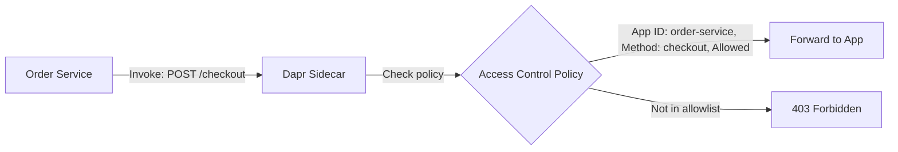
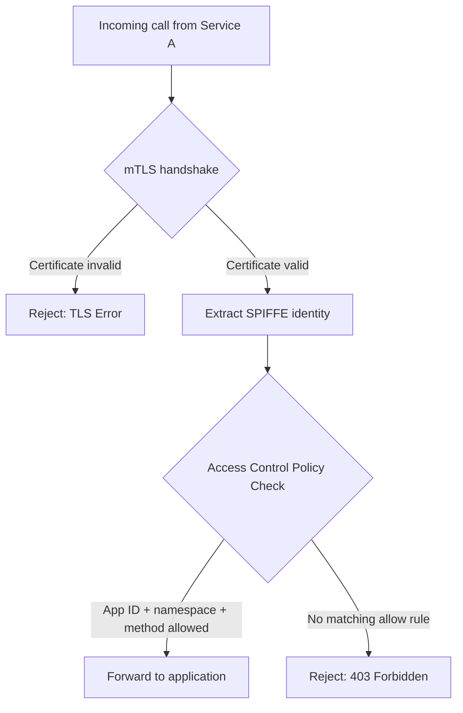

# How to Configure Dapr Access Control Policies

Author: [nawazdhandala](https://www.github.com/nawazdhandala)

Tags: Dapr, Access Control, Security, Authorization, Policy

Description: Learn how to configure Dapr access control policies to restrict which services can invoke specific methods on your application, using Dapr Configuration resources.

---

## Introduction

Dapr's access control policies allow you to define which services (identified by their app ID and SPIFFE identity) are allowed to invoke specific HTTP methods on your service. This provides a zero-trust authorization layer on top of mTLS authentication - authentication proves who the caller is, and access control policies decide what they can do.

Access control policies enforce:
- Which services can call your service at all (allow/deny by app ID)
- Which HTTP methods and paths a specific service can invoke
- Default action when no policy matches (allow or deny)

## How Access Control Works



## Prerequisites

- Dapr installed on Kubernetes with mTLS enabled
- Dapr Configuration resources supported (Kubernetes mode)

## Step 1: Create an Access Control Policy

Access control policies are defined in the Dapr `Configuration` resource and applied per application.

### Example: Checkout Service Policy

The checkout service allows:
- `order-service` to call `POST /checkout`
- `order-service` to call `GET /status`
- `admin-service` to call all methods
- All other services are denied by default

```yaml
apiVersion: dapr.io/v1alpha1
kind: Configuration
metadata:
  name: checkout-service-config
  namespace: default
spec:
  accessControl:
    defaultAction: deny
    trustDomain: "cluster.local"
    policies:
    - appId: order-service
      defaultAction: deny
      namespace: "default"
      operations:
      - name: /checkout
        httpVerb: ['POST']
        action: allow
      - name: /status
        httpVerb: ['GET']
        action: allow
    - appId: admin-service
      defaultAction: allow
      namespace: "default"
```

```bash
kubectl apply -f checkout-service-config.yaml
```

Apply to the checkout service deployment:

```yaml
metadata:
  annotations:
    dapr.io/enabled: "true"
    dapr.io/app-id: "checkout-service"
    dapr.io/app-port: "3000"
    dapr.io/config: "checkout-service-config"
```

## Step 2: Policy Fields Explained

### `defaultAction`

Controls what happens when no policy matches a caller:
- `allow` - allow all calls not explicitly denied
- `deny` - deny all calls not explicitly allowed (recommended for production)

### `trustDomain`

The SPIFFE trust domain. For Kubernetes, this is typically `cluster.local`.

### `policies[].appId`

The Dapr app ID of the calling service. Matched against the mTLS certificate's SPIFFE identity.

### `policies[].namespace`

The Kubernetes namespace of the calling service. Prevents cross-namespace spoofing.

### `policies[].operations[].name`

The operation path. Supports wildcards:
- `/checkout` - exact match
- `/api/*` - wildcard match for all paths under `/api/`

### `policies[].operations[].httpVerb`

List of allowed HTTP methods: `GET`, `POST`, `PUT`, `DELETE`, `PATCH`, `HEAD`, `OPTIONS`

Use `['*']` to allow all verbs.

## Example Configurations

### Allow-All for Internal Services

```yaml
spec:
  accessControl:
    defaultAction: allow
    trustDomain: "cluster.local"
```

### Strict Deny-All with Explicit Allowlist

```yaml
apiVersion: dapr.io/v1alpha1
kind: Configuration
metadata:
  name: payment-service-config
  namespace: default
spec:
  accessControl:
    defaultAction: deny
    trustDomain: "cluster.local"
    policies:
    - appId: checkout-service
      defaultAction: deny
      namespace: "default"
      operations:
      - name: /charge
        httpVerb: ['POST']
        action: allow
      - name: /refund
        httpVerb: ['POST']
        action: allow
    - appId: admin-service
      defaultAction: deny
      namespace: "default"
      operations:
      - name: /transactions
        httpVerb: ['GET']
        action: allow
      - name: /transactions/*
        httpVerb: ['GET']
        action: allow
```

### Multi-Namespace Policy

Allow calls from the same app ID but from a different namespace:

```yaml
policies:
- appId: order-service
  defaultAction: deny
  namespace: "production"
  operations:
  - name: /checkout
    httpVerb: ['POST']
    action: allow
- appId: order-service
  defaultAction: deny
  namespace: "staging"
  operations:
  - name: /checkout
    httpVerb: ['POST']
    action: allow
```

## Verifying Access Control

Test that a denied call returns 403:

```bash
# From a service that is NOT in the allowlist
curl -X POST http://localhost:3500/v1.0/invoke/checkout-service/method/checkout \
  -H "Content-Type: application/json" \
  -d '{"test": true}'
```

Expected response:

```json
{"error":"ERR_ACCESS_CONTROL_NOT_ENOUGH_PERMISSIONS"}
```

Check Dapr sidecar logs for access control decisions:

```bash
kubectl logs -l app=checkout-service -c daprd | grep -i "access control"
```

## Combining with mTLS

Access control policies work on top of mTLS. The flow is:



## Summary

Dapr access control policies provide fine-grained authorization on top of mTLS authentication. Set `defaultAction: deny` on sensitive services and explicitly allow only the services and HTTP methods that should have access. Policies are applied per-app via Dapr Configuration resources and validated using the mTLS SPIFFE certificate identity of the calling service. This creates a zero-trust service mesh where every call is both authenticated and authorized before reaching your application.
