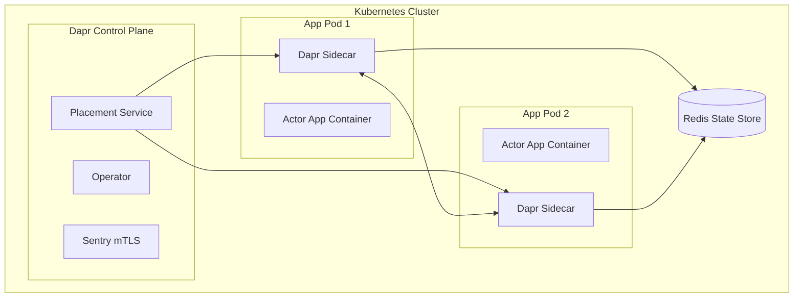
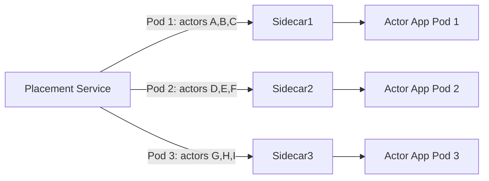

# How to Use Dapr Actor Hosting in Kubernetes

Author: [nawazdhandala](https://www.github.com/nawazdhandala)

Tags: Dapr, Actor, Kubernetes, Deployment, Hosting

Description: Learn how to deploy and host Dapr virtual actors on Kubernetes, including sidecar injection, placement service configuration, and scaling considerations.

---

## Introduction

Hosting Dapr actors on Kubernetes provides automatic sidecar injection, a distributed Placement Service for actor routing, and native Kubernetes scaling and availability features. The Dapr control plane components manage actor registration and routing, so your application only needs to expose actor method endpoints and advertise its supported actor types.

## Architecture Overview



## Prerequisites

- Kubernetes cluster (1.22+)
- Dapr installed on Kubernetes (`dapr init -k`)
- A state store component with `actorStateStore: "true"`
- Your actor application containerized and pushed to a registry

## Step 1: Install Dapr on Kubernetes

```bash
dapr init -k
```

Verify the installation:

```bash
dapr status -k
```

Expected output:

```text
  NAME                   NAMESPACE    HEALTHY  STATUS   REPLICAS  VERSION
  dapr-operator          dapr-system  True     Running  1         1.x.x
  dapr-placement-server  dapr-system  True     Running  1         1.x.x
  dapr-sentry            dapr-system  True     Running  1         1.x.x
  dapr-sidecar-injector  dapr-system  True     Running  1         1.x.x
```

## Step 2: Deploy the State Store Component

```yaml
apiVersion: dapr.io/v1alpha1
kind: Component
metadata:
  name: statestore
  namespace: default
spec:
  type: state.redis
  version: v1
  metadata:
  - name: redisHost
    value: "redis-master.default.svc.cluster.local:6379"
  - name: redisPassword
    secretKeyRef:
      name: redis-secret
      key: password
  - name: actorStateStore
    value: "true"
```

```bash
kubectl apply -f statestore.yaml
```

## Step 3: Deploy the Actor Application

Annotate your Kubernetes Deployment to enable Dapr sidecar injection:

```yaml
apiVersion: apps/v1
kind: Deployment
metadata:
  name: actor-service
  namespace: default
spec:
  replicas: 3
  selector:
    matchLabels:
      app: actor-service
  template:
    metadata:
      labels:
        app: actor-service
      annotations:
        dapr.io/enabled: "true"
        dapr.io/app-id: "actor-service"
        dapr.io/app-port: "3000"
        dapr.io/log-level: "info"
        dapr.io/config: "actorconfig"
    spec:
      containers:
      - name: actor-service
        image: myregistry/actor-service:latest
        ports:
        - containerPort: 3000
        env:
        - name: APP_PORT
          value: "3000"
        resources:
          requests:
            cpu: "100m"
            memory: "128Mi"
          limits:
            cpu: "500m"
            memory: "512Mi"
```

## Step 4: Configure Actor Settings (Optional)

Create a Dapr `Configuration` resource to tune actor behavior:

```yaml
apiVersion: dapr.io/v1alpha1
kind: Configuration
metadata:
  name: actorconfig
  namespace: default
spec:
  actor:
    reentrancy:
      enabled: false
    remindersStoragePartitions: 0
```

```bash
kubectl apply -f actorconfig.yaml
```

## Step 5: Deploy a Service for Your App

Since actors are invoked through the Dapr sidecar (not directly), you typically do not need a Kubernetes Service for external traffic. For inter-service calls, Dapr uses the app ID for service discovery. If you need external access:

```yaml
apiVersion: v1
kind: Service
metadata:
  name: actor-service
  namespace: default
spec:
  selector:
    app: actor-service
  ports:
  - port: 80
    targetPort: 3000
  type: ClusterIP
```

## Verifying Actor Registration

Check that the Dapr sidecar is running in your pods:

```bash
kubectl get pods -l app=actor-service
```

Check sidecar logs for actor registration:

```bash
kubectl logs deployment/actor-service -c daprd | grep -i actor
```

You should see log lines like:

```toml
time="..." level=info msg="Actor runtime started. Actor idle timeout: 1h0m0s. Actor scan interval: 30s"
time="..." level=info msg="Registered actor types: [CounterActor]"
```

## Placement Service and Actor Distribution

The Placement Service distributes actors evenly across available pods. When a pod is added or removed, the Placement Service rebalances actor assignments.



## Scaling Considerations

When scaling a Deployment hosting actors, Dapr will redistribute actor ownership across new pods. In-flight actor method calls complete before redistribution. Consider:

- **Graceful termination**: Set a long enough `terminationGracePeriodSeconds` to allow in-flight actor calls to complete
- **Placement partition size**: With many actor types, increase the Placement Service replicas for HA
- **State store capacity**: Ensure your Redis or other state store can handle the actor state load

```yaml
spec:
  template:
    spec:
      terminationGracePeriodSeconds: 60
```

## Summary

Hosting Dapr actors on Kubernetes is straightforward: install the Dapr control plane, annotate your Deployment for sidecar injection, and deploy your actor application. The Placement Service automatically handles actor distribution across pods. Use a Dapr Configuration resource to tune actor settings, and ensure your state store component has `actorStateStore: "true"`. With multiple replicas, Dapr distributes actors automatically, providing scalability and fault tolerance.
