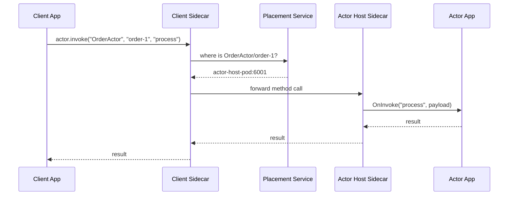

# How to Use Dapr Actor Method Invocation via SDK

Author: [nawazdhandala](https://www.github.com/nawazdhandala)

Tags: Dapr, Actor, SDK, Virtual Actor, State Management

Description: Invoke Dapr virtual actor methods using the Go, Python, and TypeScript SDKs with typed interfaces, actor proxies, and state management examples.

---

## Overview

Dapr virtual actors are single-threaded objects uniquely identified by type and ID. The Dapr SDK provides actor proxies that let you call actor methods as if they were local objects. The sidecar handles placement, state persistence, and turn-based concurrency automatically.

## Actor Architecture



## Go SDK

### Define the Actor Interface

```go
// actor_interface.go
package orderactor

import "context"

type OrderActorInterface interface {
    // Methods must return (interface{}, error)
    Process(ctx context.Context, req *ProcessRequest) (*ProcessResponse, error)
    GetStatus(ctx context.Context) (*StatusResponse, error)
    Cancel(ctx context.Context) error
}

type ProcessRequest struct {
    Items    []string `json:"items"`
    Amount   float64  `json:"amount"`
}

type ProcessResponse struct {
    OrderID string `json:"orderId"`
    Status  string `json:"status"`
}

type StatusResponse struct {
    Status    string  `json:"status"`
    Total     float64 `json:"total"`
    UpdatedAt string  `json:"updatedAt"`
}
```

### Implement the Actor

```go
// order_actor.go
package orderactor

import (
    "context"
    "fmt"
    "time"

    dapr "github.com/dapr/go-sdk/actor"
    "github.com/dapr/go-sdk/actor/state"
)

type OrderActor struct {
    dapr.ServerImplBase
}

func (a *OrderActor) Type() string {
    return "OrderActor"
}

func (a *OrderActor) Process(ctx context.Context, req *ProcessRequest) (*ProcessResponse, error) {
    orderID := fmt.Sprintf("order-%s", a.ID())

    // Save state via actor state manager
    status := StatusResponse{
        Status:    "processing",
        Total:     req.Amount,
        UpdatedAt: time.Now().UTC().Format(time.RFC3339),
    }
    if err := a.GetStateManager().Set(ctx, "status", status); err != nil {
        return nil, err
    }

    return &ProcessResponse{
        OrderID: orderID,
        Status:  "processing",
    }, nil
}

func (a *OrderActor) GetStatus(ctx context.Context) (*StatusResponse, error) {
    var status StatusResponse
    exists, err := a.GetStateManager().Get(ctx, "status", &status)
    if err != nil {
        return nil, err
    }
    if !exists {
        return &StatusResponse{Status: "not_found"}, nil
    }
    return &status, nil
}

func (a *OrderActor) Cancel(ctx context.Context) error {
    return a.GetStateManager().Remove(ctx, "status")
}
```

### Register and Host the Actor

```go
// server/main.go
package main

import (
    "log"

    dapr "github.com/dapr/go-sdk/actor/runtime"
    daprd "github.com/dapr/go-sdk/service/grpc"
    orderactor "github.com/example/orderactor"
)

func main() {
    s, err := daprd.NewService(":6001")
    if err != nil {
        log.Fatal(err)
    }

    s.RegisterActorImplFactoryContext(func() dapr.Actor {
        return &orderactor.OrderActor{}
    })

    if err := s.Start(); err != nil {
        log.Fatal(err)
    }
}
```

Start:

```bash
dapr run \
  --app-id actor-host \
  --app-port 6001 \
  --app-protocol grpc \
  --dapr-http-port 3501 \
  -- go run server/main.go
```

### Invoke the Actor from a Client

```go
// client/main.go
package main

import (
    "context"
    "fmt"
    "log"

    dapr "github.com/dapr/go-sdk/client"
    orderactor "github.com/example/orderactor"
)

func main() {
    client, err := dapr.NewClient()
    if err != nil {
        log.Fatal(err)
    }
    defer client.Close()

    ctx := context.Background()

    // Build a proxy for actor type "OrderActor" with ID "order-1"
    proxy, err := dapr.NewActorProxyWithClient(client, "OrderActor", "order-1",
        new(orderactor.OrderActorInterface))
    if err != nil {
        log.Fatal(err)
    }

    // Call the Process method
    req := &orderactor.ProcessRequest{Items: []string{"sku-1", "sku-2"}, Amount: 149.99}
    var resp orderactor.ProcessResponse
    err = proxy.CallMethod(ctx, "Process", req, &resp)
    if err != nil {
        log.Fatal(err)
    }
    fmt.Printf("Process result: %+v\n", resp)

    // Call GetStatus
    var status orderactor.StatusResponse
    err = proxy.CallMethod(ctx, "GetStatus", nil, &status)
    if err != nil {
        log.Fatal(err)
    }
    fmt.Printf("Status: %+v\n", status)
}
```

## Python SDK

### Define and Implement the Actor

```python
# order_actor.py
from dapr.actor import Actor, ActorInterface, actormethod
from dapr.actor.runtime.context import ActorRuntimeContext

class OrderActorInterface(ActorInterface):
    @actormethod(name="Process")
    async def process(self, payload: dict) -> dict: ...

    @actormethod(name="GetStatus")
    async def get_status(self) -> dict: ...

class OrderActor(Actor, OrderActorInterface):
    def __init__(self, ctx: ActorRuntimeContext, actor_id):
        super().__init__(ctx, actor_id)

    async def process(self, payload: dict) -> dict:
        await self._state_manager.set_state("status", {
            "status": "processing",
            "amount": payload.get("amount", 0),
        })
        await self._state_manager.save_state()
        return {"orderId": f"order-{self.id.id}", "status": "processing"}

    async def get_status(self) -> dict:
        has_value, value = await self._state_manager.try_get_state("status")
        if not has_value:
            return {"status": "not_found"}
        return value
```

### Register and Host

```python
# server.py
from dapr.actor.runtime.runtime import ActorRuntime
from dapr.ext.fastapi import DaprActor
from fastapi import FastAPI
from order_actor import OrderActor

app = FastAPI()
actor = DaprActor(app)

@app.on_event("startup")
async def startup():
    await actor.register_actor(OrderActor)
```

```bash
dapr run \
  --app-id actor-host \
  --app-port 8000 \
  -- uvicorn server:app --port 8000
```

### Invoke from Python Client

```python
# client.py
from dapr.actor import ActorProxy, ActorId
from order_actor import OrderActorInterface

async def main():
    proxy = ActorProxy.create("OrderActor", ActorId("order-1"), OrderActorInterface)

    result = await proxy.process({"items": ["sku-1"], "amount": 49.99})
    print("Process:", result)

    status = await proxy.get_status()
    print("Status:", status)
```

## TypeScript SDK

```typescript
// orderActor.ts
import { AbstractActor } from "@dapr/dapr";

interface OrderActorInterface {
  process(payload: object): Promise<object>;
  getStatus(): Promise<object>;
}

class OrderActor extends AbstractActor implements OrderActorInterface {
  async process(payload: { items: string[]; amount: number }): Promise<object> {
    await this.getStateManager().setState("status", {
      status: "processing",
      amount: payload.amount,
    });
    await this.getStateManager().saveState();
    return { orderId: `order-${this.getActorId().getId()}`, status: "processing" };
  }

  async getStatus(): Promise<object> {
    const [hasValue, value] = await this.getStateManager().tryGetState("status");
    return hasValue ? value : { status: "not_found" };
  }
}

// client.ts
import { DaprClient, ActorProxyBuilder, ActorId } from "@dapr/dapr";

const client = new DaprClient();
const builder = new ActorProxyBuilder<OrderActorInterface>("OrderActor", client);
const actor = builder.build(new ActorId("order-1"));

const result = await actor.process({ items: ["sku-1"], amount: 99.95 });
console.log("Result:", result);
```

## Summary

Dapr actor method invocation via SDK uses a proxy pattern: you call methods on a typed proxy object and the SDK routes the call through the sidecar to the correct actor instance. The Go SDK uses `ActorProxy.CallMethod`, the Python SDK uses `ActorProxy.create` with an interface, and the TypeScript SDK uses `ActorProxyBuilder`. All SDKs handle serialization, placement resolution, and turn-based concurrency transparently.
