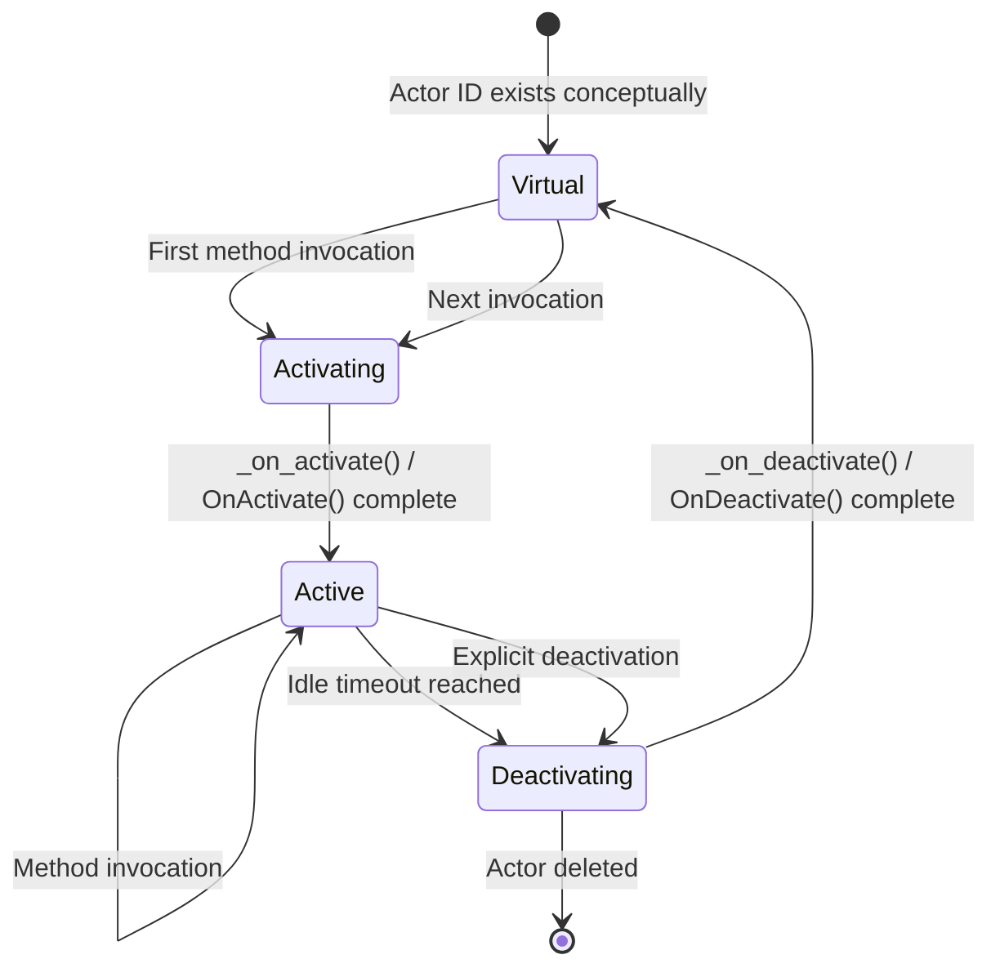
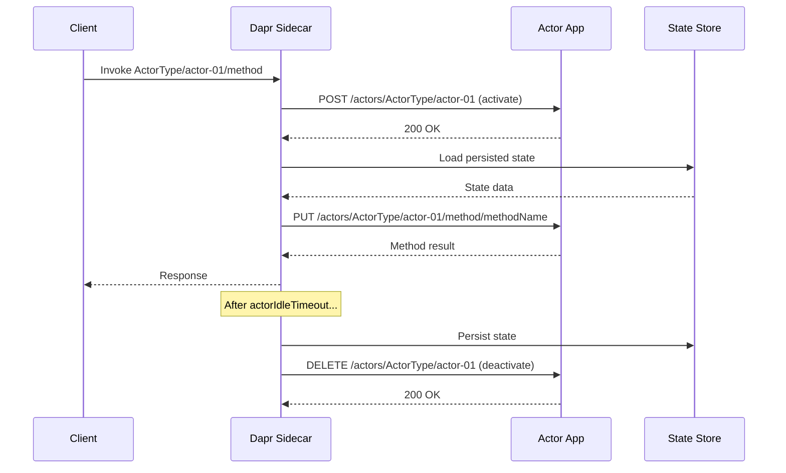

# How to Manage Dapr Actor Lifecycle (Activation, Deactivation)

Author: [nawazdhandala](https://www.github.com/nawazdhandala)

Tags: Dapr, Actor, Lifecycle, Activation, Deactivation

Description: Learn how Dapr manages the actor lifecycle including activation on first invocation, idle timeout deactivation, and how to implement lifecycle hooks in your actor code.

---

## Introduction

Dapr actors have a well-defined lifecycle managed by the Dapr runtime. Actors are "virtual" - they always exist conceptually, but they are only physically instantiated (activated) in memory when invoked. After a configurable idle period with no method calls, the actor is deactivated and its in-memory state is released. State is always persisted to the store, so reactivation simply reloads it.

Understanding the actor lifecycle helps you:

- Implement initialization and cleanup logic
- Configure idle timeouts appropriately for your workload
- Avoid resource leaks from long-lived actors

## Actor Lifecycle States



## Lifecycle Callbacks

Dapr calls your application at specific lifecycle events:

| Callback | HTTP endpoint (Dapr calls your app) | When called |
|---|---|---|
| Activate | `POST /actors/{type}/{id}` | First invocation of an actor |
| Deactivate | `DELETE /actors/{type}/{id}` | Actor idle timeout or explicit removal |
| Timer fire | `PUT /actors/{type}/{id}/method/timerName` | Timer triggers |
| Reminder fire | `PUT /actors/{type}/{id}/method/reminderName` | Reminder triggers |

## Configuring Idle Timeout and Scan Interval

The actor idle timeout and scan interval are advertised by your application via the `/dapr/config` endpoint:

```json
{
  "entities": ["SessionActor"],
  "actorIdleTimeout": "30m",
  "actorScanInterval": "60s",
  "drainOngoingCallTimeout": "30s",
  "drainRebalancedActors": true
}
```

- `actorIdleTimeout` - how long an actor can be idle before being deactivated
- `actorScanInterval` - how often the runtime scans for idle actors
- `drainOngoingCallTimeout` - max time to wait for in-flight calls before forced deactivation during rebalancing

## Implementing Lifecycle Hooks

### Go SDK

```go
package main

import (
    "context"
    "log"
    "github.com/dapr/go-sdk/actor"
)

type SessionActorImpl struct {
    actor.ServerImplBase
    sessionID string
}

func (a *SessionActorImpl) Type() string { return "SessionActor" }

// Called when the actor is first activated
func (a *SessionActorImpl) OnActivate() error {
    a.sessionID = a.ID()
    log.Printf("SessionActor %s activated - loading state", a.sessionID)

    // Initialize default state if this is the first activation
    ctx := context.Background()
    var initialized bool
    err := a.GetStateManager().Get(ctx, "initialized", &initialized)
    if err != nil || !initialized {
        // First time - set up default state
        a.GetStateManager().Set(ctx, "initialized", true)
        a.GetStateManager().Set(ctx, "visitCount", 0)
        a.GetStateManager().Save(ctx)
    }
    return nil
}

// Called when the actor is deactivated
func (a *SessionActorImpl) OnDeactivate() error {
    log.Printf("SessionActor %s deactivated - state persisted", a.sessionID)
    // Cleanup in-memory resources (e.g., close connections)
    return nil
}

// Business method
func (a *SessionActorImpl) RecordVisit(ctx context.Context) (int, error) {
    var count int
    a.GetStateManager().Get(ctx, "visitCount", &count)
    count++
    a.GetStateManager().Set(ctx, "visitCount", count)
    a.GetStateManager().Save(ctx)
    return count, nil
}
```

### Python SDK

```python
from dapr.actor import Actor, ActorInterface, actormethod
import logging

logger = logging.getLogger(__name__)

class SessionActorInterface(ActorInterface):
    @actormethod(name="recordVisit")
    async def record_visit(self) -> int: ...

class SessionActor(Actor, SessionActorInterface):
    async def _on_activate(self) -> None:
        logger.info(f"SessionActor {self.id.id} activating")
        exists, count = await self._state_manager.try_get_state("visitCount")
        if not exists:
            await self._state_manager.set_state("visitCount", 0)
            await self._state_manager.save_state()
        logger.info(f"SessionActor {self.id.id} activated with visitCount={count or 0}")

    async def _on_deactivate(self) -> None:
        logger.info(f"SessionActor {self.id.id} deactivating - persisting state")
        await self._state_manager.save_state()

    async def record_visit(self) -> int:
        exists, count = await self._state_manager.try_get_state("visitCount")
        count = (count or 0) + 1
        await self._state_manager.set_state("visitCount", count)
        await self._state_manager.save_state()
        return count
```

### .NET SDK

```csharp
using Dapr.Actors.Runtime;
using System.Threading.Tasks;
using Microsoft.Extensions.Logging;

public class SessionActor : Actor, ISessionActor
{
    private readonly ILogger<SessionActor> _logger;

    public SessionActor(ActorHost host, ILogger<SessionActor> logger) : base(host)
    {
        _logger = logger;
    }

    protected override async Task OnActivateAsync()
    {
        _logger.LogInformation("SessionActor {Id} activating", Id);
        var hasState = await StateManager.ContainsStateAsync("visitCount");
        if (!hasState)
        {
            await StateManager.SetStateAsync("visitCount", 0);
        }
    }

    protected override Task OnDeactivateAsync()
    {
        _logger.LogInformation("SessionActor {Id} deactivating", Id);
        return Task.CompletedTask;
    }

    public async Task<int> RecordVisitAsync()
    {
        var count = await StateManager.GetOrAddStateAsync("visitCount", 0);
        count++;
        await StateManager.SetStateAsync("visitCount", count);
        return count;
    }
}
```

## HTTP Endpoint Implementation (No SDK)

```javascript
// Node.js Express
// Activation callback
app.post('/actors/SessionActor/:actorId', async (req, res) => {
  const { actorId } = req.params;
  console.log(`Actor ${actorId} activated`);
  // Initialize in-memory state if needed
  res.sendStatus(200);
});

// Deactivation callback
app.delete('/actors/SessionActor/:actorId', async (req, res) => {
  const { actorId } = req.params;
  console.log(`Actor ${actorId} deactivated`);
  // Clean up resources
  res.sendStatus(200);
});
```

## Activation Flow Diagram



## Best Practices

- Keep `_on_activate` / `OnActivate` fast - it blocks the first method call
- Use activation to initialize defaults, not to trigger business logic
- Use deactivation only for resource cleanup - do not rely on it for critical state saves (state is auto-persisted)
- Set `actorIdleTimeout` based on expected call frequency to balance memory usage and reactivation overhead

## Summary

Dapr manages actor lifecycle automatically: activating actors on demand, deactivating them after idle periods, and persisting state transparently. Implement `OnActivate` and `OnDeactivate` hooks to initialize defaults and clean up resources. Configure `actorIdleTimeout` and `actorScanInterval` in your app's `/dapr/config` response to tune memory usage versus reactivation overhead. Because state is always persisted to the backing store, deactivation and reactivation are safe and transparent operations.
