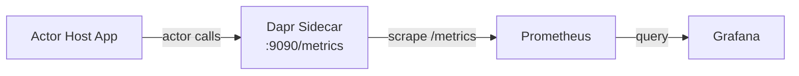

# How to Monitor Dapr Actor Metrics and Runtime State

Author: [nawazdhandala](https://www.github.com/nawazdhandala)

Tags: Dapr, Actor, Metric, Monitoring, Prometheus

Description: Monitor Dapr virtual actor runtime state, active actor counts, method call rates, and timer metrics using Prometheus and the Dapr metadata API.

---

## Overview

Dapr emits Prometheus metrics for actor runtime operations including active actor counts, method invocation rates, reminders, timers, and state operation counts. You can also query the Dapr metadata API to inspect which actors are currently active on a sidecar.

## Actor Metrics Architecture



## Step 1: Enable Dapr Metrics

Enable metrics on the sidecar:

```bash
# Self-hosted
dapr run \
  --app-id actor-host \
  --app-port 6001 \
  --app-protocol grpc \
  --enable-metrics \
  --metrics-port 9090 \
  -- go run main.go
```

On Kubernetes, metrics are enabled by default on port `9090`. Add Prometheus annotations to scrape:

```yaml
# k8s/deployment.yaml
metadata:
  annotations:
    dapr.io/enabled: "true"
    dapr.io/app-id: "order-actor-host"
    dapr.io/app-port: "6001"
    dapr.io/app-protocol: "grpc"
    prometheus.io/scrape: "true"
    prometheus.io/port: "9090"
    prometheus.io/path: "/metrics"
```

## Step 2: Key Actor Prometheus Metrics

### Active Actor Count

```promql
# Number of active actors by type
dapr_actor_active_actors{app_id="order-actor-host", actor_type="OrderActor"}
```

### Actor Method Invocation Rate

```promql
# Rate of actor method calls per second
rate(dapr_actor_method_total{app_id="order-actor-host"}[1m])

# Latency histogram (P99)
histogram_quantile(0.99,
  rate(dapr_actor_method_duration_milliseconds_bucket{app_id="order-actor-host"}[5m])
)
```

### Actor Method Errors

```promql
# Error rate for actor method calls
rate(dapr_actor_method_total{app_id="order-actor-host", success="false"}[1m])
```

### Actor Timer and Reminder Metrics

```promql
# Active reminders
dapr_actor_reminders_total{app_id="order-actor-host", actor_type="OrderActor"}

# Timer fired rate
rate(dapr_actor_timers_total{app_id="order-actor-host"}[1m])

# Reminder fired rate
rate(dapr_actor_reminder_total{app_id="order-actor-host"}[1m])
```

### Actor State Operations

```promql
# State save rate
rate(dapr_actor_state_transaction_commit_total{app_id="order-actor-host"}[1m])
```

## Step 3: Full Metrics Reference

| Metric | Type | Description |
|---|---|---|
| `dapr_actor_active_actors` | Gauge | Number of currently active actors |
| `dapr_actor_method_total` | Counter | Total actor method invocations |
| `dapr_actor_method_duration_milliseconds` | Histogram | Actor method call latency |
| `dapr_actor_timers_total` | Counter | Timer fire count |
| `dapr_actor_reminders_total` | Counter | Active reminder count |
| `dapr_actor_reminder_total` | Counter | Reminder fire count |
| `dapr_actor_state_transaction_commit_total` | Counter | State transaction commits |

## Step 4: Query Dapr Metadata API for Active Actors

The Dapr metadata API exposes the list of actor types registered on a sidecar and their configuration:

```bash
curl http://localhost:3500/v1.0/metadata
```

Example response:

```json
{
  "id": "order-actor-host",
  "actors": [
    {
      "type": "OrderActor",
      "count": 12
    },
    {
      "type": "InventoryActor",
      "count": 5
    }
  ],
  "components": [...],
  "appConnectionProperties": {
    "port": 6001,
    "protocol": "grpc",
    "maxConcurrency": -1
  }
}
```

Poll this endpoint to track active actor counts outside Prometheus:

```bash
# Watch actor counts every 5 seconds
watch -n 5 "curl -s http://localhost:3500/v1.0/metadata | jq '.actors'"
```

## Step 5: Grafana Dashboard

Create panels for actor monitoring:

```yaml
# Example Grafana panel JSON snippet
panels:
  - title: "Active Actors by Type"
    type: stat
    targets:
      - expr: "sum by (actor_type) (dapr_actor_active_actors)"
        legendFormat: "{{actor_type}}"

  - title: "Actor Method Rate (req/s)"
    type: graph
    targets:
      - expr: "sum(rate(dapr_actor_method_total[1m])) by (actor_type, method)"
        legendFormat: "{{actor_type}}.{{method}}"

  - title: "Actor Method P99 Latency (ms)"
    type: graph
    targets:
      - expr: |
          histogram_quantile(0.99,
            sum(rate(dapr_actor_method_duration_milliseconds_bucket[5m])) by (le, actor_type)
          )
        legendFormat: "P99 {{actor_type}}"
```

## Step 6: Prometheus Scrape Configuration

```yaml
# prometheus.yml
scrape_configs:
  - job_name: 'dapr-actor-sidecar'
    kubernetes_sd_configs:
      - role: pod
    relabel_configs:
      - source_labels: [__meta_kubernetes_pod_annotation_prometheus_io_scrape]
        action: keep
        regex: "true"
      - source_labels: [__meta_kubernetes_pod_annotation_prometheus_io_port]
        action: replace
        target_label: __address__
        regex: (.+)
        replacement: ${1}:9090
      - source_labels: [__meta_kubernetes_pod_label_app]
        target_label: app
```

## Step 7: Alerting Rules

```yaml
# alert-rules.yaml
groups:
  - name: dapr-actor-alerts
    rules:
      - alert: HighActorErrorRate
        expr: |
          rate(dapr_actor_method_total{success="false"}[5m]) > 0.1
        for: 2m
        labels:
          severity: warning
        annotations:
          summary: "Dapr actor method error rate is high"
          description: "Actor {{ $labels.actor_type }} error rate > 10% for 2 minutes"

      - alert: ActorMethodLatencyHigh
        expr: |
          histogram_quantile(0.99,
            rate(dapr_actor_method_duration_milliseconds_bucket[5m])
          ) > 1000
        for: 5m
        labels:
          severity: critical
        annotations:
          summary: "Actor method P99 latency > 1000ms"
```

## Summary

Dapr actor metrics are exposed on the sidecar's `/metrics` endpoint (port `9090` by default) and include active actor counts, method invocation rates, latency histograms, and timer/reminder fires. The `/v1.0/metadata` API provides a real-time view of active actor types and counts. Use Prometheus to scrape these metrics, Grafana to visualise them, and alerting rules to detect error rate spikes or latency regressions.
