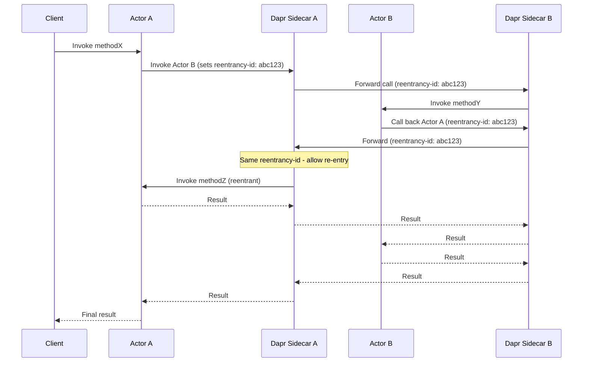
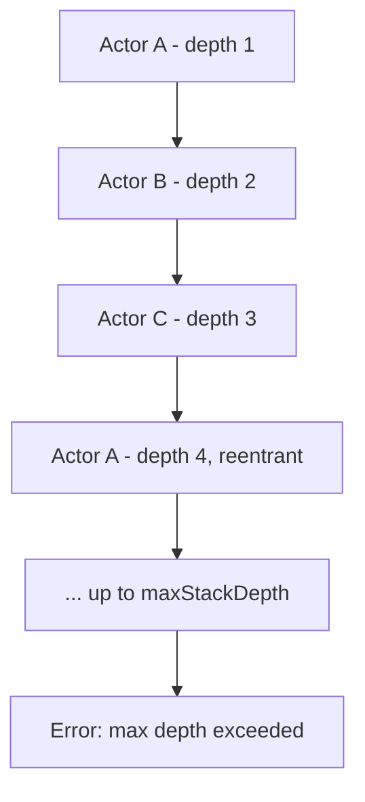

# How to Use Dapr Actor Reentrancy

Author: [nawazdhandala](https://www.github.com/nawazdhandala)

Tags: Dapr, Actor, Reentrancy, Concurrency, Microservice

Description: Learn how to enable and use Dapr actor reentrancy to allow an actor to call another actor that calls back into the original actor without deadlocking.

---

## Introduction

By default, Dapr actors use turn-based concurrency - only one call can execute at a time per actor. This prevents race conditions but can cause deadlocks when actor A calls actor B, which calls back into actor A (a reentrant call chain). Dapr's actor reentrancy feature solves this by allowing a chain of actor calls to re-enter an already-active actor using a request context ID.

Reentrancy is useful for:

- Hierarchical actor call patterns
- Graph traversal or tree operations using actors
- Recursive workflows where an actor orchestrates other actors that report back

## How Reentrancy Works

Without reentrancy, a call from actor A to actor B that loops back to A would deadlock because A is already processing a request. With reentrancy enabled, Dapr tracks a `reentrancy-id` header through the call chain. If A's sidecar receives a call with the same reentrancy ID that A initiated, it allows the call to proceed instead of queuing it.



## Prerequisites

- Dapr v1.7 or later
- Actor application with Dapr sidecar
- State store configured with `actorStateStore: "true"`

## Enabling Reentrancy

Reentrancy is configured at two levels: in the Dapr configuration and optionally in the actor application's config endpoint.

### Dapr Configuration (Kubernetes)

Create a `Configuration` resource enabling actor reentrancy:

```yaml
apiVersion: dapr.io/v1alpha1
kind: Configuration
metadata:
  name: actorconfig
  namespace: default
spec:
  features:
  - name: Actor.Reentrancy
    enabled: true
  actor:
    reentrancy:
      enabled: true
      maxStackDepth: 32
```

Apply it:

```bash
kubectl apply -f actorconfig.yaml
```

Reference the configuration in your deployment:

```yaml
apiVersion: apps/v1
kind: Deployment
metadata:
  name: actor-service
spec:
  template:
    metadata:
      annotations:
        dapr.io/enabled: "true"
        dapr.io/app-id: "actor-service"
        dapr.io/config: "actorconfig"
```

### App-Level Actor Config Endpoint

Your actor application's `/dapr/config` endpoint should also advertise reentrancy support:

```json
{
  "entities": ["WorkflowActor"],
  "reentrancy": {
    "enabled": true,
    "maxStackDepth": 32
  },
  "actorIdleTimeout": "1h",
  "actorScanInterval": "30s"
}
```

In Node.js:

```javascript
app.get('/dapr/config', (req, res) => {
  res.json({
    entities: ['WorkflowActor'],
    reentrancy: {
      enabled: true,
      maxStackDepth: 32
    },
    actorIdleTimeout: '1h',
    actorScanInterval: '30s'
  });
});
```

## Code Example - Reentrant Actor Call Chain

### Go SDK

```go
package main

import (
    "context"
    "github.com/dapr/go-sdk/actor"
    dapr "github.com/dapr/go-sdk/client"
)

type OrchestratorActorImpl struct {
    actor.ServerImplBase
    daprClient dapr.Client
}

func (a *OrchestratorActorImpl) Type() string { return "OrchestratorActor" }

// Calls WorkerActor, which calls back into OrchestratorActor
func (a *OrchestratorActorImpl) StartWorkflow(ctx context.Context) (string, error) {
    // This call goes to WorkerActor
    var result string
    err := a.daprClient.InvokeActorMethod(ctx,
        &dapr.InvokeActorRequest{
            ActorType: "WorkerActor",
            ActorID:   "worker-01",
            Method:    "doWork",
        },
        &result,
    )
    return result, err
}

// This is called back by WorkerActor (reentrant)
func (a *OrchestratorActorImpl) GetConfig(ctx context.Context) (map[string]string, error) {
    return map[string]string{"env": "production"}, nil
}
```

### Python SDK

```python
from dapr.actor import Actor, ActorInterface, actormethod
from dapr.clients import DaprClient

class OrchestratorActorInterface(ActorInterface):
    @actormethod(name="startWorkflow")
    async def start_workflow(self) -> str: ...

    @actormethod(name="getConfig")
    async def get_config(self) -> dict: ...

class OrchestratorActor(Actor, OrchestratorActorInterface):
    async def start_workflow(self) -> str:
        # WorkerActor will call back getConfig on this actor
        async with DaprClient() as client:
            result = await client.invoke_actor(
                actor_type="WorkerActor",
                actor_id="worker-01",
                method="doWork",
                data=b'{}'
            )
        return result.data.decode()

    async def get_config(self) -> dict:
        # This is the reentrant callback from WorkerActor
        return {"env": "production", "maxRetries": 3}
```

## maxStackDepth

The `maxStackDepth` setting limits how deep the reentrant call stack can go, preventing infinite recursion. The default is 32.



## Reentrancy and Concurrency

With reentrancy enabled, calls within the same reentrancy chain execute in a turn-based manner. Calls from different clients (different reentrancy IDs) still queue as normal, maintaining isolation.

## Summary

Dapr actor reentrancy solves deadlocks that arise from circular actor call chains by tracking a reentrancy context ID through each call hop. Enable it via Dapr Configuration resources and your app's `/dapr/config` endpoint. Set `maxStackDepth` to prevent infinite recursion. Reentrancy is especially valuable for hierarchical workflow actors, graph traversal patterns, and any scenario where actors need to coordinate in a bidirectional or recursive manner.
