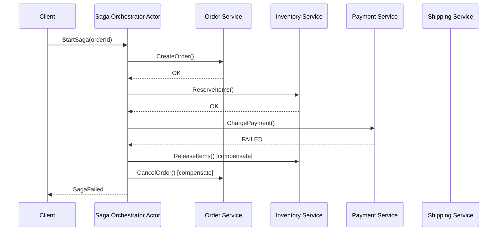

# How to Use Dapr Actor for Saga Orchestration Pattern

Author: [nawazdhandala](https://www.github.com/nawazdhandala)

Tags: Dapr, Actor, Saga, Orchestration, Distributed Transaction

Description: Implement the saga orchestration pattern using Dapr virtual actors to coordinate multi-step distributed transactions with compensating actions on failure.

---

## What Is the Saga Pattern?

A saga is a sequence of local transactions coordinated by an orchestrator. If any step fails, the orchestrator executes compensating transactions to undo completed steps. Dapr virtual actors are a natural fit for saga orchestrators because they are single-threaded, stateful, and reliably placed across a cluster.



## Saga State Model

The orchestrator actor holds the saga state:

```go
// saga_state.go
package main

import "time"

type SagaStatus string

const (
    SagaStatusStarted    SagaStatus = "STARTED"
    SagaStatusCompleted  SagaStatus = "COMPLETED"
    SagaStatusFailed     SagaStatus = "FAILED"
    SagaStatusCompensating SagaStatus = "COMPENSATING"
)

type SagaState struct {
    OrderID     string            `json:"orderId"`
    Status      SagaStatus        `json:"status"`
    CurrentStep int               `json:"currentStep"`
    Steps       []SagaStep        `json:"steps"`
    StartedAt   time.Time         `json:"startedAt"`
    UpdatedAt   time.Time         `json:"updatedAt"`
    ErrorMsg    string            `json:"errorMsg,omitempty"`
}

type SagaStep struct {
    Name        string `json:"name"`
    Status      string `json:"status"` // pending, completed, compensated, failed
    ServiceURL  string `json:"serviceUrl"`
    ActionPath  string `json:"actionPath"`
    CompensatePath string `json:"compensatePath"`
}
```

## Saga Orchestrator Actor (Python)

```python
# saga_actor.py
import json
import requests
from dapr.actor import Actor, ActorInterface, actormethod
from dapr.actor.runtime.context import ActorRuntimeContext
from datetime import datetime, timezone

class SagaOrchestratorInterface(ActorInterface):
    @actormethod(name="StartSaga")
    async def start_saga(self, order_data: dict) -> dict: ...

    @actormethod(name="GetStatus")
    async def get_status(self) -> dict: ...

class SagaOrchestratorActor(Actor, SagaOrchestratorInterface):

    STEPS = [
        {
            "name": "CreateOrder",
            "serviceAppId": "order-service",
            "actionPath": "/orders",
            "compensatePath": "/orders/{orderId}/cancel"
        },
        {
            "name": "ReserveInventory",
            "serviceAppId": "inventory-service",
            "actionPath": "/inventory/reserve",
            "compensatePath": "/inventory/release/{orderId}"
        },
        {
            "name": "ProcessPayment",
            "serviceAppId": "payment-service",
            "actionPath": "/payments/charge",
            "compensatePath": "/payments/refund/{orderId}"
        },
        {
            "name": "CreateShipment",
            "serviceAppId": "shipping-service",
            "actionPath": "/shipments",
            "compensatePath": "/shipments/{orderId}/cancel"
        }
    ]

    async def _on_activate(self) -> None:
        exists = await self._state_manager.try_get_state("sagaState")
        if not exists[0]:
            await self._state_manager.set_state("sagaState", {
                "status": "NOT_STARTED",
                "currentStep": -1,
                "completedSteps": []
            })

    async def start_saga(self, order_data: dict) -> dict:
        saga_state = {
            "orderId": order_data["orderId"],
            "status": "STARTED",
            "currentStep": 0,
            "completedSteps": [],
            "startedAt": datetime.now(timezone.utc).isoformat()
        }
        await self._state_manager.set_state("sagaState", saga_state)
        await self._state_manager.set_state("orderData", order_data)

        return await self._execute_steps(order_data)

    async def _execute_steps(self, order_data: dict) -> dict:
        state = await self._state_manager.get_state("sagaState")

        for i, step in enumerate(self.STEPS):
            state["currentStep"] = i
            await self._state_manager.set_state("sagaState", state)

            print(f"Executing step {i+1}/{len(self.STEPS)}: {step['name']}")

            success = await self._call_service(
                step["serviceAppId"],
                step["actionPath"],
                order_data
            )

            if success:
                state["completedSteps"].append(step["name"])
                await self._state_manager.set_state("sagaState", state)
                print(f"Step {step['name']} completed")
            else:
                print(f"Step {step['name']} failed. Starting compensation.")
                state["status"] = "COMPENSATING"
                await self._state_manager.set_state("sagaState", state)

                await self._compensate(state["completedSteps"], order_data)

                state["status"] = "FAILED"
                state["errorMsg"] = f"Step {step['name']} failed"
                await self._state_manager.set_state("sagaState", state)
                return {"status": "FAILED", "failedStep": step["name"]}

        state["status"] = "COMPLETED"
        await self._state_manager.set_state("sagaState", state)
        return {"status": "COMPLETED", "orderId": order_data["orderId"]}

    async def _call_service(self, app_id: str, path: str, data: dict) -> bool:
        """Call a service via Dapr service invocation."""
        try:
            url = f"http://localhost:3500/v1.0/invoke/{app_id}/method{path}"
            response = requests.post(url, json=data, timeout=10)
            return response.status_code in (200, 201)
        except Exception as e:
            print(f"Service call failed: {e}")
            return False

    async def _compensate(self, completed_steps: list, order_data: dict):
        """Execute compensating transactions in reverse order."""
        order_id = order_data["orderId"]
        for step_name in reversed(completed_steps):
            step = next((s for s in self.STEPS if s["name"] == step_name), None)
            if step:
                comp_path = step["compensatePath"].replace("{orderId}", order_id)
                print(f"Compensating: {step_name} at {comp_path}")
                await self._call_service(step["serviceAppId"], comp_path, order_data)

    async def get_status(self) -> dict:
        state = await self._state_manager.get_state("sagaState")
        return state
```

## Actor Host Application

```python
# main.py
import asyncio
from dapr.actor.runtime.runtime import ActorRuntime
from dapr.actor.runtime.config import ActorRuntimeConfig
from saga_actor import SagaOrchestratorActor
from fastapi import FastAPI
import uvicorn

app = FastAPI()

@app.on_event("startup")
async def startup():
    config = ActorRuntimeConfig()
    ActorRuntime.set_actor_config(config)
    ActorRuntime.register_actor(SagaOrchestratorActor)

@app.post("/start-order")
async def start_order(order: dict):
    from dapr.clients import DaprClient
    with DaprClient() as client:
        resp = client.invoke_actor(
            actor_type="SagaOrchestratorActor",
            actor_id=order["orderId"],
            method="StartSaga",
            data=order
        )
        return resp.data

if __name__ == "__main__":
    uvicorn.run(app, host="0.0.0.0", port=5001)
```

## Starting a Saga via HTTP

```bash
# Start a saga for a new order
curl -X POST \
  http://localhost:3500/v1.0/actors/SagaOrchestratorActor/order-123/method/StartSaga \
  -H "Content-Type: application/json" \
  -d '{
    "orderId": "order-123",
    "customerId": "cust-456",
    "items": [{"productId": "prod-1", "qty": 2, "price": 49.99}],
    "total": 99.98,
    "paymentMethod": "card",
    "shippingAddress": "123 Main St"
  }'

# Check saga status
curl http://localhost:3500/v1.0/actors/SagaOrchestratorActor/order-123/method/GetStatus
```

## Kubernetes Deployment

```yaml
# saga-orchestrator.yaml
apiVersion: apps/v1
kind: Deployment
metadata:
  name: saga-orchestrator
  namespace: default
spec:
  replicas: 1
  selector:
    matchLabels:
      app: saga-orchestrator
  template:
    metadata:
      labels:
        app: saga-orchestrator
      annotations:
        dapr.io/enabled: "true"
        dapr.io/app-id: "saga-orchestrator"
        dapr.io/app-port: "5001"
    spec:
      containers:
      - name: saga-orchestrator
        image: your-registry/saga-orchestrator:latest
        ports:
        - containerPort: 5001
```

## Summary

Dapr virtual actors implement saga orchestration by maintaining the saga state and current step in actor state storage. The actor executes each service call sequentially and, on failure, runs compensating transactions in reverse order. Because actors are single-threaded and durable, the saga state survives restarts without distributed locking. Use the actor ID equal to the business transaction ID (e.g., `orderId`) so each saga instance is independent and addressable.
