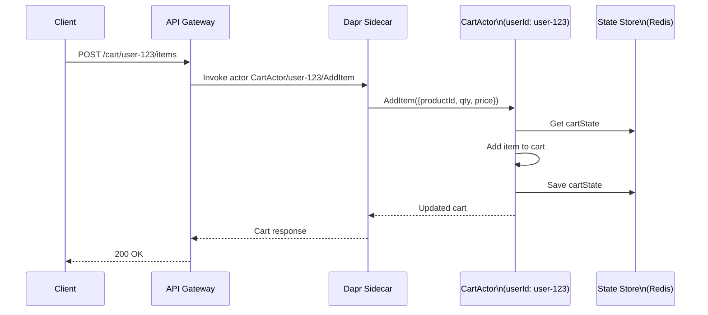

# How to Build a Shopping Cart Service with Dapr Actors

Author: [nawazdhandala](https://www.github.com/nawazdhandala)

Tags: Dapr, Actor, Shopping Cart, Stateful, E-Commerce

Description: Build a stateful shopping cart microservice using Dapr virtual actors, where each cart is an isolated actor instance with state persistence, item management, and checkout logic.

---

## Why Dapr Actors for Shopping Cart?

Shopping carts have a natural 1:1 mapping to virtual actors: each user has one cart, operations are sequential (no concurrent modifications needed), and cart state must survive service restarts. Dapr actors provide per-user state isolation, single-threaded execution guarantees, and automatic state persistence.



## Cart Actor Interface

```go
// cart_actor.go
package main

import (
    "context"
    "time"
)

type CartItem struct {
    ProductID   string  `json:"productId"`
    ProductName string  `json:"productName"`
    Quantity    int     `json:"quantity"`
    UnitPrice   float64 `json:"unitPrice"`
}

type CartState struct {
    UserID    string     `json:"userId"`
    Items     []CartItem `json:"items"`
    CreatedAt time.Time  `json:"createdAt"`
    UpdatedAt time.Time  `json:"updatedAt"`
    Coupon    string     `json:"coupon,omitempty"`
}

type CartSummary struct {
    UserID     string     `json:"userId"`
    Items      []CartItem `json:"items"`
    ItemCount  int        `json:"itemCount"`
    SubTotal   float64    `json:"subTotal"`
    Discount   float64    `json:"discount"`
    Total      float64    `json:"total"`
}

type AddItemRequest struct {
    ProductID   string  `json:"productId"`
    ProductName string  `json:"productName"`
    Quantity    int     `json:"quantity"`
    UnitPrice   float64 `json:"unitPrice"`
}

type UpdateQuantityRequest struct {
    ProductID string `json:"productId"`
    Quantity  int    `json:"quantity"`
}

type ApplyCouponRequest struct {
    Coupon string `json:"coupon"`
}
```

## Cart Actor Implementation (Go)

```go
// cart_actor_impl.go
package main

import (
    "context"
    "encoding/json"
    "fmt"
    "strings"
    "time"

    dapr "github.com/dapr/go-sdk/actor"
)

type CartActor struct {
    dapr.ServerImplBase
}

func (c *CartActor) Type() string {
    return "CartActor"
}

func (c *CartActor) AddItem(ctx context.Context, req *AddItemRequest) (*CartSummary, error) {
    state, err := c.getCart(ctx)
    if err != nil {
        return nil, err
    }

    // Find existing item or add new one
    found := false
    for i, item := range state.Items {
        if item.ProductID == req.ProductID {
            state.Items[i].Quantity += req.Quantity
            found = true
            break
        }
    }
    if !found {
        state.Items = append(state.Items, CartItem{
            ProductID:   req.ProductID,
            ProductName: req.ProductName,
            Quantity:    req.Quantity,
            UnitPrice:   req.UnitPrice,
        })
    }

    state.UpdatedAt = time.Now()
    if err := c.saveCart(ctx, state); err != nil {
        return nil, err
    }

    return c.buildSummary(state), nil
}

func (c *CartActor) RemoveItem(ctx context.Context, req *UpdateQuantityRequest) (*CartSummary, error) {
    state, err := c.getCart(ctx)
    if err != nil {
        return nil, err
    }

    filtered := make([]CartItem, 0)
    for _, item := range state.Items {
        if item.ProductID != req.ProductID {
            filtered = append(filtered, item)
        }
    }
    state.Items = filtered
    state.UpdatedAt = time.Now()

    if err := c.saveCart(ctx, state); err != nil {
        return nil, err
    }
    return c.buildSummary(state), nil
}

func (c *CartActor) UpdateQuantity(ctx context.Context, req *UpdateQuantityRequest) (*CartSummary, error) {
    state, err := c.getCart(ctx)
    if err != nil {
        return nil, err
    }

    for i, item := range state.Items {
        if item.ProductID == req.ProductID {
            if req.Quantity <= 0 {
                state.Items = append(state.Items[:i], state.Items[i+1:]...)
            } else {
                state.Items[i].Quantity = req.Quantity
            }
            break
        }
    }

    state.UpdatedAt = time.Now()
    if err := c.saveCart(ctx, state); err != nil {
        return nil, err
    }
    return c.buildSummary(state), nil
}

func (c *CartActor) GetCart(ctx context.Context) (*CartSummary, error) {
    state, err := c.getCart(ctx)
    if err != nil {
        return nil, err
    }
    return c.buildSummary(state), nil
}

func (c *CartActor) ClearCart(ctx context.Context) error {
    state, err := c.getCart(ctx)
    if err != nil {
        return err
    }
    state.Items = []CartItem{}
    state.Coupon = ""
    state.UpdatedAt = time.Now()
    return c.saveCart(ctx, state)
}

func (c *CartActor) ApplyCoupon(ctx context.Context, req *ApplyCouponRequest) (*CartSummary, error) {
    state, err := c.getCart(ctx)
    if err != nil {
        return nil, err
    }
    state.Coupon = req.Coupon
    state.UpdatedAt = time.Now()
    if err := c.saveCart(ctx, state); err != nil {
        return nil, err
    }
    return c.buildSummary(state), nil
}

func (c *CartActor) Checkout(ctx context.Context) (*CartSummary, error) {
    state, err := c.getCart(ctx)
    if err != nil {
        return nil, err
    }
    if len(state.Items) == 0 {
        return nil, fmt.Errorf("cart is empty")
    }

    summary := c.buildSummary(state)

    // Clear cart after checkout
    state.Items = []CartItem{}
    state.Coupon = ""
    state.UpdatedAt = time.Now()
    _ = c.saveCart(ctx, state)

    return summary, nil
}

func (c *CartActor) getCart(ctx context.Context) (*CartState, error) {
    var state CartState
    err := c.GetStateManager().Get(ctx, "cart", &state)
    if err != nil {
        // Initialize empty cart
        state = CartState{
            UserID:    c.ID(),
            Items:     []CartItem{},
            CreatedAt: time.Now(),
            UpdatedAt: time.Now(),
        }
    }
    return &state, nil
}

func (c *CartActor) saveCart(ctx context.Context, state *CartState) error {
    return c.GetStateManager().Set(ctx, "cart", state)
}

func (c *CartActor) buildSummary(state *CartState) *CartSummary {
    var subTotal float64
    var itemCount int
    for _, item := range state.Items {
        subTotal += item.UnitPrice * float64(item.Quantity)
        itemCount += item.Quantity
    }

    discount := 0.0
    if state.Coupon == "SAVE10" {
        discount = subTotal * 0.10
    } else if state.Coupon == "SAVE20" {
        discount = subTotal * 0.20
    }

    return &CartSummary{
        UserID:    state.UserID,
        Items:     state.Items,
        ItemCount: itemCount,
        SubTotal:  subTotal,
        Discount:  discount,
        Total:     subTotal - discount,
    }
}
```

## Cart API Gateway (HTTP)

Expose the actor as a REST API:

```go
// api.go
package main

import (
    "encoding/json"
    "fmt"
    "io"
    "net/http"
    "strings"

    dapr "github.com/dapr/go-sdk/client"
)

func cartHandler(w http.ResponseWriter, r *http.Request) {
    client, _ := dapr.NewClient()
    defer client.Close()

    parts := strings.Split(r.URL.Path, "/")
    if len(parts) < 3 {
        http.Error(w, "invalid path", http.StatusBadRequest)
        return
    }

    userID := parts[2]

    switch r.Method {
    case http.MethodGet:
        invokeActor(w, client, userID, "GetCart", nil)
    case http.MethodPost:
        body, _ := io.ReadAll(r.Body)
        invokeActor(w, client, userID, "AddItem", body)
    case http.MethodDelete:
        invokeActor(w, client, userID, "ClearCart", nil)
    }
}

func invokeActor(w http.ResponseWriter, client dapr.Client, actorID, method string, data []byte) {
    resp, err := client.InvokeActorMethod(
        r.Context(),
        "CartActor",
        actorID,
        method,
        data,
    )
    if err != nil {
        http.Error(w, err.Error(), http.StatusInternalServerError)
        return
    }
    w.Header().Set("Content-Type", "application/json")
    w.Write(resp)
}
```

## Using the Cart via curl

```bash
# Add an item to user-123's cart
curl -X POST \
  http://localhost:3500/v1.0/actors/CartActor/user-123/method/AddItem \
  -H "Content-Type: application/json" \
  -d '{"productId":"prod-001","productName":"Wireless Mouse","quantity":1,"unitPrice":29.99}'

# Add another item
curl -X POST \
  http://localhost:3500/v1.0/actors/CartActor/user-123/method/AddItem \
  -H "Content-Type: application/json" \
  -d '{"productId":"prod-002","productName":"USB Hub","quantity":2,"unitPrice":24.99}'

# Get cart
curl http://localhost:3500/v1.0/actors/CartActor/user-123/method/GetCart

# Apply coupon
curl -X POST \
  http://localhost:3500/v1.0/actors/CartActor/user-123/method/ApplyCoupon \
  -H "Content-Type: application/json" \
  -d '{"coupon":"SAVE10"}'

# Checkout
curl -X POST \
  http://localhost:3500/v1.0/actors/CartActor/user-123/method/Checkout \
  -H "Content-Type: application/json" \
  -d '{}'
```

## State Store Configuration

```yaml
# statestore.yaml
apiVersion: dapr.io/v1alpha1
kind: Component
metadata:
  name: statestore
  namespace: default
spec:
  type: state.redis
  version: v1
  metadata:
  - name: redisHost
    value: "redis-master:6379"
  - name: actorStateStore
    value: "true"
```

The `actorStateStore: "true"` flag designates this state store for actor state.

## Kubernetes Deployment

```yaml
# cart-service.yaml
apiVersion: apps/v1
kind: Deployment
metadata:
  name: cart-service
  namespace: default
spec:
  replicas: 3
  selector:
    matchLabels:
      app: cart-service
  template:
    metadata:
      labels:
        app: cart-service
      annotations:
        dapr.io/enabled: "true"
        dapr.io/app-id: "cart-service"
        dapr.io/app-port: "5001"
    spec:
      containers:
      - name: cart-service
        image: your-registry/cart-service:latest
        ports:
        - containerPort: 5001
```

Scale to 3 replicas: Dapr's placement service routes requests for `CartActor/user-123` to the correct pod regardless of which replica handles the request.

## Summary

Dapr virtual actors map naturally to shopping cart use cases: one actor instance per user, isolated single-threaded state, and durable persistence across restarts. Implement the cart operations (add, remove, update, checkout) as actor methods, use actor state to store the cart contents, and expose the actor through the Dapr HTTP API. Deploying multiple replicas is transparent because the placement service handles actor routing automatically.
