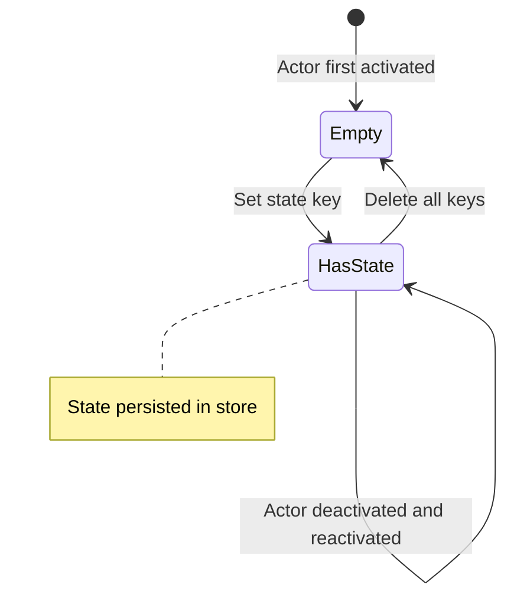

# How to Use Dapr Actor State Persistence

Author: [nawazdhandala](https://www.github.com/nawazdhandala)

Tags: Dapr, Actor, State, Persistence, Storage

Description: Learn how Dapr persists actor state to a backing state store, how to read and write actor state, and how to configure transactional state operations in actors.

---

## Introduction

Dapr actors maintain their state in a durable backing state store. When an actor method reads or writes state, those changes are persisted transparently through the Dapr sidecar to the configured state store. Even if an actor is deactivated or the host application restarts, the state is preserved and reloaded when the actor is next activated.

Dapr actor state is:

- **Isolated per actor** - each actor instance has its own state namespace
- **Transactional** - multiple state operations can be committed atomically
- **Automatically managed** - the SDK handles state serialization and persistence

## State Key Naming Convention

Dapr uses a structured key format in the state store: `{appId}||{actorType}||{actorId}||{stateKey}`. This ensures isolation between actor instances and types.

```mermaid
flowchart LR
    A[Actor: OrderActor/order-42] -->|key: status| B[Dapr Sidecar]
    B -->|Key: myapp||OrderActor||order-42||status| C[(Redis State Store)]
```

## Prerequisites

- Dapr initialized with a state store supporting actors
- State store component with `actorStateStore: "true"`

## Configuring the State Store

```yaml
apiVersion: dapr.io/v1alpha1
kind: Component
metadata:
  name: statestore
  namespace: default
spec:
  type: state.redis
  version: v1
  metadata:
  - name: redisHost
    value: "redis-master:6379"
  - name: redisPassword
    value: ""
  - name: actorStateStore
    value: "true"
```

## Reading and Writing Actor State

### Go SDK

```go
package main

import (
    "context"
    "encoding/json"
    "github.com/dapr/go-sdk/actor"
)

type OrderState struct {
    Status   string  `json:"status"`
    Total    float64 `json:"total"`
    Customer string  `json:"customer"`
}

type OrderActorImpl struct {
    actor.ServerImplBase
}

func (a *OrderActorImpl) Type() string { return "OrderActor" }

// Write state
func (a *OrderActorImpl) CreateOrder(ctx context.Context, state OrderState) error {
    return a.GetStateManager().Set(ctx, "orderState", state)
}

// Read state
func (a *OrderActorImpl) GetOrder(ctx context.Context) (OrderState, error) {
    var state OrderState
    err := a.GetStateManager().Get(ctx, "orderState", &state)
    return state, err
}

// Update state
func (a *OrderActorImpl) UpdateStatus(ctx context.Context, newStatus string) error {
    var state OrderState
    if err := a.GetStateManager().Get(ctx, "orderState", &state); err != nil {
        return err
    }
    state.Status = newStatus
    return a.GetStateManager().Set(ctx, "orderState", state)
}

// Delete state
func (a *OrderActorImpl) DeleteOrder(ctx context.Context) error {
    return a.GetStateManager().Remove(ctx, "orderState")
}
```

### Python SDK

```python
from dapr.actor import Actor, ActorInterface, actormethod
from dataclasses import dataclass, asdict
from typing import Optional

@dataclass
class OrderState:
    status: str
    total: float
    customer: str

class OrderActorInterface(ActorInterface):
    @actormethod(name="createOrder")
    async def create_order(self, state: dict) -> None: ...

    @actormethod(name="getOrder")
    async def get_order(self) -> dict: ...

    @actormethod(name="updateStatus")
    async def update_status(self, new_status: str) -> None: ...

class OrderActor(Actor, OrderActorInterface):
    async def create_order(self, state: dict) -> None:
        await self._state_manager.set_state("orderState", state)
        await self._state_manager.save_state()

    async def get_order(self) -> dict:
        exists, state = await self._state_manager.try_get_state("orderState")
        if not exists:
            return {}
        return state

    async def update_status(self, new_status: str) -> None:
        exists, state = await self._state_manager.try_get_state("orderState")
        if exists and state:
            state["status"] = new_status
            await self._state_manager.set_state("orderState", state)
            await self._state_manager.save_state()
```

### .NET SDK

```csharp
using Dapr.Actors.Runtime;
using System.Threading.Tasks;

public class OrderActor : Actor, IOrderActor
{
    public OrderActor(ActorHost host) : base(host) { }

    public async Task CreateOrderAsync(OrderState state)
    {
        await StateManager.SetStateAsync("orderState", state);
    }

    public async Task<OrderState> GetOrderAsync()
    {
        var result = await StateManager.TryGetStateAsync<OrderState>("orderState");
        return result.HasValue ? result.Value : new OrderState();
    }

    public async Task UpdateStatusAsync(string newStatus)
    {
        var state = await StateManager.GetStateAsync<OrderState>("orderState");
        state.Status = newStatus;
        await StateManager.SetStateAsync("orderState", state);
    }
}
```

## Transactional State Updates

Dapr actors support atomic multi-key state updates. All state changes within a single actor method invocation are committed atomically when the method returns (in SDKs that support it).

In Go, you can explicitly control state commits:

```go
func (a *OrderActorImpl) ProcessPayment(ctx context.Context, amount float64) error {
    var state OrderState
    a.GetStateManager().Get(ctx, "orderState", &state)
    state.Status = "paid"
    state.Total = amount
    // Both keys are committed atomically
    a.GetStateManager().Set(ctx, "orderState", state)
    a.GetStateManager().Set(ctx, "paymentTimestamp", time.Now().Unix())
    return a.GetStateManager().Save(ctx)
}
```

## Direct State Access via HTTP API

You can read and write actor state directly through Dapr's HTTP API (useful for admin or debugging):

Read a state key:

```bash
curl http://localhost:3500/v1.0/actors/OrderActor/order-42/state/orderState
```

Write state (transactional batch):

```bash
curl -X PUT \
  http://localhost:3500/v1.0/actors/OrderActor/order-42/state \
  -H "Content-Type: application/json" \
  -d '[
    {"operation":"upsert","request":{"key":"orderState","value":{"status":"shipped","total":99.99,"customer":"Alice"}}},
    {"operation":"upsert","request":{"key":"paymentTimestamp","value":1711929600}}
  ]'
```

Delete a state key:

```bash
curl -X PUT \
  http://localhost:3500/v1.0/actors/OrderActor/order-42/state \
  -H "Content-Type: application/json" \
  -d '[{"operation":"delete","request":{"key":"orderState"}}]'
```

## State Lifecycle



## Summary

Dapr actor state persistence is a core feature that makes actors durable and reliable. By backing actor state in a configurable state store, Dapr ensures that state survives deactivation, restarts, and failovers. Use the SDK's state manager APIs for type-safe reads, writes, and atomic transactional commits. For debugging or administrative access, Dapr's HTTP API provides direct state manipulation. Always configure your state store component with `actorStateStore: "true"` to enable actor state operations.
