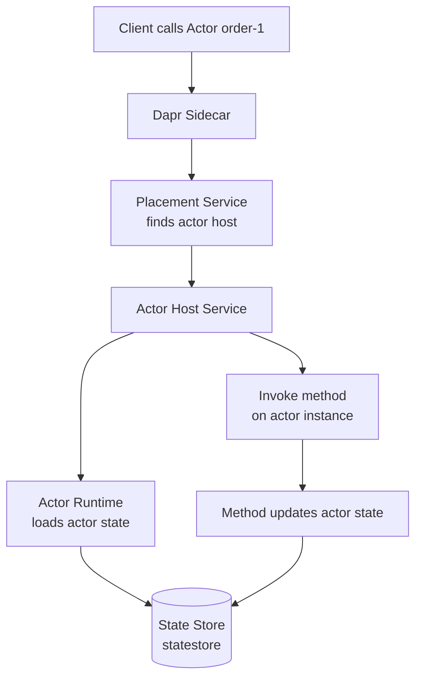

# How to Use Dapr Actor State Management

Author: [nawazdhandala](https://www.github.com/nawazdhandala)

Tags: Dapr, Actor, State Management, Virtual Actor, Distributed

Description: Learn how Dapr Virtual Actors manage isolated per-actor state with built-in concurrency guarantees, enabling stateful microservice patterns without distributed locks.

---

## What Are Dapr Virtual Actors?

Dapr implements the Virtual Actor pattern from Microsoft Orleans. Each actor is an isolated, single-threaded object with its own private state. Actors are addressable by a unique ID and only one instance of each actor runs at a time, eliminating the need for distributed locks. Actor state is persisted in the configured state store.

## How Actor State Works



## Prerequisites

- Dapr initialized with a state store that supports actors (`actorStateStore: "true"`)
- Placement service running (started automatically by `dapr init`)

## Configuring the Actor State Store

The state store used by actors must have `actorStateStore` set to `true`:

```yaml
apiVersion: dapr.io/v1alpha1
kind: Component
metadata:
  name: statestore
spec:
  type: state.redis
  version: v1
  metadata:
  - name: redisHost
    value: localhost:6379
  - name: redisPassword
    value: ""
  - name: actorStateStore
    value: "true"
```

## Python Actor Example

Install the Dapr Python SDK:

```bash
pip install dapr dapr-ext-fastapi
```

Define and implement an actor:

```python
# order_actor.py
from dapr.actor import Actor, Remindable
from dapr.actor.runtime.context import ActorRuntimeContext
import json

class OrderActorInterface:
    """Actor interface (abstract base)"""
    async def place_order(self, item: str, quantity: int) -> dict:
        raise NotImplementedError

    async def get_status(self) -> dict:
        raise NotImplementedError

    async def complete_order(self) -> None:
        raise NotImplementedError


class OrderActor(Actor, OrderActorInterface):
    """Stateful actor managing a single order"""

    def __init__(self, ctx: ActorRuntimeContext, actor_id):
        super().__init__(ctx, actor_id)

    async def _on_activate(self):
        """Called when actor is activated. Initialize state if needed."""
        state = await self._state_manager.try_get_state("order_state")
        if not state[0]:  # state does not exist
            await self._state_manager.set_state("order_state", {
                "status": "new",
                "items": [],
                "total": 0.0
            })
            await self._state_manager.save_state()

    async def place_order(self, item: str, quantity: int) -> dict:
        state = await self._state_manager.get_state("order_state")
        state["items"].append({"item": item, "qty": quantity})
        state["status"] = "pending"
        state["total"] += quantity * 10.0  # simplified pricing
        await self._state_manager.set_state("order_state", state)
        await self._state_manager.save_state()
        return {"orderId": self.id.id, "status": state["status"], "total": state["total"]}

    async def get_status(self) -> dict:
        state = await self._state_manager.get_state("order_state")
        return {"orderId": self.id.id, "status": state["status"], "total": state["total"]}

    async def complete_order(self) -> None:
        state = await self._state_manager.get_state("order_state")
        state["status"] = "completed"
        await self._state_manager.set_state("order_state", state)
        await self._state_manager.save_state()
```

Host the actor with FastAPI:

```python
# app.py
from fastapi import FastAPI
from dapr.ext.fastapi import DaprActor
from order_actor import OrderActor

app = FastAPI()
actor = DaprActor(app)

@app.on_event("startup")
async def startup_event():
    await actor.register_actor(OrderActor)

@app.get("/health")
def health():
    return {"status": "ok"}
```

Start it:

```bash
dapr run \
  --app-id order-service \
  --app-port 8000 \
  --dapr-http-port 3500 \
  -- uvicorn app:app --host 0.0.0.0 --port 8000
```

## Calling Actor Methods via HTTP

Call an actor method using the Dapr HTTP API:

```bash
# Invoke place_order on actor with ID "order-42"
curl -X POST \
  "http://localhost:3500/v1.0/actors/OrderActor/order-42/method/place_order" \
  -H "Content-Type: application/json" \
  -d '{"item": "Widget", "quantity": 3}'
```

Get actor status:

```bash
curl "http://localhost:3500/v1.0/actors/OrderActor/order-42/method/get_status"
```

## Go Actor Example

```go
// actor.go
package main

import (
    "context"
    "encoding/json"

    dapr "github.com/dapr/go-sdk/actor"
)

type OrderState struct {
    Status string  `json:"status"`
    Items  []Item  `json:"items"`
    Total  float64 `json:"total"`
}

type Item struct {
    Name string `json:"name"`
    Qty  int    `json:"qty"`
}

type OrderActor struct {
    dapr.ServerImplBase
}

func (a *OrderActor) Type() string {
    return "OrderActor"
}

func (a *OrderActor) PlaceOrder(ctx context.Context, req *PlaceOrderRequest) (*PlaceOrderResponse, error) {
    var state OrderState
    a.GetStateManager().Get(ctx, "order_state", &state)

    state.Items = append(state.Items, Item{Name: req.Item, Qty: req.Quantity})
    state.Status = "pending"
    state.Total += float64(req.Quantity) * 10.0

    a.GetStateManager().Set(ctx, "order_state", state)
    return &PlaceOrderResponse{Status: state.Status, Total: state.Total}, nil
}
```

## Actor State in the State Store

Actor state is stored in the configured state store with a key format of:

```json
{app-id}||{actor-type}-{actor-id}-{state-key}
```

For example:

```text
order-service||OrderActor-order-42-order_state
```

You can inspect actor state directly in Redis:

```bash
redis-cli keys "order-service||OrderActor*"
redis-cli get "order-service||OrderActor-order-42-order_state"
```

## Actor Reminders

Actors support reminders that persist across actor deactivation:

```python
from dapr.actor import Remindable

class OrderActor(Actor, Remindable, OrderActorInterface):
    async def register_reminder(self):
        await self.register_reminder(
            "followup",
            b"reminder-data",
            due_time=timedelta(minutes=30),
            period=timedelta(hours=1)
        )

    async def receive_reminder(self, name: str, state: bytes,
                                due_time, period, ttl=None):
        print(f"Reminder {name} fired")
        # Check order status and send follow-up
```

## Summary

Dapr Virtual Actors provide per-actor isolated state management with built-in single-threaded execution guarantees. Actor state is persisted in the configured Dapr state store (which must have `actorStateStore: true`). Each actor instance has its own private key-value state managed through the state manager, and the placement service ensures only one instance runs per actor ID at any time.
