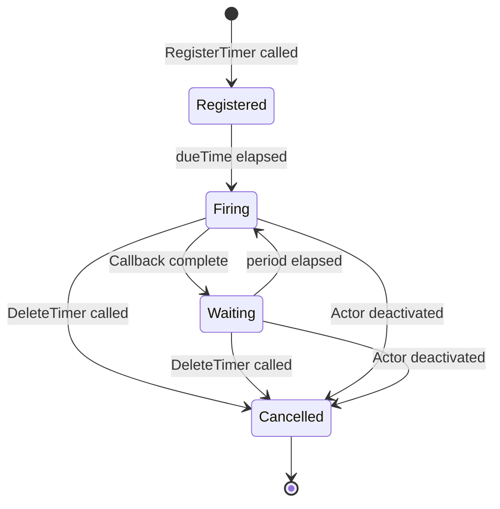

# How to Use Dapr Actor Timers for Scheduled Callbacks

Author: [nawazdhandala](https://www.github.com/nawazdhandala)

Tags: Dapr, Actor, Timer, Scheduling, Microservice

Description: Learn how to use Dapr actor timers to schedule periodic callbacks within an actor's lifetime, including setup, configuration, and practical examples.

---

## Introduction

Dapr actor timers allow an actor to schedule periodic callbacks to itself. Timers are lightweight, non-persistent scheduling mechanisms - they live only as long as the actor is active. If the actor is deactivated (due to idle timeout or host failure), all timers are cancelled. When the actor is reactivated, timers do not automatically restart.

Timers are ideal for:

- Polling external resources periodically while an actor is active
- Sending periodic heartbeats or health checks
- Refreshing cached data at intervals

For persistent scheduling that survives actor deactivation, use actor reminders instead.

## How Timers Work

A timer is registered with Dapr and fires a callback method on the actor after an initial delay (`dueTime`) and then repeatedly at a configured `period`. The callback runs within the actor's turn-based concurrency model, so it will not interrupt an in-progress method call.

```mermaid
sequenceDiagram
    participant Actor
    participant DaprSidecar as Dapr Sidecar
    participant TimerStore as Timer Registry

    Actor->>DaprSidecar: POST /actors/{type}/{id}/timers/{name}
    DaprSidecar->>TimerStore: Register timer
    Note over DaprSidecar: Wait for dueTime
    DaprSidecar->>Actor: PUT /actors/{type}/{id}/method/callback
    Note over DaprSidecar: Wait for period
    DaprSidecar->>Actor: PUT /actors/{type}/{id}/method/callback
    Actor->>DaprSidecar: DELETE /actors/{type}/{id}/timers/{name}
    DaprSidecar->>TimerStore: Remove timer
```

## Prerequisites

- Dapr initialized locally or on Kubernetes
- A state store with `actorStateStore: "true"` configured
- An actor application running with the Dapr sidecar

## Registering a Timer

### Via HTTP API

To register a timer, POST to `/v1.0/actors/{actorType}/{actorId}/timers/{timerName}`:

```bash
curl -X POST \
  http://localhost:3500/v1.0/actors/MonitorActor/sensor-01/timers/heartbeat \
  -H "Content-Type: application/json" \
  -d '{
    "dueTime": "5s",
    "period": "10s",
    "callback": "checkStatus",
    "data": {"threshold": 90}
  }'
```

Parameters:
- `dueTime` - delay before first fire (ISO 8601 duration or Go duration string)
- `period` - interval between subsequent fires
- `callback` - actor method name to invoke
- `data` - optional JSON payload passed to the callback
- `ttl` - optional time-to-live after which the timer stops firing

### Via Go SDK

```go
package main

import (
    "context"
    "encoding/json"
    "time"
    "github.com/dapr/go-sdk/actor"
)

type MonitorActorImpl struct {
    actor.ServerImplBase
}

func (a *MonitorActorImpl) Type() string { return "MonitorActor" }

// Called when actor activates - register timer
func (a *MonitorActorImpl) OnActivate() error {
    timerData, _ := json.Marshal(map[string]int{"threshold": 90})
    return a.RegisterActorTimer(
        "heartbeat",
        "checkStatus",
        timerData,
        5*time.Second,  // dueTime
        10*time.Second, // period
    )
}

// Timer callback method
func (a *MonitorActorImpl) CheckStatus(ctx context.Context, data []byte) error {
    var payload map[string]int
    json.Unmarshal(data, &payload)
    threshold := payload["threshold"]
    // Perform check logic
    _ = threshold
    return nil
}
```

### Via Python SDK

```python
from dapr.actor import Actor, ActorInterface, actormethod
import asyncio

class MonitorActorInterface(ActorInterface):
    @actormethod(name="checkStatus")
    async def check_status(self, data: dict) -> None: ...

class MonitorActor(Actor, MonitorActorInterface):
    async def _on_activate(self) -> None:
        await self.register_timer(
            "heartbeat",
            "checkStatus",
            {"threshold": 90},
            due_time="5s",
            period="10s"
        )

    async def check_status(self, data: dict) -> None:
        threshold = data.get("threshold", 80)
        # Perform monitoring logic
        print(f"Checking status with threshold: {threshold}")
```

## Handling the Timer Callback in Your App

When using the HTTP API (no SDK), your app receives the timer callback as a PUT request:

```javascript
// Node.js Express example
app.put('/actors/MonitorActor/:actorId/method/checkStatus', (req, res) => {
  const { actorId } = req.params;
  const data = req.body; // { threshold: 90 }
  console.log(`Timer fired for actor ${actorId}:`, data);
  // Perform your logic here
  res.sendStatus(200);
});
```

## Deleting a Timer

```bash
curl -X DELETE \
  http://localhost:3500/v1.0/actors/MonitorActor/sensor-01/timers/heartbeat
```

## Timer vs. Reminder Comparison

| Feature | Timer | Reminder |
|---|---|---|
| Persistent across deactivation | No | Yes |
| Persisted to state store | No | Yes |
| Auto-restarts on reactivation | No | Yes |
| Best for | Short-lived periodic tasks | Durable scheduled tasks |

## Timer Lifecycle



## TTL-Based Timers

You can set a timer to stop after a specific duration using the `ttl` field:

```bash
curl -X POST \
  http://localhost:3500/v1.0/actors/MonitorActor/sensor-01/timers/temp-check \
  -H "Content-Type: application/json" \
  -d '{
    "dueTime": "0s",
    "period": "5s",
    "ttl": "1m",
    "callback": "checkStatus"
  }'
```

This timer fires every 5 seconds but stops automatically after 1 minute.

## Summary

Dapr actor timers provide a simple way to schedule recurring callbacks within an actor's active lifetime. They are easy to register via the HTTP API or SDK and automatically respect the actor's turn-based concurrency. Because timers are ephemeral, use them for transient periodic tasks, and use reminders when you need scheduling that persists across actor deactivation and reactivation cycles.
