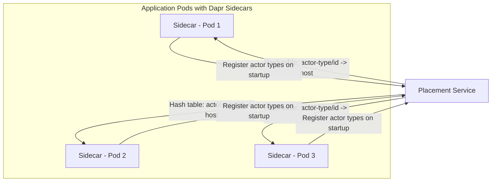
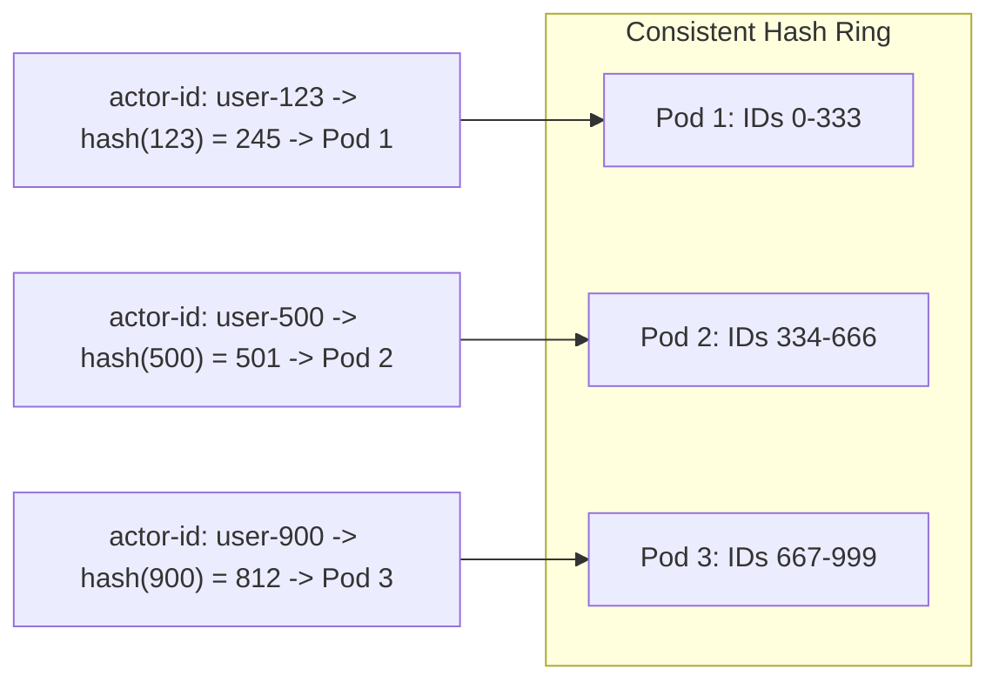

# How to Scale Dapr Actors with Placement Service

Author: [nawazdhandala](https://www.github.com/nawazdhandala)

Tags: Dapr, Actor, Placement, Scaling, Kubernetes

Description: Learn how Dapr's Placement Service distributes and scales virtual actors across application instances, and how to tune placement for high-throughput production workloads.

---

## Introduction

Dapr's Placement Service is the control plane component responsible for tracking which host (pod/process) owns each actor type, and distributing actor assignments across the available application instances. It uses a consistent hashing algorithm to ensure that a given actor ID always maps to one host at a time, preventing concurrent execution of the same actor.

Understanding the Placement Service helps you:

- Scale actor-heavy applications efficiently
- Minimize actor rebalancing disruption during deployments
- Configure the Placement Service for high availability

## How the Placement Service Works



When a client invokes an actor:
1. The client's Dapr sidecar queries the Placement Service for the actor's host
2. The Placement Service returns the consistent hash table mapping
3. The sidecar forwards the call to the correct pod's Dapr sidecar
4. That sidecar activates the actor (if needed) and executes the method

## Consistent Hashing

Dapr uses a consistent hashing ring to assign actors to hosts. This means:

- Adding a new pod only causes a fraction of actors to be reassigned
- Removing a pod causes only that pod's actors to be redistributed
- Actor ID to host mapping is deterministic and reproducible



## Installing and Verifying the Placement Service

The Placement Service is installed as part of Dapr:

```bash
dapr init -k
```

Verify it is running:

```bash
kubectl get pods -n dapr-system -l app=dapr-placement-server
```

Check Placement Service logs:

```bash
kubectl logs -n dapr-system -l app=dapr-placement-server
```

## Scaling the Placement Service for HA

For production, run the Placement Service with 3 replicas (odd number for Raft consensus):

Using Helm:

```bash
helm upgrade dapr dapr/dapr \
  --namespace dapr-system \
  --set dapr_placement.replicaCount=3 \
  --set dapr_placement.raft.logStorePath=/var/log/dapr/raft.db
```

Or update the Helm values file:

```yaml
dapr_placement:
  replicaCount: 3
  raft:
    logStorePath: "/var/log/dapr/raft.db"
  resources:
    requests:
      cpu: "100m"
      memory: "256Mi"
    limits:
      cpu: "500m"
      memory: "1Gi"
```

## Scaling Your Actor Application

Scale your application deployment to distribute actors across more pods:

```bash
kubectl scale deployment actor-service --replicas=5
```

The Placement Service automatically detects new pods and redistributes actor ownership. Monitor the rebalancing:

```bash
kubectl logs -n dapr-system -l app=dapr-placement-server | grep rebalance
```

## Actor Reminder Partitioning

For applications with millions of actor reminders, enable reminder partitioning to spread reminder storage across multiple state store keys:

```yaml
apiVersion: dapr.io/v1alpha1
kind: Configuration
metadata:
  name: actorconfig
  namespace: default
spec:
  actor:
    remindersStoragePartitions: 16
```

This distributes reminder storage across 16 partitions, avoiding hot spots in the state store.

## Graceful Pod Shutdown

When scaling down, Kubernetes terminates pods. Configure a long enough termination grace period to let in-flight actor calls complete before the pod is removed from the placement ring:

```yaml
spec:
  template:
    spec:
      terminationGracePeriodSeconds: 60
```

The Dapr sidecar listens for `SIGTERM` and drains in-flight calls before the placement table is updated.

## Monitoring Placement Health

```bash
# Check placement health endpoint
kubectl port-forward -n dapr-system svc/dapr-placement-server 8080:8080
curl http://localhost:8080/healthz
```

Key metrics to monitor:
- `dapr_placement_actor_count_total` - total registered actor types
- `dapr_placement_host_count` - number of actor hosts registered
- `dapr_placement_rebalance_count` - number of rebalancing events

## Actor Distribution Example

With 3 pods and 1000 actor instances:

```mermaid
bar
    title Actor Distribution Across Pods
    x-axis [Pod 1, Pod 2, Pod 3]
    y-axis "Number of Actors"
    bar [333, 334, 333]
```

After scaling to 4 pods, approximately 750 actors remain on original pods, and 250 are rebalanced to the new pod.

## Summary

Dapr's Placement Service uses consistent hashing to distribute virtual actors across application pods. For production, run 3 Placement Service replicas for high availability. Scale your actor application by increasing the pod replica count, and the Placement Service handles the rest. Enable reminder partitioning for high-volume reminder workloads, and configure adequate termination grace periods for graceful pod shutdown during scaling events.
