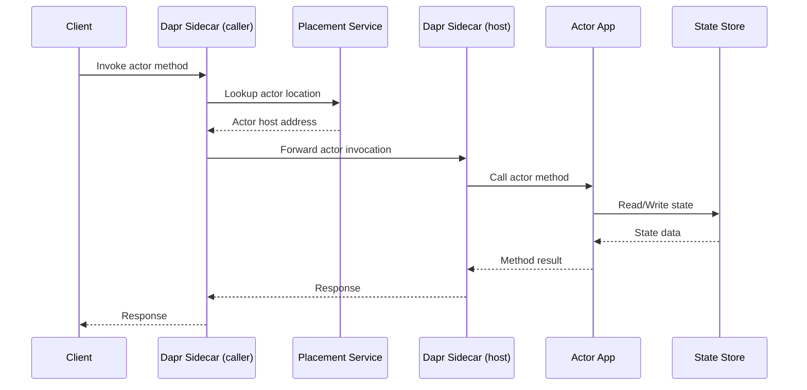
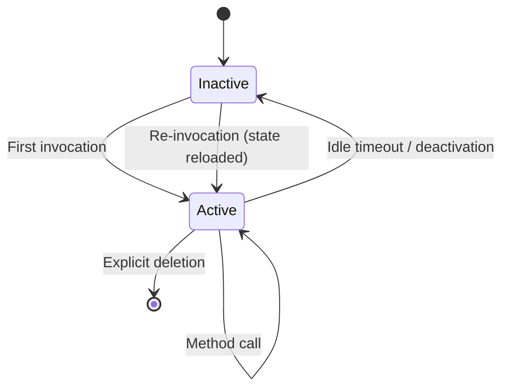

# How to Use Dapr Actors for Stateful Microservices

Author: [nawazdhandala](https://www.github.com/nawazdhandala)

Tags: Dapr, Actor, Microservice, State, Kubernetes

Description: Learn how to use Dapr's virtual actor model to build stateful microservices with automatic state management, concurrency control, and scalable actor placement.

---

## Introduction

Dapr Actors implement the virtual actor pattern, originally introduced by Microsoft Orleans. An actor is an isolated unit of compute and state, identified by a unique ID. Actors process one request at a time (single-threaded), which eliminates the need for explicit locking in concurrent systems. Dapr manages where actors live across your cluster, activating and deactivating them automatically.

This makes Dapr Actors ideal for:

- Per-entity business logic (per user, per device, per order)
- Stateful workflows with isolated state
- Low-latency, concurrent workloads where each entity operates independently

## How Dapr Actors Work

The Dapr runtime manages actor placement via a **Placement Service**. When you invoke an actor by ID, Dapr routes the call to the correct sidecar hosting that actor. If the actor is not yet active, Dapr activates it. Actor state is persisted to a configured state store.



## Prerequisites

- Dapr CLI installed (`dapr init`)
- A running Dapr environment (local or Kubernetes)
- A state store component configured (Redis by default in local mode)
- Application SDK: Go, Python, .NET, Java, or JavaScript

## Configuration

### State Store Component

Actors require a state store that supports actors (transactional). Create or verify the state store component:

```yaml
apiVersion: dapr.io/v1alpha1
kind: Component
metadata:
  name: statestore
  namespace: default
spec:
  type: state.redis
  version: v1
  metadata:
  - name: redisHost
    value: "redis-master:6379"
  - name: redisPassword
    value: ""
  - name: actorStateStore
    value: "true"
```

The key setting is `actorStateStore: "true"`, which tells Dapr this store can be used for actor state.

### Actor Configuration in Your App

Your application must expose certain endpoints that Dapr calls during actor lifecycle management. These include `/dapr/config` (to advertise supported actor types), and `/actors/{actorType}/{actorId}/method/{methodName}`.

## Implementing Actors

### Go Example

In Go, you use the `dapr-go` SDK to define and register actors.

```go
package main

import (
    "context"
    "fmt"
    "log"

    dapr "github.com/dapr/go-sdk/client"
    "github.com/dapr/go-sdk/actor"
    daprd "github.com/dapr/go-sdk/service/http"
)

// Define actor interface
type CounterActor interface {
    actor.Server
    Increment(ctx context.Context) error
    GetCount(ctx context.Context) (int, error)
}

// Define actor implementation
type CounterActorImpl struct {
    actor.ServerImplBase
}

func (a *CounterActorImpl) Type() string {
    return "CounterActor"
}

func (a *CounterActorImpl) Increment(ctx context.Context) error {
    var count int
    if err := a.GetStateManager().Get(ctx, "count", &count); err != nil {
        count = 0
    }
    count++
    return a.GetStateManager().Set(ctx, "count", count)
}

func (a *CounterActorImpl) GetCount(ctx context.Context) (int, error) {
    var count int
    err := a.GetStateManager().Get(ctx, "count", &count)
    return count, err
}

func main() {
    s := daprd.NewService(":3000")
    s.RegisterActorImplFactory(actor.NewDefaultFactory(func() actor.Server {
        return &CounterActorImpl{}
    }))
    if err := s.Start(); err != nil {
        log.Fatalf("error starting actor service: %v", err)
    }
}
```

### Python Example

```python
from dapr.actor import Actor, ActorInterface, actormethod
from dapr.actor.runtime.runtime import ActorRuntime
from dapr.actor.runtime.config import ActorRuntimeConfig, ActorTypeConfig
import asyncio

class CounterActorInterface(ActorInterface):
    @actormethod(name="increment")
    async def increment(self) -> None: ...

    @actormethod(name="get_count")
    async def get_count(self) -> int: ...

class CounterActor(Actor, CounterActorInterface):
    async def _on_activate(self) -> None:
        exists = await self._state_manager.try_get_state("count")
        if not exists[0]:
            await self._state_manager.set_state("count", 0)

    async def increment(self) -> None:
        _, count = await self._state_manager.try_get_state("count")
        await self._state_manager.set_state("count", (count or 0) + 1)
        await self._state_manager.save_state()

    async def get_count(self) -> int:
        _, count = await self._state_manager.try_get_state("count")
        return count or 0

ActorRuntime.set_actor_config(
    ActorRuntimeConfig(actor_idle_timeout="1h", actor_scan_interval="30s")
)
ActorRuntime.register_actor(CounterActor)
```

### HTTP API (Direct Invocation)

You can invoke actors directly via Dapr's HTTP API without an SDK.

To call the `increment` method on actor with ID `user-42`:

```bash
curl -X POST http://localhost:3500/v1.0/actors/CounterActor/user-42/method/increment \
  -H "Content-Type: application/json" \
  -d '{}'
```

To get the count:

```bash
curl http://localhost:3500/v1.0/actors/CounterActor/user-42/method/getCount
```

## Running Locally

Start your actor service with the Dapr CLI:

```bash
dapr run \
  --app-id actor-service \
  --app-port 3000 \
  --dapr-http-port 3500 \
  -- go run main.go
```

## Actor Lifecycle

Actors are activated on first invocation and deactivated after an idle period (configurable). State is always persisted to the state store, so actors can be safely deactivated and reactivated.



## Concurrency Control

Dapr Actors provide turn-based concurrency by default. Only one method executes at a time per actor instance, preventing race conditions without explicit locks.

If you need to allow re-entrant calls (e.g., actor A calls actor B which calls back actor A), enable actor reentrancy in your component configuration.

## Summary

Dapr Actors provide a powerful virtual actor model for building stateful microservices. By routing requests through the Placement Service, Dapr ensures each actor runs on exactly one host at a time. State is persisted automatically, and turn-based concurrency eliminates the need for manual locking. Actors are well-suited for per-entity workloads such as user sessions, IoT device state, and order management systems.
